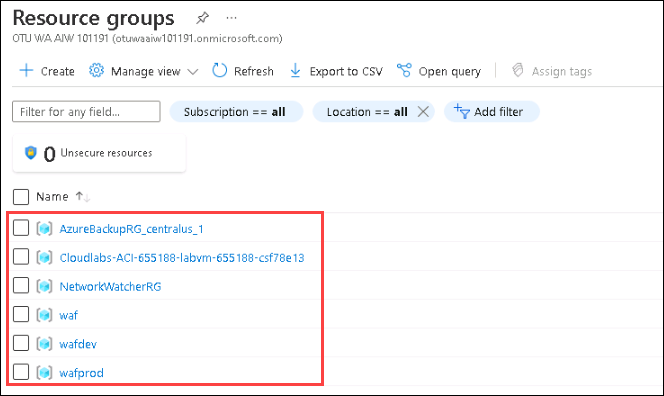

# Getting Started with Lab

1. Once the environment is provisioned, a virtual machine (JumpVM) and **Lab Guide** will load up in your browser. Use this virtual machine throughout the workshop to perform the lab. Use the footer numbered navigation to switch between different exercises in lab guide.

   

1. To get the lab environment details, you can select the **Environment Details** tab. Additionally, the credentials will also be sent to your email address provided at the time of registration. You can also open the Lab Guide on separate full window mode by selecting the **Split Window** icon from lower right corner. Also, you can start, stop and restart the virtual machines from the **Virtual Machines** tab.

   
 

## Login to Azure Portal
1. In the JumpVM, click on the **Azure Portal** desktop shortcut.

   
   
1. Once you are on the **Sign in to Microsoft Azure** login screen, enter the following email/username and then click on **Next**. 
   * Email/Username: **<inject key="AzureAdUserEmail"></inject>**
   
     
     
1. Now enter the following password and click on **Sign in**.
   * Password: **<inject key="AzureAdUserPassword"></inject>**
   
     
     
   > If you get a **Help us protect your account** dialog box, select **Skip for now**.

       
    
  
1. If you see a pop-up message to **Stay Signed in?**, click on **Yes**.

1. If you see a pop-up window **You have free Azure Advisor recommendations!**, close the window to continue the lab.

1. If a **Welcome to Microsoft Azure** popup window appears, click on **Maybe Later** to skip the tour.
   
1. Now you will see Azure Portal Dashboard, click on **Resource groups** from the Navigate panel to see the Resource groups.

    
   
1. On this screen, confirm you have all the resource group as shown below.

    
   
1. Now, click on the **Next** button from lower right corner to move on to the next page.

