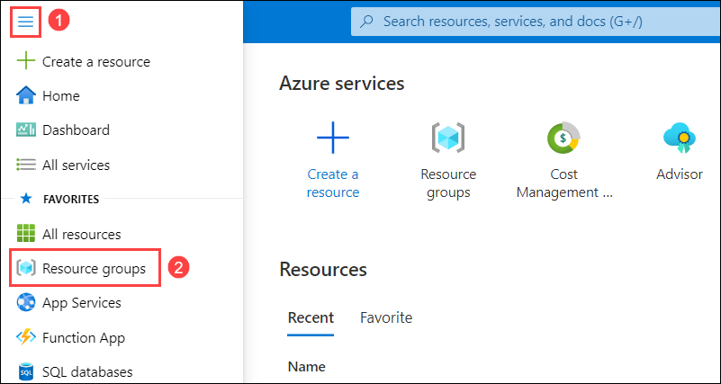
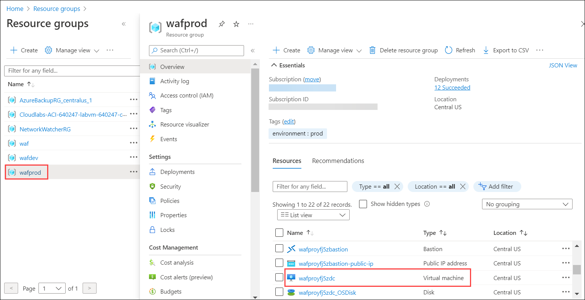
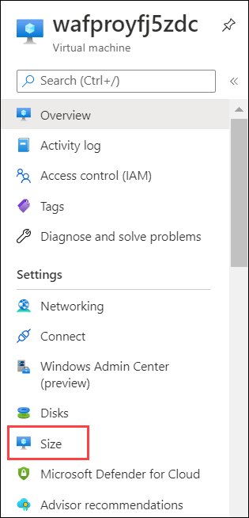
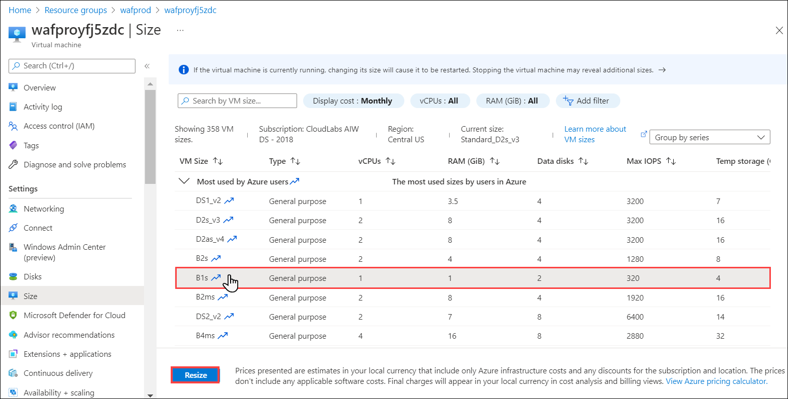
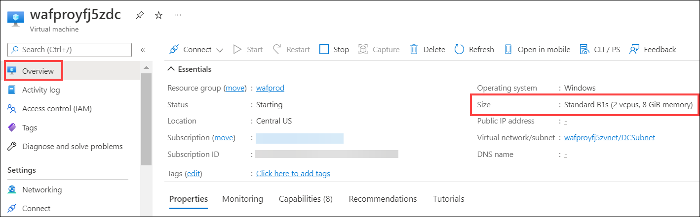
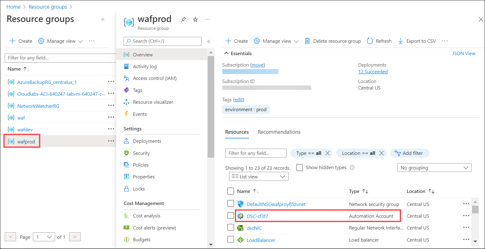
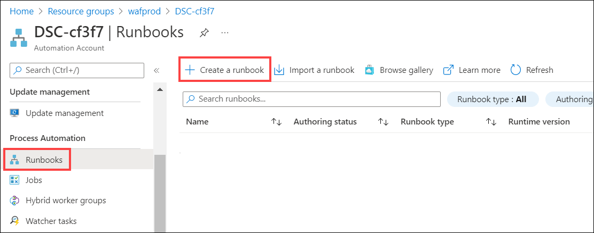

# Exercise 1: Cost Optimization

## Overview

Cost Optimization is the process of managing costs to maximize the value delivered. The **Cost Optimization** pillar provides principles for balancing business goals with budget justification to create a cost-effective workload while avoiding capital-intensive solutions. Cost optimization is about looking at ways to reduce unnecessary expenses and improve operational efficiencies.

The **Cost Optimization** in Well-Architected Assessment is a top-down review of your workload to identify what could be improved in your architecture. In this exercise, we will begin by looking at the costs of the workload as well as the most prevalent pain points and how to address them, such as:

  * Are there any hidden costs in the current architecture? How can you identify them?
  * Can the current IaaS architecture be more cost-effective? How?
  * How would you keep track of cloud expenditure?
  * What will be the cost impact of your new architecture recommendations?

This will help on the most immediate and direct impact of the recommendations.

**Task 1: Monitor and Forecast**

In this task you will learn how to monitor the cost of a workload with tools like Azure Advisor, Azure Cost Management and Billing.

**Task 2: Resize a Virtual Machine**

You can lower cost by managing the size of the VMs. 

1. In the Azure portal, click on **Show portal menu (1)** and select **Resource groups(2)**.

   
   
2. Open **wafprod** resource group and select a vitrual machine.

   
   
3. Select **Size** present under _Settings_ pane.

   
   
4. From the list of available sizes, click on **B1s** size to select it and then click on **Resize** button.

   

 > **Note:** B-series burstable VMs are ideal for workloads that do not need the full performance of the CPU continuously, like web servers, small databases and development and test environments. TThe B-Series provides these customers the ability to purchase a VM size with a _**price conscious baseline performance**_ that allows the VM instance to build up credits when the VM is utilizing less than its base performance. When the VM has accumulated credit, the VM can burst above the VM’s baseline using up to 100% of the CPU when your application requires the higher CPU performance.

5. Go back to **Overview** page and verify the VM size. 

   

 &#11088; For a D2s_v3 which has 2 vCPUs and 8 GiB of memory the hourly rate is $0.227 per hour (monthly $163.83) and for B1s with 1 vCPU and 1 GiB memory the rate is $0.031 per hour (monthly $21.85). This results in savings! 

**Task 3: Shutdown**

Use the Start/stop VMs during off-hours feature of virtual machines to minimize waste. The feature is suitable as a **low-cost automation** option. There are many configuration options to schedule start the stop times. 

Some ways to Start/stop VMs are:
* From Azure portal, by going to each VM and start/stop it manually.
* Using PowerShell/CLI
* Enabling Autoshutdown for a VM
* Using Azure Automation

With respect to the workload we have, we will use Automation Accounts to perform the Start/Stop operation.

1. In the Azure portal, click on **Show portal menu (1)** and select **Resource groups(2)**.

   

2. Open **wafprod** resource group and open the Automation account **DSC-xxxx**.

   

3. In the left pane, scroll to _Process Automation_, select **Runbooks** and click on **+Create a runbook**.

   
   
4. Fill the details as following:
 * Name: **stop-prod-vms (1)**
 * Runbook type: Select **PowerShell (2)** from the dropdown.
 * Runtime verion: **5.1 (3)**
 * Description: Give a description such as, **Stop the Virtual Machines present in WAF Prod resource group. (4)**
 * Click on **Create (5)**.

   
   
5. 

