# Exercise 1: Cost Optimization

## Overview

Cost Optimization is the process of managing costs to maximize the value delivered. The **Cost Optimization** pillar provides principles for balancing business goals with budget justification to create a cost-effective workload while avoiding capital-intensive solutions. Cost optimization is about looking at ways to reduce unnecessary expenses and improve operational efficiencies.

The **Cost Optimization** in Well-Architected Assessment is a top-down review of your workload to identify what could be improved in your architecture. In this exercise, we will begin by looking at the costs of the workload as well as the most prevalent pain points and how to address them, such as:

  * Are there any hidden costs in the current architecture? How can you identify them?
  * Can the current IaaS architecture be more cost-effective? How?
  * How would you keep track of cloud expenditure?
  * What will be the cost impact of your new architecture recommendations?

This will help on the most immediate and direct impact of the recommendations.

### **Task 1: Monitor and Forecast**

In this task you will learn how to monitor the cost of a workload with tools like Azure Advisor, Azure Cost Management and Billing.

**a. Azure Advisor:** It helps you optimize and reduce your overall Azure spend by identifying idle and underutilized resources. You can get cost recommendations from the Cost tab on the Advisor dashboard.

1. In the Azure portal, search for Advisor and select **Advisor** from the suggestions.

   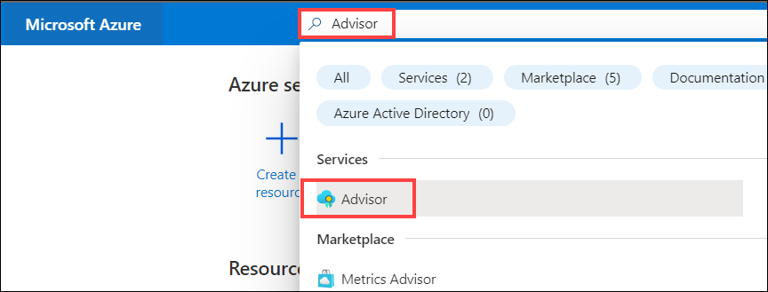

2. The Advisor dashboard will display a summary of your recommendations for all selected subscriptions. You can choose the subscriptions that you want recommendations to be displayed for using the subscription filter dropdown.

   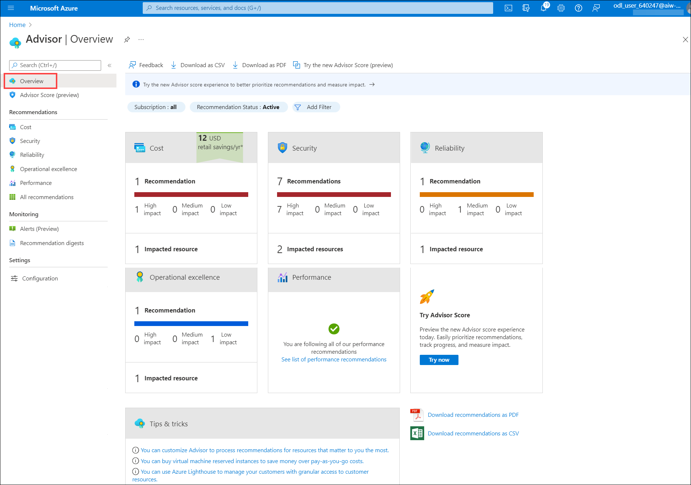

3. Now to get recommendations for Cost category, click on the Cost tab. You can either select it from the **dashboard(1)** or in the left pane, under _Recommendations_ you have **Cost(2)** tab.

   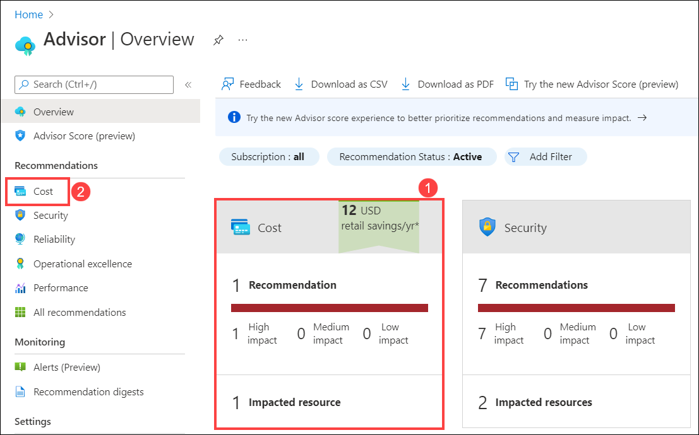

4. Click a recommendation that you want to review in detail.

5. Review the information about the recommendation and the resources that the recommendation applies to.

6. Click on the Recommended Action to implement the recommendation.

**b. Cost Management:** 

One can significantly improve the technical performance of your business workloads. It can also reduce your costs and the overhead required to manage organizational assets. Cost Management is a suite of tools provided by Microsoft that help you analyze, manage, and optimize the costs of your workloads. 

With advanced analytics, Cost Management reveals corporate cost and use patterns. The usage-based charges incurred by Azure services and third-party Marketplace offerings are displayed in Cost Management reports.

1. In the Azure portal, click on **Show portal menu (1)** and select **Cost Management + Billing (2)**.

   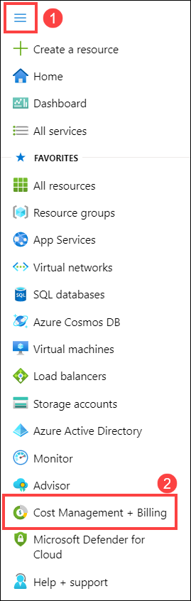
   
2. Now select **Cost Management**.

   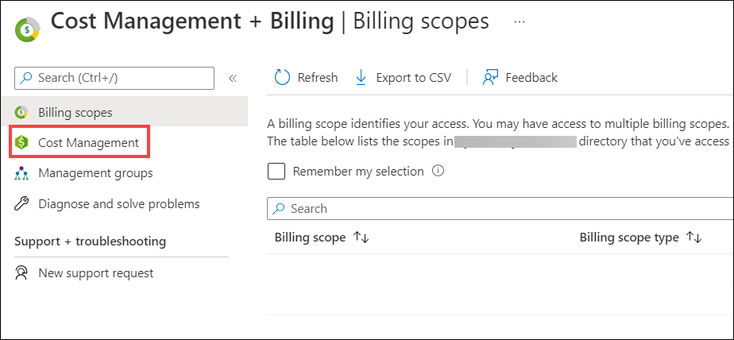

3. You will be directed to Overview page. There select **Cost analysis** present under _Cost Management_.

   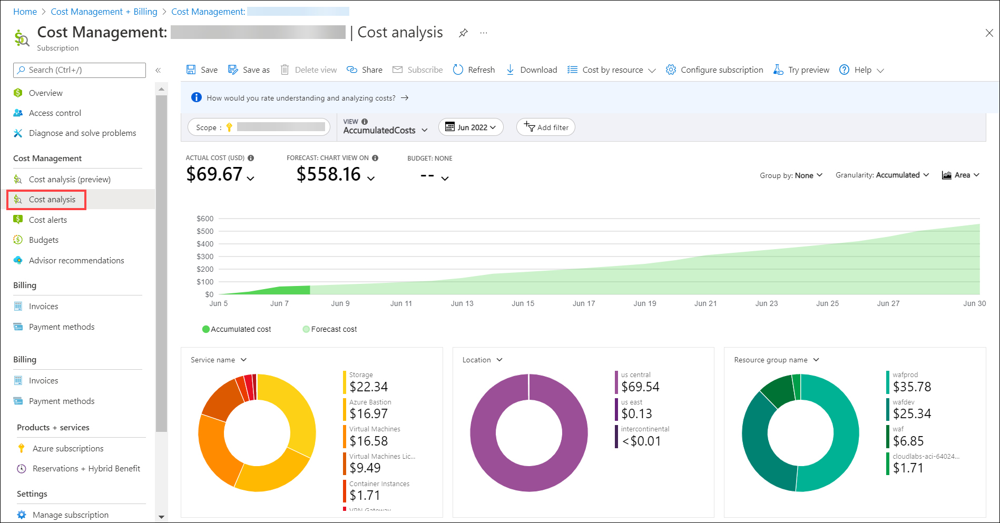
   
4. The initial cost analysis view includes the following areas:

 * **Currently selected view:** This represents the predefined cost analysis view configuration. Each view includes date range, granularity, group by, and filter settings. The default view shows the current billing period's total combined costs, but you can switch to one of the other built-in views.

 * **Cost (1):** Shows the total usage and purchase costs for the current month, as they're accrued and will show on your bill. Costs are estimated until the invoice is generated and do not factor in credits. Pay-as-you-go subscriptions only include usage costs.

 * **Forecast (2):** Shows the total forecasted costs for time period you choose. Forecast is based on usage for the selected time period and does not account for purchases. Changes in usage may take up to a week to be reflected.

 * **Budget (if selected) (3):** Shows the planned spending limit for the selected scope, if available.

 * **Accumulated granularity (4):** Shows the total aggregate daily costs, from the beginning of the billing period. You can easily monitor your spending trend versus the budget after creating a budget for your billing account or subscription. Hover over a date to view the accumulated cost for that day.

 * **Pivot (donut) charts (5):** These charts provide dynamic pivots, breaking down the total cost by a common set of standard properties. They show the largest to smallest costs for the current month.

   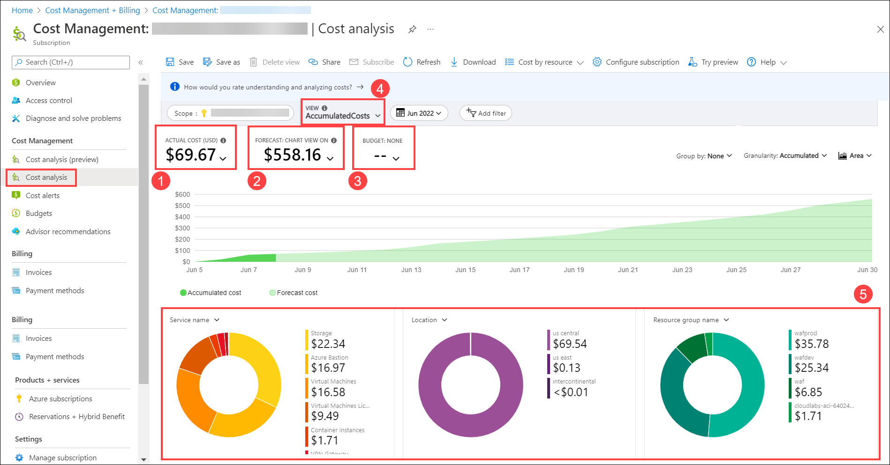

> **Forecast:** Cost forecasts display a projection of your projected costs for the given time period based on your recent spending. You can see when forecasted spend is going to exceed the budget threshold if you put up a budget in Cost analysis. For up to a year, the prediction model can anticipate future costs.

5. You can play with different filters provided here to analyze the cost, such as:

 * **View:** Cost analysis has four built-in views, they are as follow:
   1. **Accumulated cost -** How much have I spent so far this month? Will I stay within my budget?
   2. **Daily cost -** Have there been any increases in the costs per day for the last 30 days?
   3. **Cost by service -**	How has my monthly usage vary over the past three invoices?
   4. **Cost by resource -**	Which resources cost the most so far this month?
   5. **Invoice details -**	What charges did I have on my last invoice?

   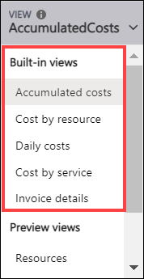
   
 * **Date Range:** Here you can select custom dates as well as time periods for a betterand deeper analysis.
    1. By default, the current month's data is displayed in cost analysis. Switch to common date ranges fast by using the date selector.
    2. Examples include the last seven days, the last month, the current year, or a custom date range.   

   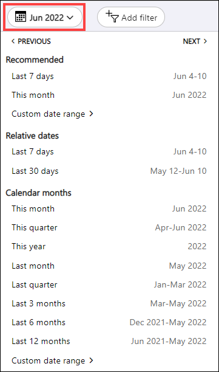

 * **View Cost:** To have a better visibility on cost, you can use different views given below: 
    1. **Group by:** _Group by_ common properties to break down costs and identify top contributors. From the drop down you can select group by keys such as, Tag, Resource type, Provider, etc. 
    2. **Granularity:** This view is optimized to show how you're trending against a budget for the selected time range.
    3. **Graph type:** It asks for graphical representation, what kind of representation you prefer. It could be Table, Column, Line and much more.

The image below shows _**Group by: Resource type, Granularity: Daily and Graph type: Column(Stacked)**_

   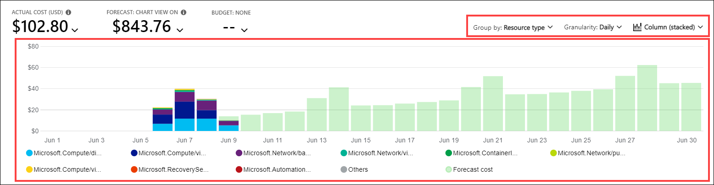


### **Task 2: Cost controls**

In this task you will learn about Budgets and Alert in Azure that help to analyse and optimize the cost in a better way.

There is an alert feature in Azure Cost Management. When consumption reaches a critical threshold, an alert is sent out. Consider the metrics that each workload resource produces. For each metric, build alerts on baseline thresholds. 

This way, the admins can be alerted when the workload is using the services at capacity. Admins can then fine-tune the resources to target specific SKUs based on current demand. You can also set budget alerts at the scopes of resource groups and management groups. Both cloud services performance and budget requirements can be balanced through alerts on metrics and budgets.

1. In the Azure portal, search for Subscriptions and select **Subscriptions** from the suggestions.

   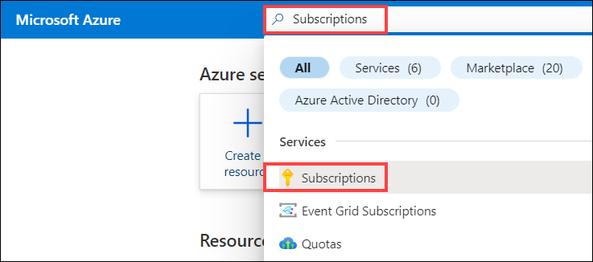

2. Select your default subscription and then select **Budgets**.

   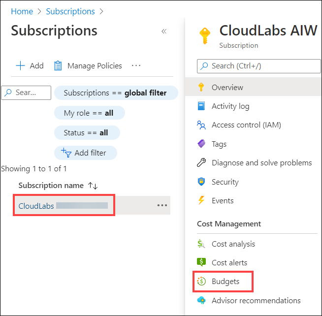

3. Click on **+ Add** to add a budget.

   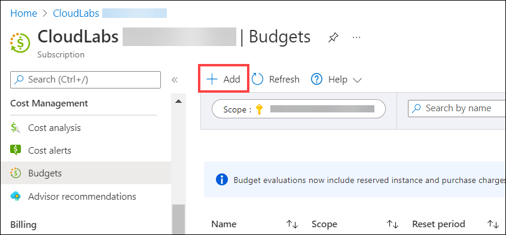

4. Fill in the Budget Details as following:

* Scope: Make sure your subscription is selected **(1)**.
* Name: **waf-budget (2)**
* Reset period: The reset period determines the time window that's analyzed by the budget. Select **Quaterly (3)** from the drop down.
* Creation date: This is the date of creation of budget and it will be selected by default **(4)**.
* Expiration date: Add an expiry date for the bduget **(5)**.
* Amount ($): Give your budget amount threshold **(6)**. 
* Click on **Next (7)**.

   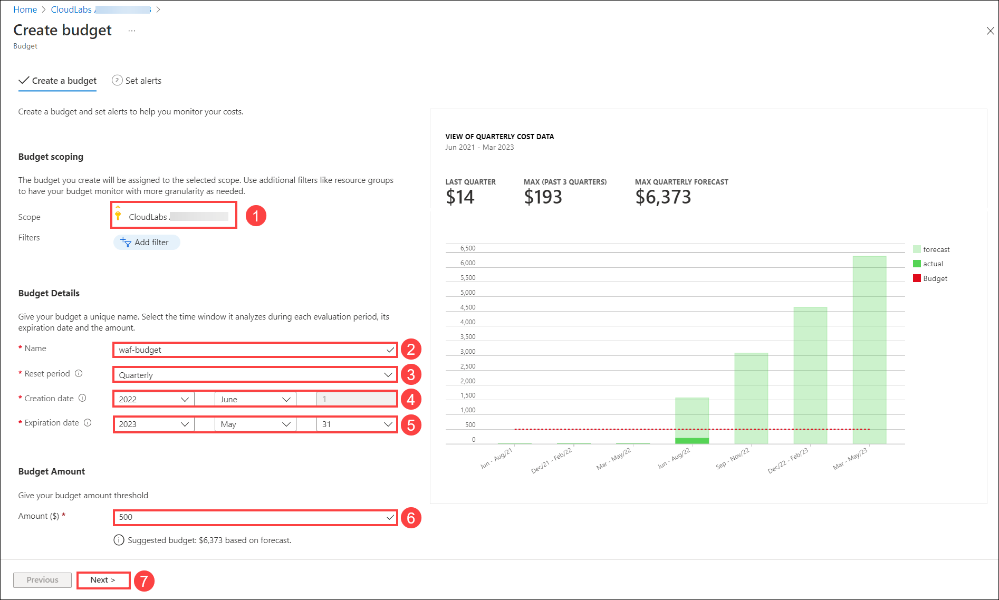

5. Fill in the alert etails as following:

* Scope: Make sure your subscription is selected **(1)**.
* Type:
* % of budget: 
* Alert recipients (email): **INJECTKEYS USERNAME**
* Alert recipients (email): Add **azure-noreply@microsoft.com** to your approved senders list so that emails don't go to your junk email folder.
* Language: You can select your language from the drop down. Here we are leaving this on **Default (5)**.

* Click on **Create (6)**.

   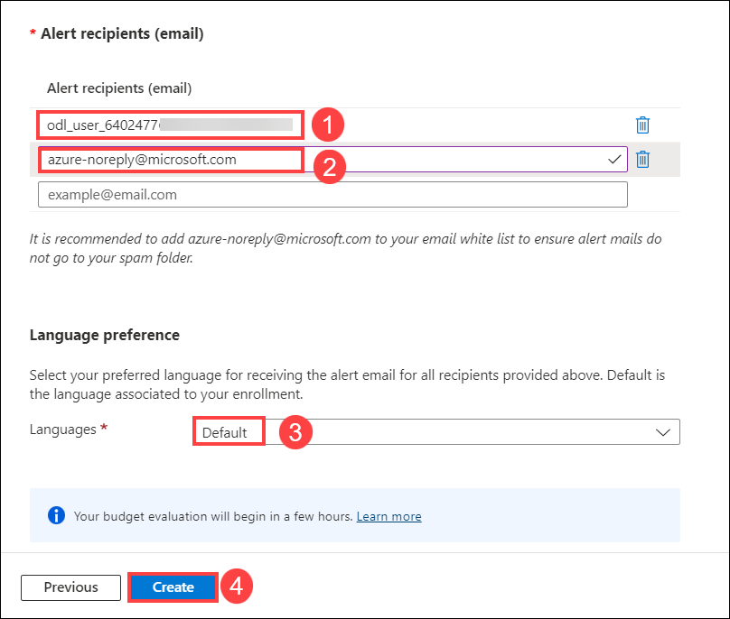

6. After you create a budget, it's shown in cost analysis. One of the first steps in analysing your costs and spending is to compare your budget to your spending patterns.

   


## **Note: Task 3 and Task 4 are read only tasks.**

### **Task 3: Azure Hybrid Benefit**

In this task you will get to know about Azure Hybrid Benefit.

**1. What is the Azure Hybrid Benefit?**

* Customer workloads are becoming more complicated, with several apps running on various hardware platforms across on-premises, multicloud, and the edge. It's critical to succeed in managing these various workload designs, providing uncompromised security, and allowing developers to be more agile.

* Azure gives you the flexibility to innovate anywhere in your hybrid environment while operating seamlessly and securely.

* **The Azure Hybrid Benefit is a pricing offer that helps you maximize the value of your existing on-premises Windows Server and/or SQL Server license investment while you’re migrating to Azure.** With it, eligible customers pay a reduced rate on Azure Virtual Machines (infrastructure as a service, or IaaS) and a reduced rate on Azure SQL Database (platform as a service, or PaaS) and SQL Server on Azure Virtual Machines (IaaS).

**2. Which products are eligible for the Azure Hybrid Benefit?**

* Windows Server Standard Edition with Software Assurance
* Windows Server Datacenter edition with Software Assurance
* SQL Server Enterprise Core with Software Assurance
* SQL Server Standard Core with Software Assurance
* Azure SQL Database

**3. What does this benefit offer for Windows Server on Azure Virtual Machines?**

Azure Hybrid Benefit helps you get more value from your Windows Server licenses and save up to 40 percent* on virtual machines.

Each 2-processor license or each set of 16-core licenses, Datacenter or Standard Editions, are entitled to two instances of up to 8 cores, or one instance of up to 16 cores. Datacenter Edition licenses allow for simultaneous usage both on-premises and in Azure. Standard Edition licenses must be used either on-premises or in Azure, although customers get 180 days of concurrent use rights while they are migrating their servers.

**4. How many Azure virtual machines one will receive with on-premises licenses?**

For every 2-processor Windows Server license or set of 16 core Windows Server licenses covered with Software Assurance, you’ll receive either of the following in Azure.

* Up to 2 virtual machines with up to 8 cores
* One virtual machine with up to 16 cores

**5. What does this benefit offer for Windows Server on Azure Virtual Machines?**

Azure Hybrid Benefit helps you get more value from your Windows Server licenses and save up to 40 percent* on virtual machines.

Each 2-processor license or each set of 16-core licenses, Datacenter or Standard Editions, are entitled to two instances of up to 8 cores, or one instance of up to 16 cores. Datacenter Edition licenses allow for simultaneous usage both on-premises and in Azure. Standard Edition licenses must be used either on-premises or in Azure, although customers get 180 days of concurrent use rights while they are migrating their servers.


**6. Who is eligible for this offer?**

The Azure Hybrid Benefit for SQL Server is available to customers with either of the following:

* SQL Server Enterprise Core with Software Assurance or qualifying subscription licenses
* SQL Server Standard Core with Software Assurance or qualifying subscription licenses

**7. What products are eligible for Azure Hybrid Benefit for SQL Server?**

This hybrid benefit is only available for use with:

* vCore-based service tiers of Azure SQL Database: Managed Instance, Single Database and Elastic Pool
* SQL Server in Azure Virtual Machines
* SQL Server Integration Services (SSIS)

### **Task 4: Reserve Instances**

**1. What is Azure Reservation?**

  By committing to one-year or three-year agreements for several goods, Azure Reservations can help you save money. Committing allows you to get a discount on the resources you use. When compared to pay-as-you-go charges, reservations can save you up to 72 percent on your resource costs. Reservations provide a billing discount and don't affect the runtime state of your resources.
  
  You can pay for a reservation in advance or on a monthly basis. The overall cost of up-front and monthly reservations is the same, and there are no additional costs if you pay monthly. Azure reservations, but not third-party items, can be paid monthly.

**2. Why should you opt for azure reservation?**

  If you have constant resource usage that supports reservations, purchasing a reservation can help you save money. Pay-as-you-go prices apply when you frequently run instances of a service without making a reservation. When you buy a reservation, you immediately get the reservation discount. Pay-as-you-go charges are no longer applied to the resources. 

**3. Which Resources are Most Appropriate for Azure Reservations?**

  Following are the resources that fall under Reservations:
  
 * App Service
 * Azure Cache for Redis
 * Cosmos DB
 * Databricks
 * Data Explorer
 * Disk Storage
 * Dedicated Host
 * Software plans
 * Storage
 * SQL Database
 * Azure Database for PostgreSQL
 * Azure Database for MySQL
 * Azure Database for MariaDB
 * Azure Synapse Analytics
 * Virtual machines
 * Log Analytics


**4. Virtual Machine size flexibility with Reserved VM Instances**

  You can select to optimise for instance size flexibility or capacity priority when purchasing a Reserved VM Instance. The reservation you purchase is valid for all sizes of virtual machines (VMs) in the same instance size flexibility group. 
  
  The number of VMs that the reservation discount applies to inside the instance size flexibility group is determined by the VM size you choose when you acquire a reservation. It also relies on the size of the virtual machines (VMs) you're operating. The relative footprint for each VM size in that instance size flexibility group is compared in the ratio column. Calculate how the reservation discount applies to the VMs you have running using the ratio value.

  For example, if you buy a reservation for a VM size that's listed in the DSv2 Series, like Standard_DS3_v2, the reservation discount can apply to the other sizes that are listed in that same instance size flexibility group such as, Standard_DS1_v2, Standard_DS2_v2, Standard_DS3_v2 and so on.
  
  But that reservation discount doesn't apply to VMs sizes that are listed in different instance size flexibility groups, like SKUs in DSv2 Series High Memory: Standard_DS11_v2, Standard_DS12_v2, and so on.


**Example:** The following examples use the sizes and ratios in the DSv2-series table.

You buy a reserved VM instance with the size Standard_DS4_v2 where the ratio or relative footprint compared to the other sizes in that series is 8.

* Scenario 1: Run eight Standard_DS1_v2 sized VMs with a ratio of 1. Your reservation discount applies to all eight of those VMs.
* Scenario 2: Run two Standard_DS2_v2 sized VMs with a ratio of 2 each. Also run a Standard_DS3_v2 sized VM with a ratio of 4. The total footprint is 2+2+4=8. So your reservation discount applies to all three of those VMs.
* Scenario 3: Run one Standard_DS5_v2 with a ratio of 16. Your reservation discount applies to half that VM's compute cost.
* Scenario 4: Run one Standard_DS5_v2 with a ratio of 16 and purchase an additional Standard_DS4_v2 reservation with a ratio of 8. Both reservations combine and apply the discount to entire VM.

The following sections show what sizes are in the same size series group when you buy a reserved VM instance optimized for instance size flexibility.  
  

### **Task 5: Shutdown**

Use the Start/stop VMs during off-hours feature of virtual machines to minimize waste. The feature is suitable as a **low-cost automation** option. There are many configuration options to schedule start the stop times. 

Some ways to Start/stop VMs are:
* From Azure portal, by going to each VM and start/stop it manually.
* Using PowerShell/CLI
* Enabling Autoshutdown for a VM
* Using Azure Automation

With respect to the workload we have, we will use Automation Accounts to perform the Start/Stop operation.

1. In the Azure portal, click on **Show portal menu (1)** and select **Resource groups(2)**.

   

2. Open **wafprod** resource group and open the Automation account **DSC-xxxx**.

   

3. In the left pane, scroll to _Process Automation_, select **Runbooks** and click on **+Create a runbook**.

   

 > **Good to know:** Microsoft Azure Automation service provides a framework to create and schedule workflows to simplify the repetitive and mundane tasks that Cloud administrators perform with Azure. The workflows are commonly known as **Runbooks**.

4. Fill the details as following:
 * Name: **stop-prod-vms (1)**
 * Runbook type: Select **PowerShell (2)** from the dropdown.
 * Runtime verion: **5.1 (3)**
 * Description: Give a description such as, **Stop the Virtual Machines present in WAF Prod resource group. (4)**
 * Click on **Create (5)**.

   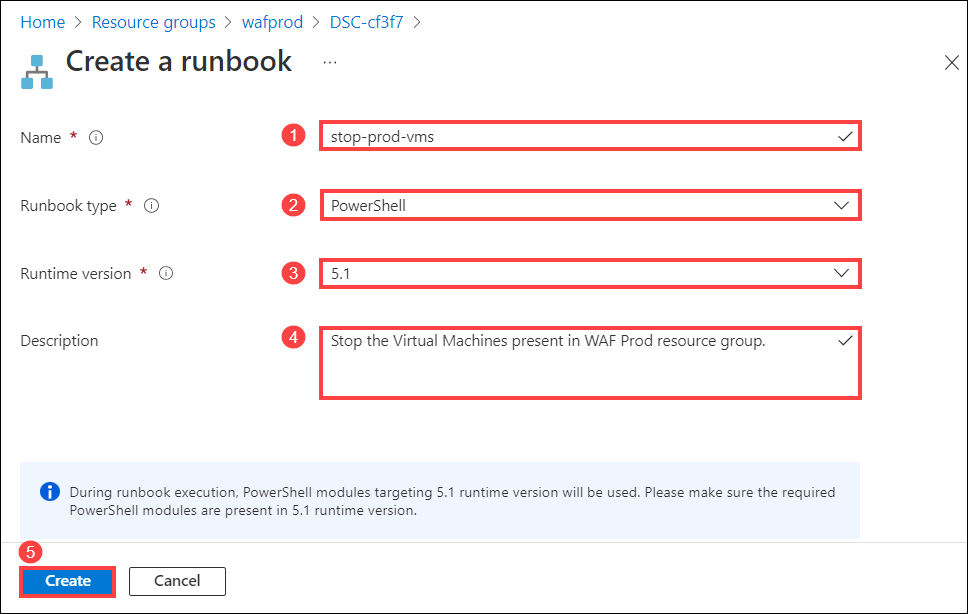
   
5. Once the runbook is created, it will look similar to the screenshot below. Now select **Edit** to add PowerShell script in the runbook.

   
   
6. Copy the script given below and paste in runbook console and then click on **Save**. 

```
$myCred = Get-AutomationPSCredential -Name '[Enter name of your credentials]'
$userName = $myCred.UserName
$securePassword = $myCred.Password
$password = $myCred.GetNetworkCredential().Password

$myPsCred = New-Object System.Management.Automation.PSCredential ($userName,$securePassword)

Connect-AzAccount -Credential $myPsCred
Set-AzContext -SubscriptionId "Enter your subscription id"

$ResourceGroupName = “Enter the resource group name”
Get-AzVM -ResourceGroupName $ResourceGroupName | Select Name | ForEach-Object {
Stop-AzVM -ResourceGroupName $ResourceGroupName -Name $_.Name
}

```
   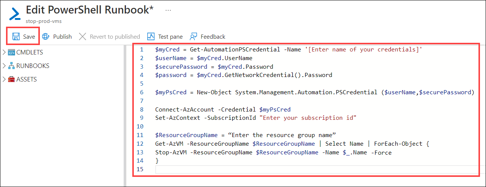
    
8. Go back to the automation account **DSC-xxxx** and from left pane scroll to _Shared Resources_. Select **Credentials** and then select **+Add a credential**. 

   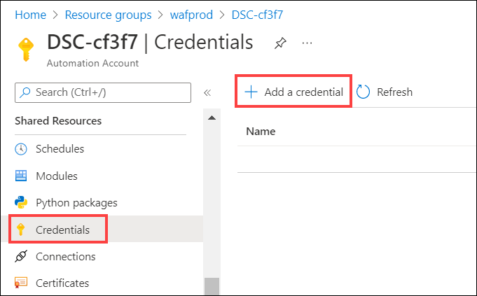
   
9. Fill following details:
 * Name: **user-credentials (1)**
 * Description: Give a description **(2)**
 * Username: **INJECTKEYS** **(3)**
 * Password: **(4)**
 * Confirm Password: **(5)**
 * Click on **Create (6)**.

   

10. From left pane, scroll to _Process Automation_ and select **Runbooks** and then select **stop-prod-vms**. 

   

11. On the Overview page, select **Edit**.

   

12. Fill in the following details:
 * Line 1: **user-credentials**
 * Line 9: **INJECTSUBSID**
 * Line 11: **wafprod**, this could be any resource group in which your VMs are present. In our workload VMs are present in wafprod resource group.
 * Click on **Publish**.

   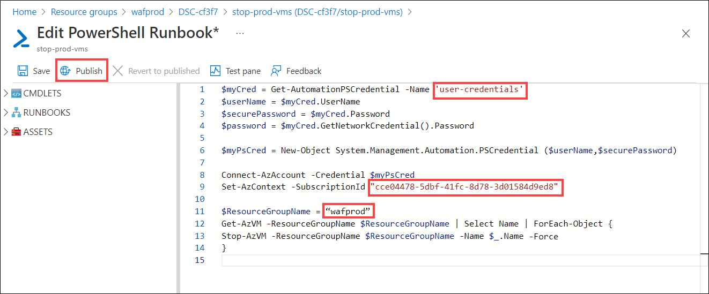

13. Select **Yes** when asked for Publish Runbook - Do you want to proceed.

   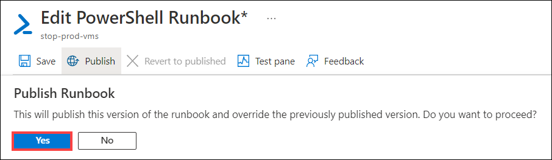

14. Once done, select **Link to schedule** on the Overview page. This is to schedule the ...

   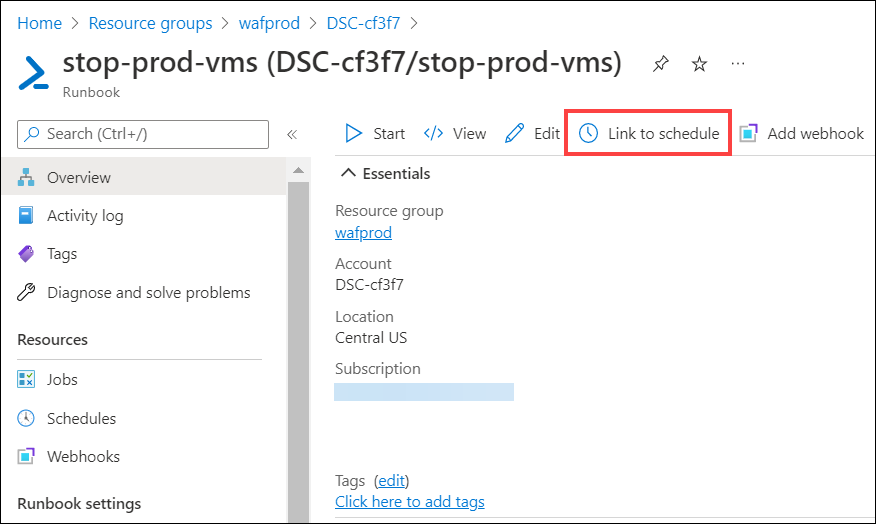

15. Select **Schedule** then **+ Add a schedule**.

   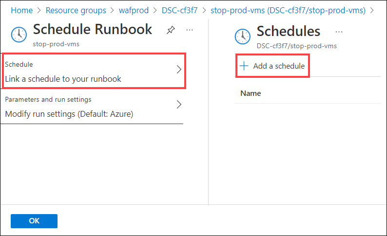

16. Fill in the details as following:
 * Name: **stop-vms**
 * Description: **stop all VMs in wafprod resource group**.
 * Starts: **Enter start time and date**.
 * Time zone: Select your time zone from the drop down.
 * Recurrence: Select **Recurring**.
 * Recur every: Enter the time period of recurrence.
 * Set expiration: Select **Yes**.
 * Expires: **Enter an expiry time and date for the runbook**.
 * Click on **Create**.

   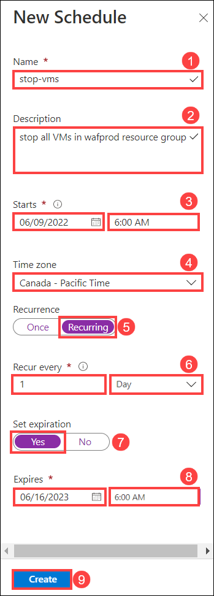
   
17. Click on **OK**.

   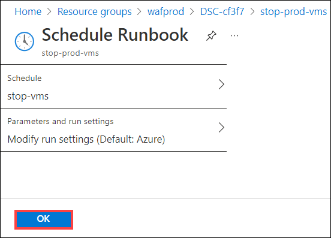

18. Now search for virtual machines in the Azure portal and select **Virtual Machines**.

   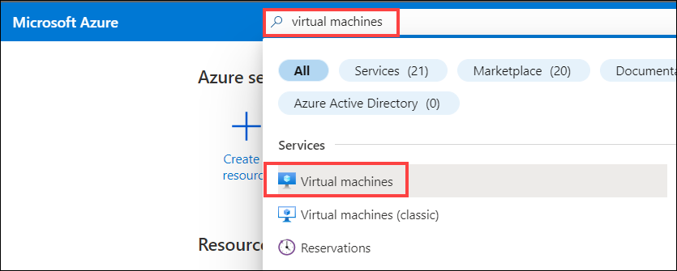

19. Notice that VMs from wafprod resource group are in running state.

   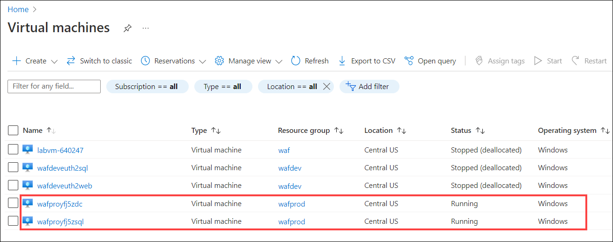

20. Navigate back to the **stop-prod-vms** runbook and click on **Start**. Select **Yes** when asked - _Are you sure that you want to start the runbook?_

   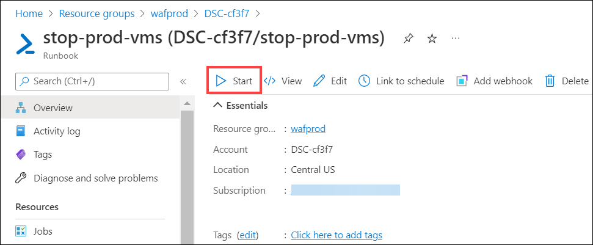

21. By clicking on Start button, it will take you to the Jobs page. In the **Output** section you can monitor the execution of the script. Keep on refreshing until it shows status of both the VMs as **succeeded**.

   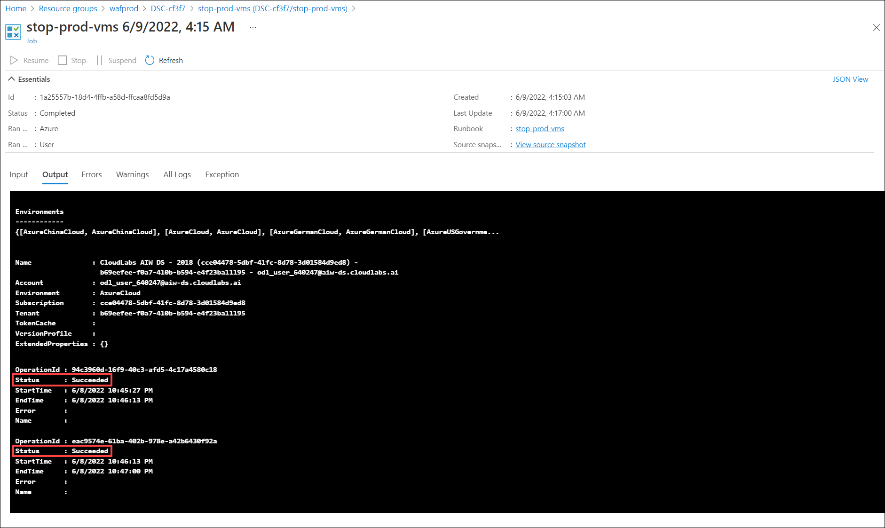

22. Go back to **Virtual Machines** and observe the status of both the machines present in wafprod resource group. It will show up as **Stopped(deallocated)**.

   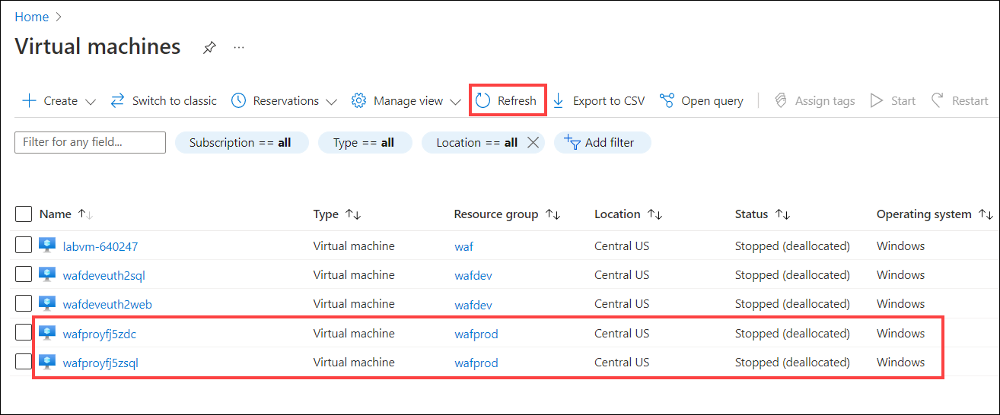

 > **Note:** Click on **Refresh** if the VMs don't reflect latest status.


### **Task 6: Resize a Virtual Machine**

You can lower cost by managing the size of the VMs. 

1. In the Azure portal, click on **Show portal menu (1)** and select **Resource groups(2)**.

   
   
2. Open **wafprod** resource group and select a vitrual machine.

   
   
3. Select **Size** present under _Settings_ pane.

   
   
4. From the list of available sizes, click on **B1s** size to select it and then click on **Resize** button.

   

 > **Note:** B-series burstable VMs are ideal for workloads that do not need the full performance of the CPU continuously, like web servers, small databases and development and test environments. TThe B-Series provides these customers the ability to purchase a VM size with a _**price conscious baseline performance**_ that allows the VM instance to build up credits when the VM is utilizing less than its base performance. When the VM has accumulated credit, the VM can burst above the VM’s baseline using up to 100% of the CPU when your application requires the higher CPU performance.

5. Go back to **Overview** page and verify the VM size. 

   


<p> &#11088; For a D2s_v3 which has 2 vCPUs and 8 GiB of memory the hourly rate is $0.227 per hour (monthly $163.83) and for B1s with 1 vCPU and 1 GiB memory the rate is $0.031 per hour (monthly $21.85). This results in savings! </p>


### **Task 7: Move to PAAS**

Infrastructure as a service (IaaS) and platform as a service (PaaS) are cloud service models.

* IaaS provides users with remote access to computing resources such as servers, storage, and networks. This infrastructure is hosted and managed by the IaaS provider. Customers access hardware and resources over the internet.

* PaaS, on the other hand, provides a framework for creating and implementing apps. 

* In the same way as IaaS hosts and maintains the platform's servers, networks, storage, and other computing resources, PaaS hosts and maintains the platform's servers, networks, storage, and other computing resources. 

* However, PaaS also covers tools, services, and systems that aid in the development of web applications. The platform allows developers to create apps without having to worry about backups, security, upgrades, or other administrative responsibilities. 

* The infrastructure cost is incorporated in the service pricing model with PaaS. For example, you can provision a lower SKU virtual machine as a jumpbox. Storage and managing a separate server come at an added cost. On the virtual machine, you must additionally configure a public IP address, which is not suggested. All of these expenditures are taken into account by a managed service like Azure Bastion, which provides improved protection.

* Use PaaS instead of IaaS wherever possible. IaaS is similar to owning a box of spare parts. You can construct anything, but you must put it together yourself. PaaS alternatives are simpler to set up and manage. Virtual machines (VMs) and virtual networks are not required. You also won't have to deal with routine maintenance such as installing patches and updates.

Here's an architecture of the workload on both IaaS and PaaS:

**IaaS Architecture**

   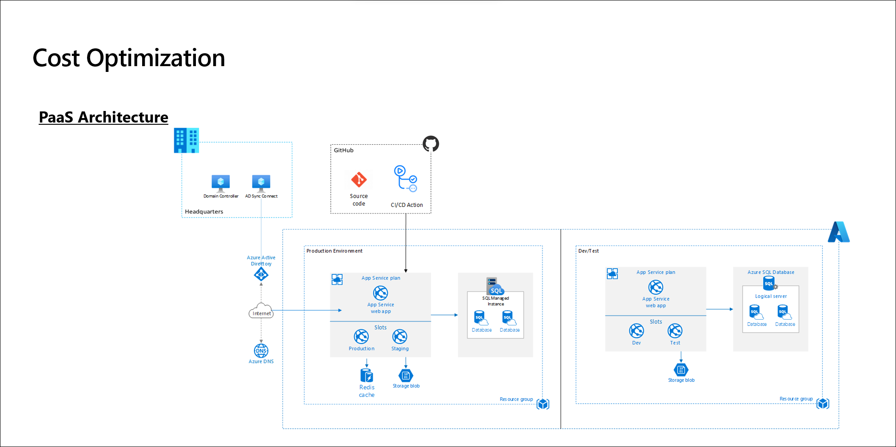


**PaaS Architecture**

   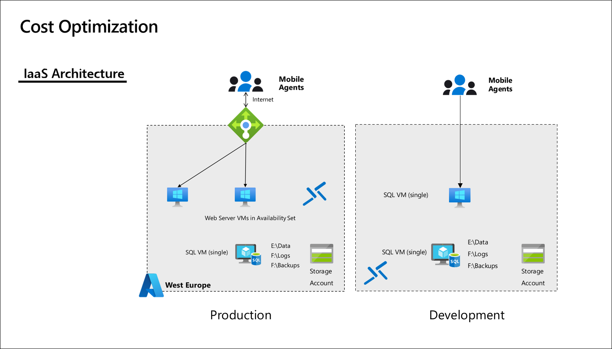


