# Exercise 2: Operational-Excellence

## Overview

**Operational excellence** apply reliable, predictable, and automated operations processes to your architecture to keep an application running in production.

It covers the operations and processes that keep an application running in production. Deployments must be reliable and predictable. Automate deployments to reduce the chance of human error. Fast and routine deployment processes won't slow down the release of new features or bug fixes.


### Task 1: DevOps

To activate resources on demand, deploy solutions rapidly, minimize human error, and produce consistent and repeatable results, we should automate deployments and updates. Complex issues may not always be able to be identified in a timely manner. However, with good automation, detection of these issues should occur quickly.
 
Once a process is automated, training and maintenance can be greatly reduced or eliminated. This frees engineers to spend less time on manual processes and more time on automating business solutions.

The different types of automation includes:

#### 1. Infrastructure deployment:

As businesses move to the cloud, they need to repeatedly deploy their solutions and know that their infrastructure is in a reliable state. To meet these challenges, you can automate deployments using a practice referred to as infrastructure as code. In code, you define the infrastructure that needs to be deployed.

-There are many deployment technologies you can use with Azure. Here are three examples that uses declarative approach:

 * Azure Resource Manager (ARM) templates
 * Azure Bicep
 * Terraform


#### 2. Infrastructure configuration

If you don't manage configuration carefully, your business could encounter disruptions such as system outages and security issues. Optimal configuration can enable you to quickly detect and correct configurations that could interrupt or slow performance.

- When creating new resources on Azure, you may take advantage of configuration as code to bootstrap the deployment.

- Configuration tools can also be used to configure and manage the ongoing state of deployed resources.

#### 3. Operational tasks

As the demand for speed in performing operational tasks increases over time, you are expected to deliver things faster and faster. Manually performing operational tasks will fail to scale as demand increases. This is where automation can help. 

To meet on-demand delivery using an automation platform, you need to develop automation components (such as runbooks and configurations), create integrations to systems that are already in place efficiently, and operate and troubleshoot.

The advantages of automating operational tasks include:

 * Optimize and extend existing processes.
 * Deliver flexible and reliable services.
 * Lower costs.
 * Improve predictability.


### Task 2: Deployment

In this task, you will learn to deploy and implement Azure Policy using ARM Template. Here, you will be working with "Add a tag to resources" policy. You can add tags to your Azure resources as metadata items. They are key-value pairs that help you in finding resources based on conditions that matter to your organization. 

Add a tag to resources policy puts tags on resources that are newly created under your subscription/resource group. For existing resources, you can remediate those by triggering a remediation task. In addition, you will see how to run remediation tasks for existing resources in your workload.

1. In the Azure search box, enter **Deploy a custom template** and select it.

     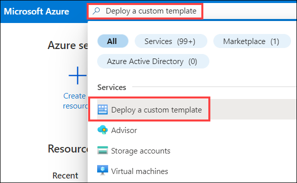

2. On the Custom deployment page, click on **Build your own template** in the editor.

     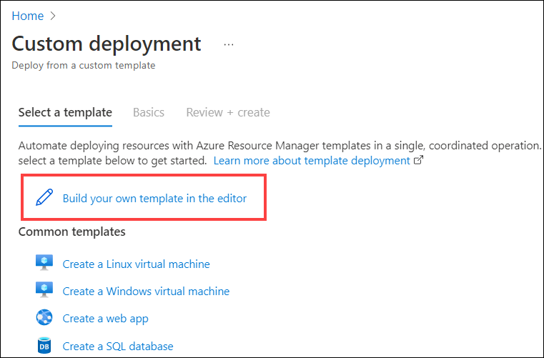
     
3. Click on **Load file (1)** option on the edit template page. From the **C:\LabFiles (2)** directory, select the **azpolicy-addtag.json (3)** file and click on **Open (4)**.

     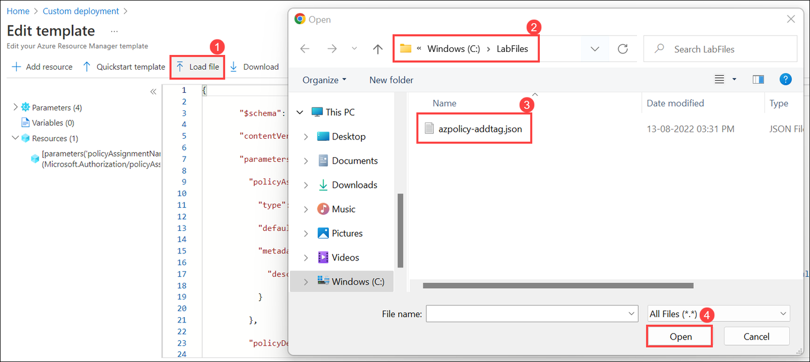

4. Go through the whole ARM Template in the Edit template console, and click on **Save**.

     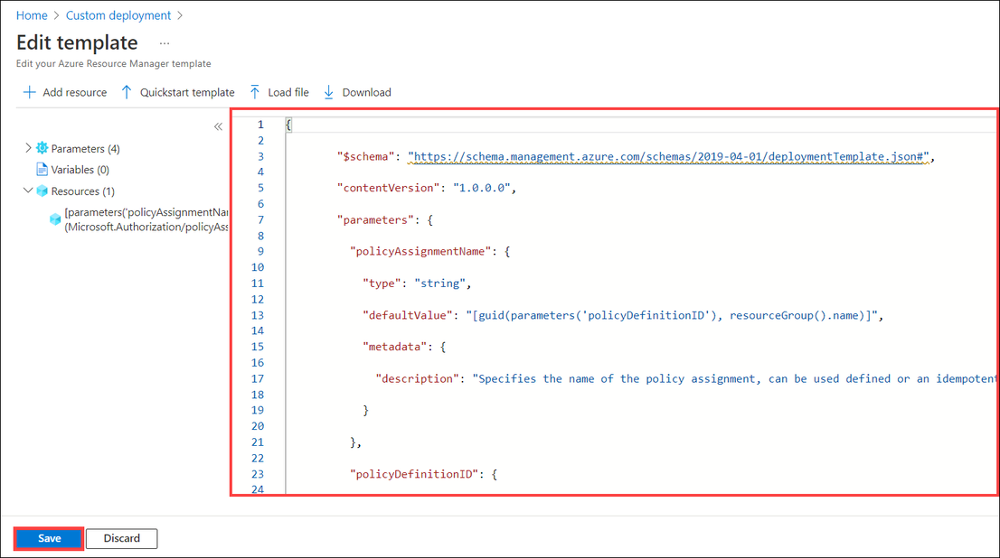

5. On the Custom deployment page, on the Basics tab,  provide the following details.

   * **Subscription**: Subscription will be selected by default.
   * **Resource Group**: Select **waf-prod (2)** from the drop down.
   * **Tag Name**:  Enter **environment (3)**. You can give a name of your choice too.
   * **Tag Value**:  Enter **production (4)**. You can give a name of your choice too.
   * Leave all the other values as default and click on **Review + Create (5)**.

    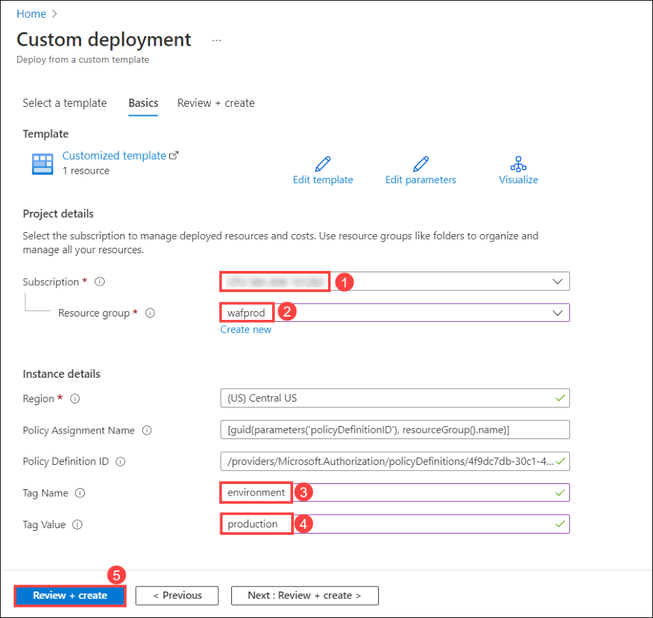

6. Finally, click on **Create**.

    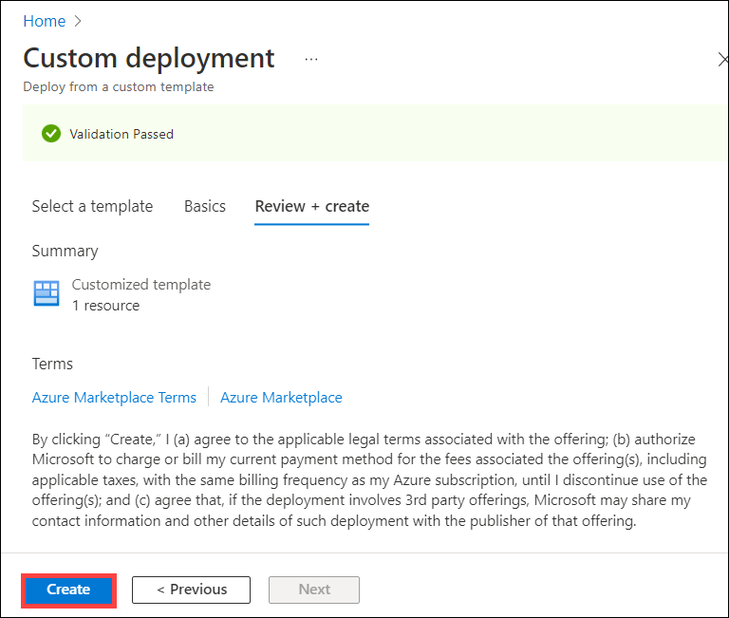
   
7. In the Azure search box, enter **Resource groups** and select it.
   
    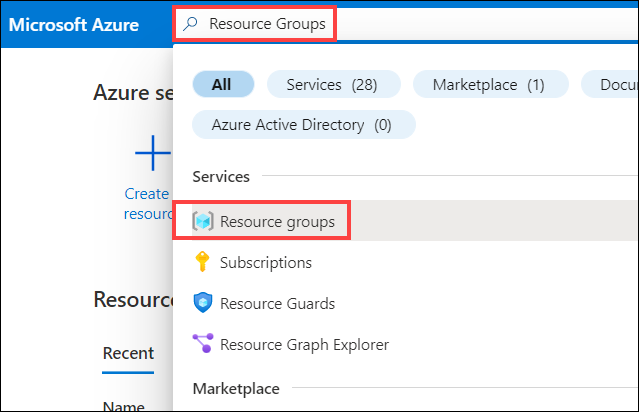

8. From the left navigation pane, select **policies** under settings.

    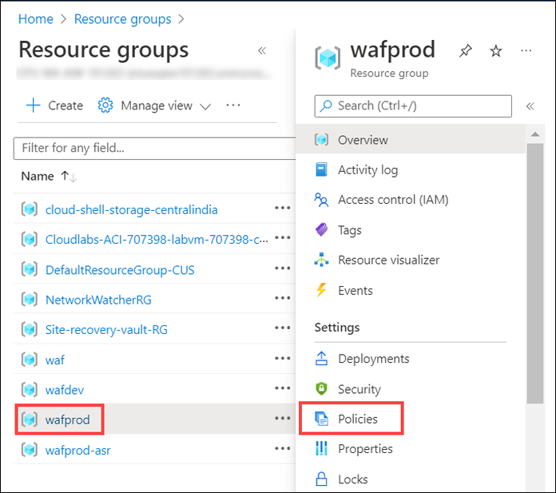

9. On the **Policy** pane, click on **Assignments** section and observe that the policy with name **Add a tag to resources** is assigned to the wafprod resource group.

    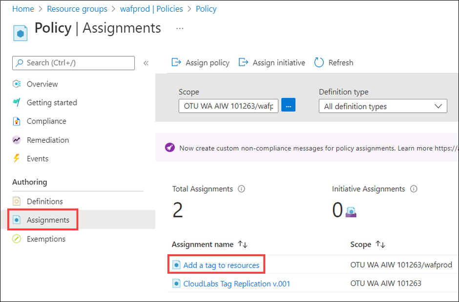
    
10. Click on **Add a tag to resources** policy and observe the **tagName** and **tagValue** in the parameters section of the policy.

    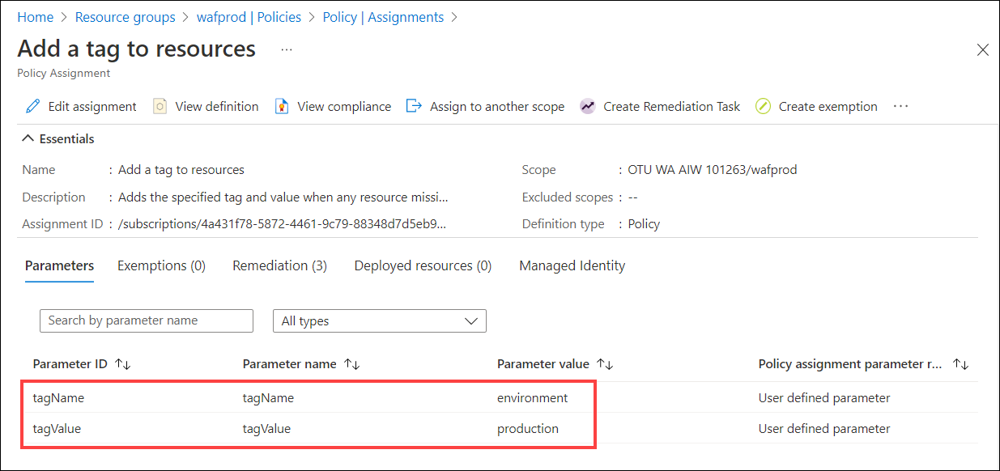
    
11. On the **Policy** page, click on **compliance** and select the tag **Add a tag to resources**.

    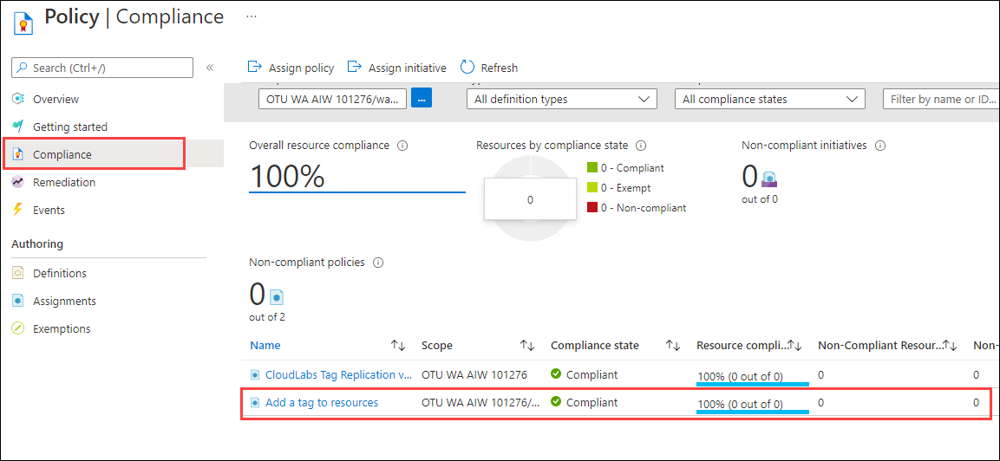

12. On the add a tag to resources page, click on **edit assignment**.

    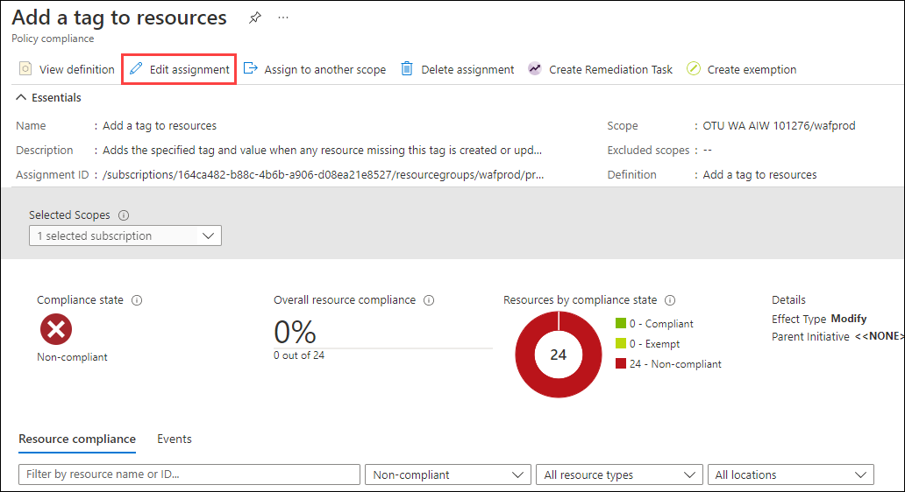

13. Leave all configurations to default and click on **Remediation** tab.

    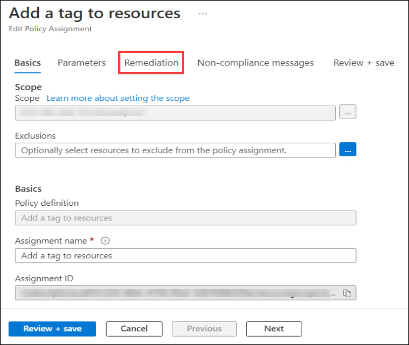

14. Check the button with **Create a remediation task (1)** option under **Remediation**. Select **Review + Save (2)**, followed by **Save (3)**.

    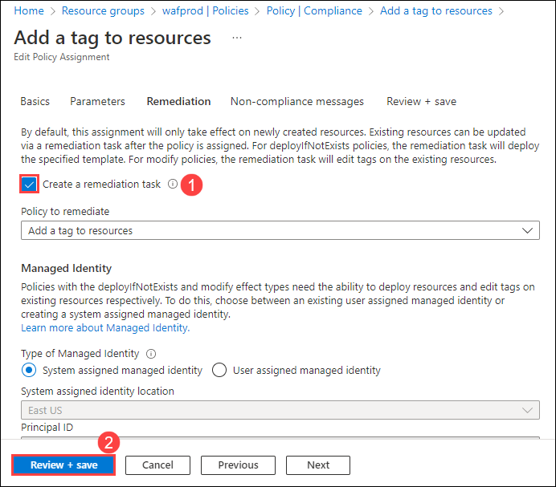
    
    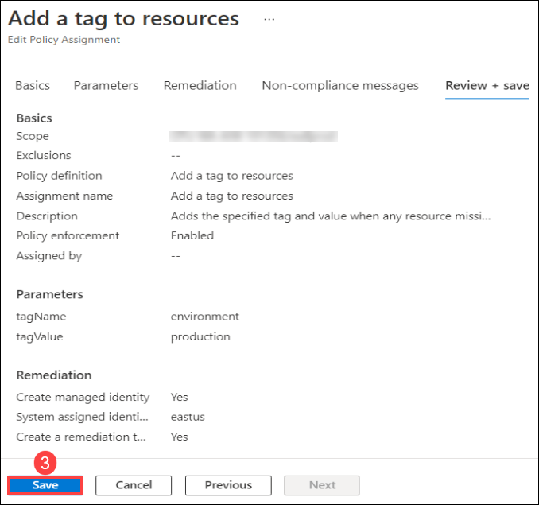

15. Go back to **Policy** pane and click on **remediation**. Observe that the remediation task is **In progress** state under Remediation tasks. 

      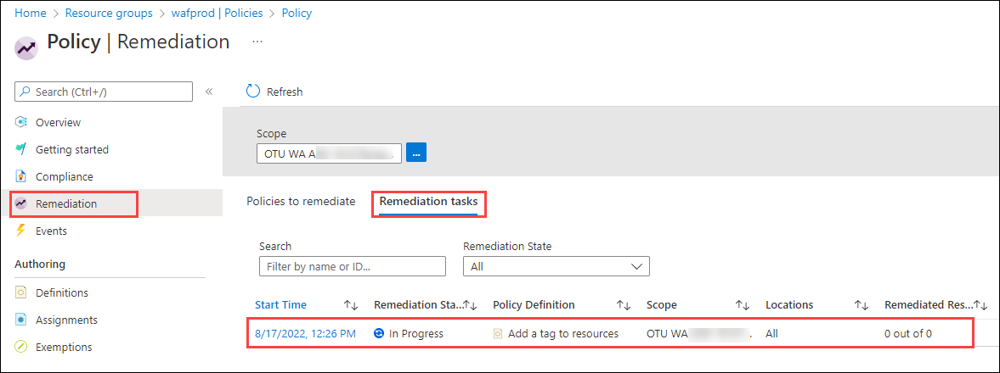


> **Note:** Wait until the **Remediation State** is successful. It can take upto 10 minutes for it to get completed.
    
16. In the Azure portal `https://portal.azure.com`, select the Azure Cloud Shell icon from the top menu.

     


17. In the Cloud Shell window that opens at the bottom of your browser window, select **PowerShell**.

      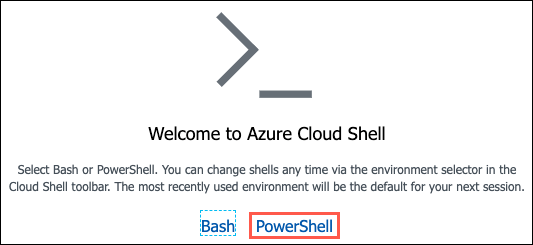

18. After a moment, a message is displayed that you have successfully requested a Cloud Shell, and you are presented with a PS Azure prompt.

      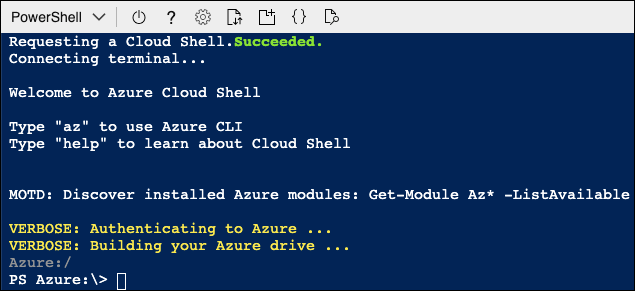
    
19. At the prompt, enter the following PowerShell command to retrieve all the resources with the specified tags. Observe the tagname and tagvalue under each resource in the output section.

    ```
    Get-AzResource -ResourceGroupName "wafprod" -TagName "environment" -TagValue "production"
    ```
   
     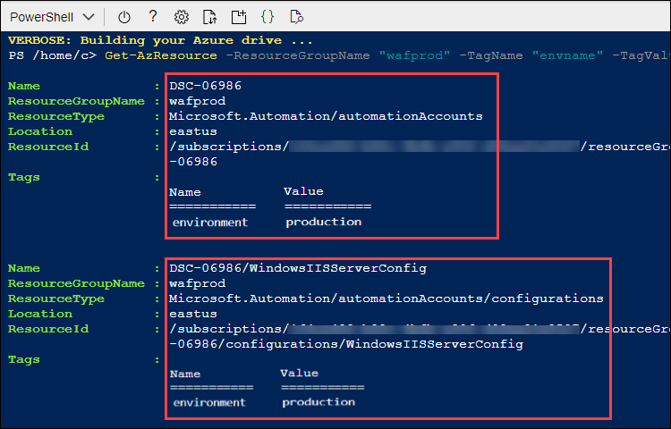


### Task 3: Monitor 

In this task, you will be creating an automated workflow that integrates two services, an RSS feed for a website and an email account using logic app. The RSS connector has a trigger that checks an RSS feed, based on a schedule. The Office 365 Outlook connector has an action that sends an email for each new item.

After you create and run a Consumption logic app workflow, you can check that workflow's run status, trigger history, runs history, and performance. To get notifications about failures or other possible problems, set up alerts. In this task we will perform all the operations such as creating alerts, checking on the run status, and trigger history.

#### **A. Create a Logic App**

1. In the Azure search box, enter **Deploy a custom template** and select it.

   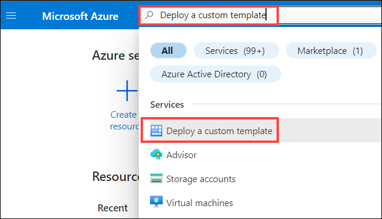
   
2. On the Custom deployment page, click on **Build your own template in the editor**.

   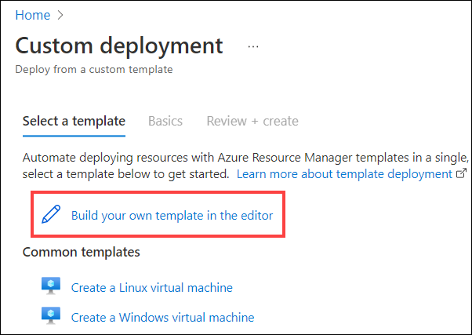

3. Click on the **Load file (1)** option on the edit template page. From the **C:\LabFiles (2)** directory, select the **logicapp.json (3)** file and click on **Open (4)**.

    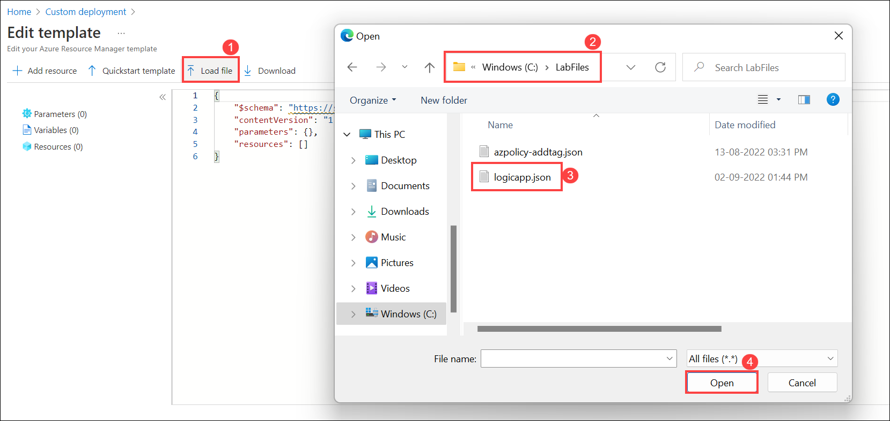

4. You can go through the whole ARM Template in the Edit template console. This template creates a Consumption logic app workflow that uses the built-in Recurrence trigger, which is set to run every hour, and a built-in HTTP action, which calls a URL that returns the status for Azure. Built-in operations run natively on the Azure Logic Apps platform. 

5. After reviewing the template, click on **Save**.

    

6. On the **Custom deployment** page, on the Basics tab, provide the following details for your logic app:

   * **Subscription**: Make sure the subscription is selected by default **(1)**.
   * **Resource Group**: Select **wafprod (2)** from the drop down 
   * **Logic App name**: Enter **waf-logic-app (3)**. You can give a name of your choice too.
   * Leave all the other values as default and click on **Review + Create (4)**.
    
   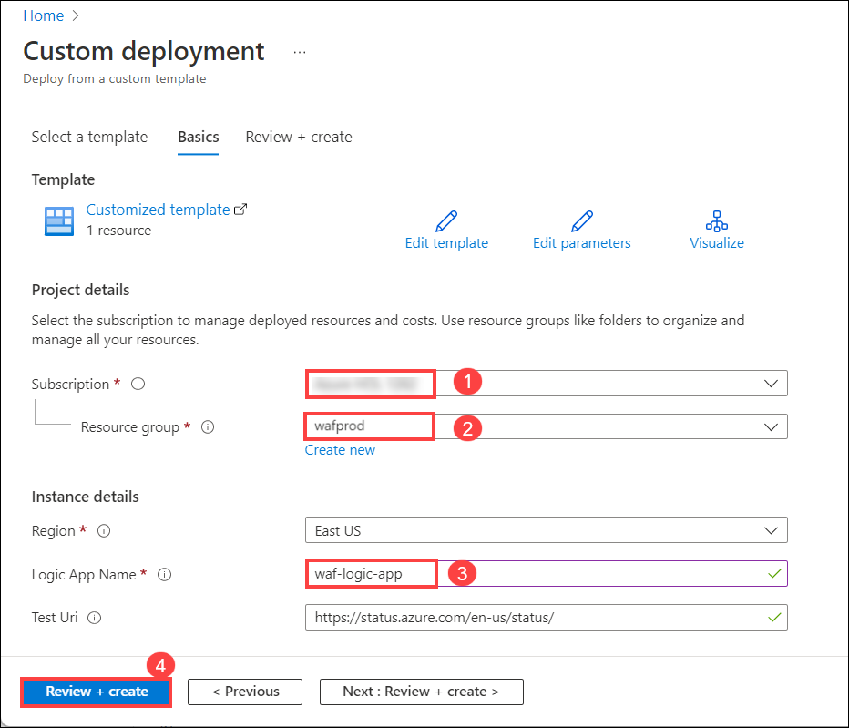
   
7. At last, click on **Create**.

   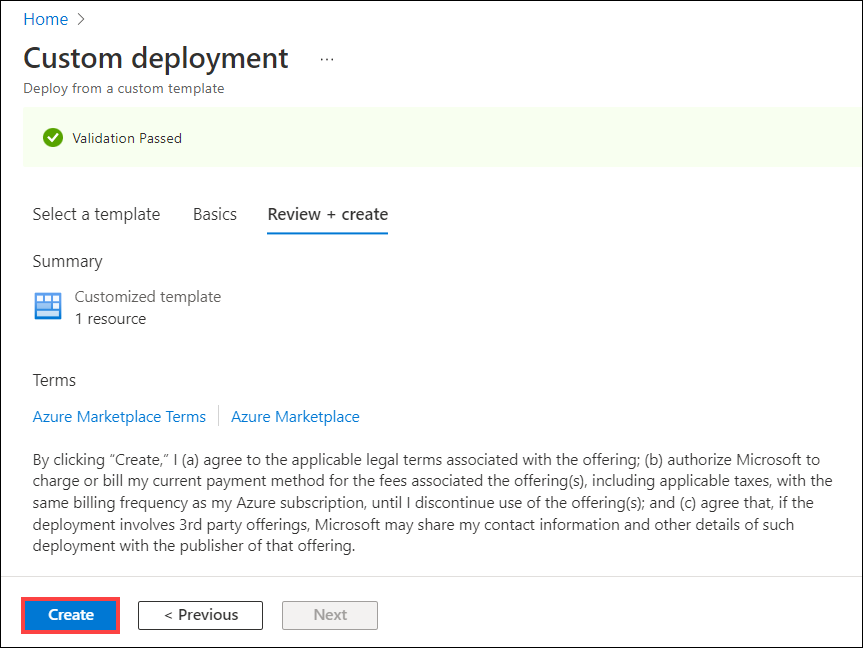

8. After Azure successfully deploys your app, select **Go to resource**.

   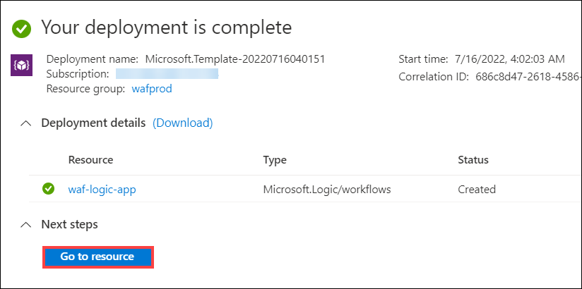
   
9. Select Logic App Designer from the left pane and click on **Templates**. 

   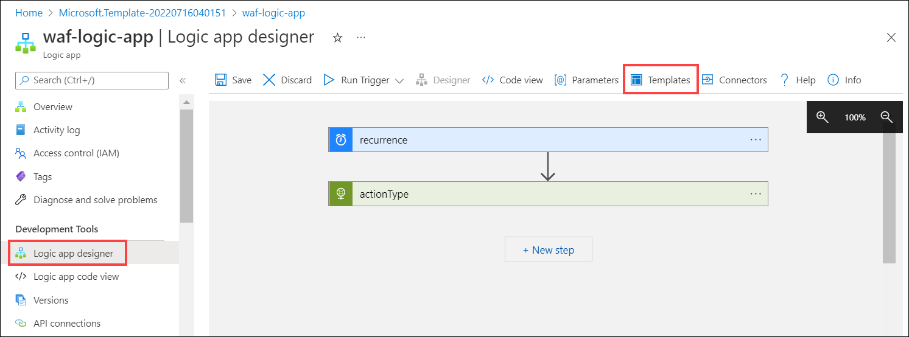
 
  > **Note:** Click on **OK** when asked for **Discard changes**.
  
10. Scroll down to the Templates section and select **Blank Logic App**.

    

11. In the designer search box, select **All** and enter **rss**. From the Triggers list, select the RSS trigger, **When a feed item is published**.
 
    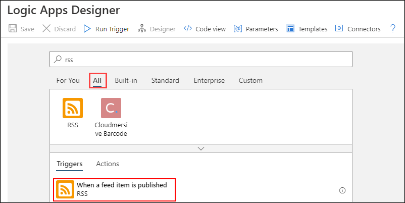
   
12. Provide the following information in the trigger details page:

    * **The RSS feed URL**: `https://feeds.a.dj.com/rss/RSSMarketsMain.xml` (1)
    * **Chosen property will be used to determine**: PublishDate (2)
    * **Interval**: 1 (3)
    * **Frequency**: Minute (4)
    * click on **New step (5)**

    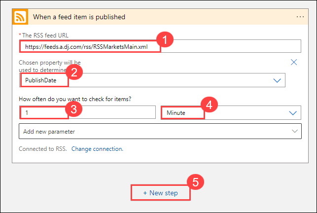
   
13. Enter `Send an email (V2)` in the filter box, then select the **Send an email (V2)** action for Office 365 Outlook.

    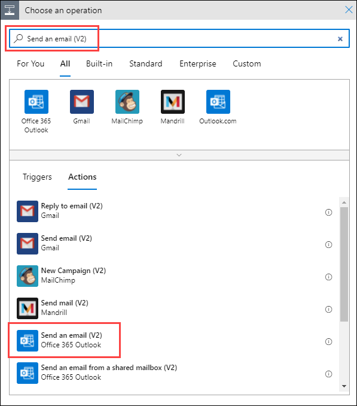
   
14. Select **Sign in** and sign in to your Office 365 Outlook account. Use the login credentials given below:

   * Email/Username: **<inject key="AzureAdUserEmail"></inject>**
   * Password: **<inject key="AzureAdUserPassword"></inject>**
   * If you are presented with **Help us protect your account** dialog box, then select **Skip** for now option.

     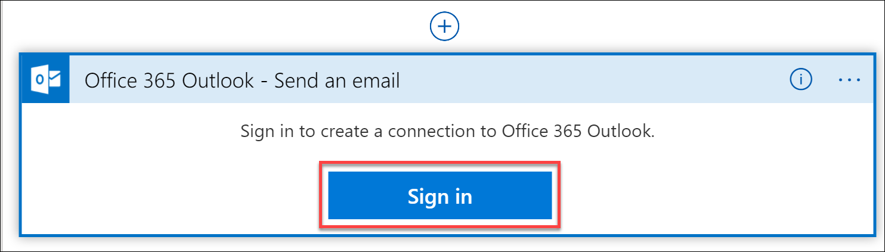
   
> **Note:** If you face any sign in issue, please refer to [this](https://github.com/CloudLabsAI-Azure/Know-Before-You-Go/blob/main/AIW-KBYG/Azure%20Well-Architected%20Framework.md#1-exercise-2---task-3---create-a-logic-app--step-no-14).
   
15. In the Send an email form, provide the following values:

    * Enter your email address in the **To** box.
    * **Subject**: Enter **New RSS item:** and from the Add dynamic content list, under When a feed item is published, select **Feed title**.
    * **Body**: Enter **Date published:** and from the Add dynamic content list, under When a feed item is published, select **Feed published on**.

    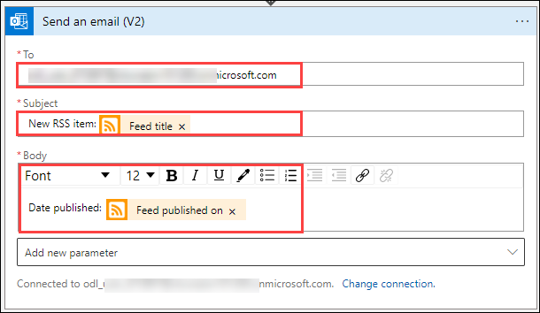

> **Note:** In case if dynamic content is not listed, click on **See more** to view the list.

   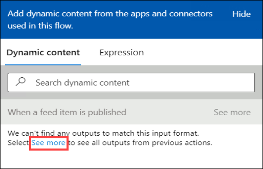

16. On the designer toolbar, select **Save** to save your logic app.

    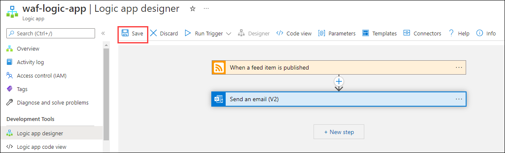
    
17. Select **Run Trigger** to execute the Logic App. If the RSS feed has new items, your workflow sends an email for each new item. Otherwise, your workflow waits until the next interval to check the RSS feed again.

     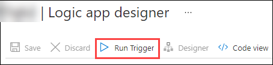
   
18. The following screenshot shows a sample email that's sent by the workflow.

     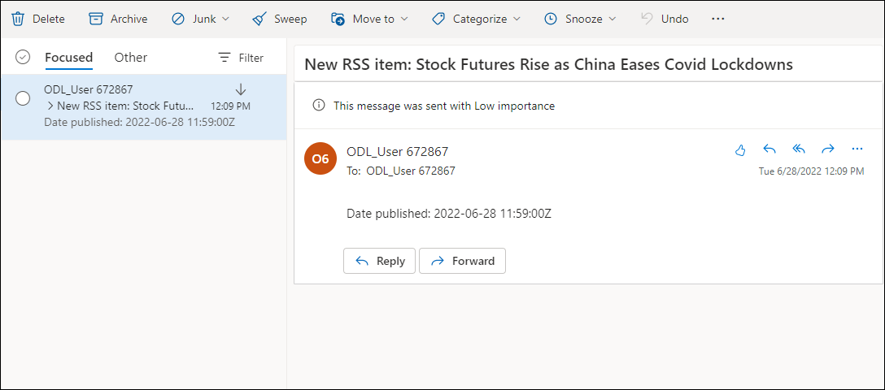


#### **B. Monitor the Workflow of the Logic App**

1. In the Azure search box, enter **logic apps (1)**, and select **Logic apps (2)**.

   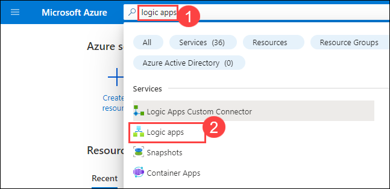
   
2. Select your logic app with the name **waf-logic-app**. 

   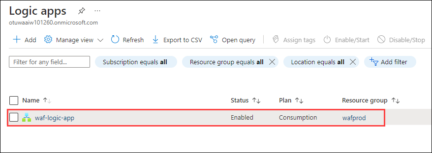
   
3. On your logic app's menu, select **Overview** and select **Trigger history**. Under **Trigger history**, all trigger attempts appear. Each time the trigger successfully fires, Azure Logic Apps creates an individual workflow instance and runs that instance.

   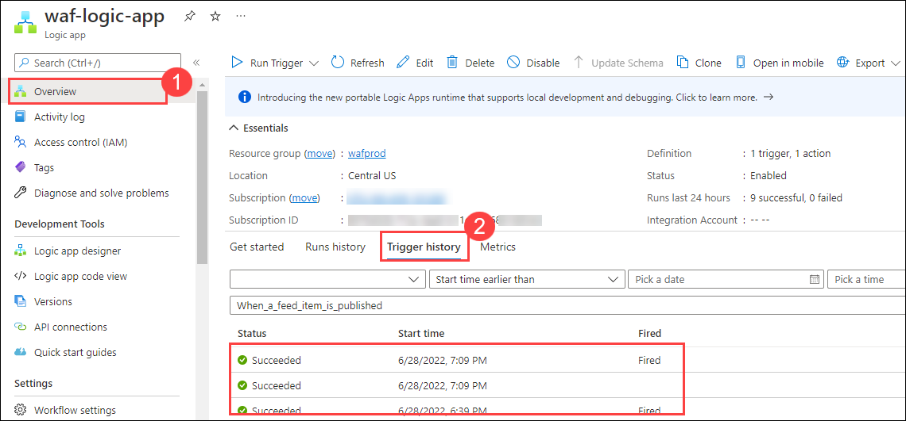
   
4. To view information about a specific trigger attempt, select that trigger event.
  
5. You can now review information about the selected trigger event.

   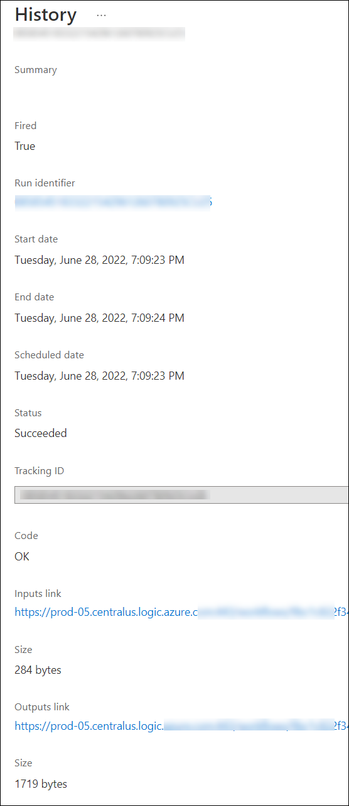
   
6. Go back to the logic app's **Overview** pane and select **Runs history**. Under **Runs history**, you can see all the past, current, and any waiting runs appear.

   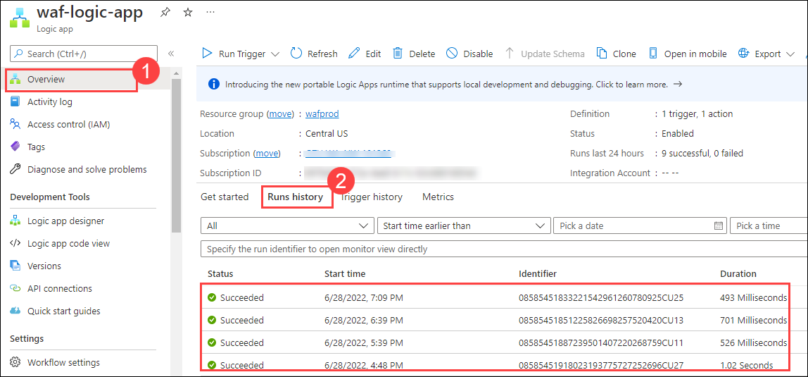
   
7. To view information about a specific run, select that run. The **Logic app run** pane shows each step in the selected run, each step's run status, and the time taken for each step to run,

     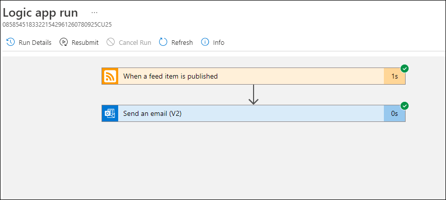
     
8. Click on **Run Details** and you will be able to view the run information in list form.

   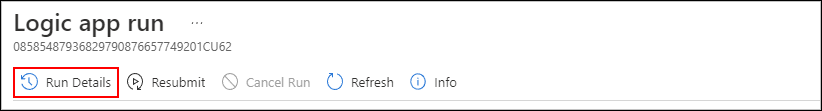
   
   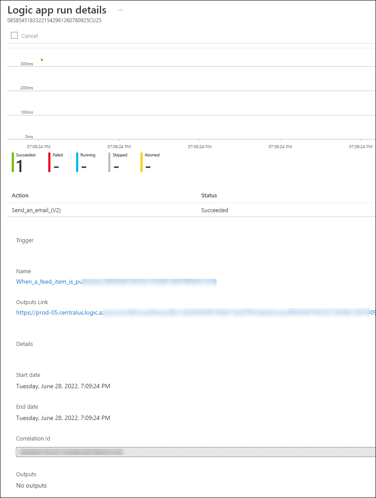
   
9. Go back to your logic app menu, under **Monitoring**, select **Alerts**.

   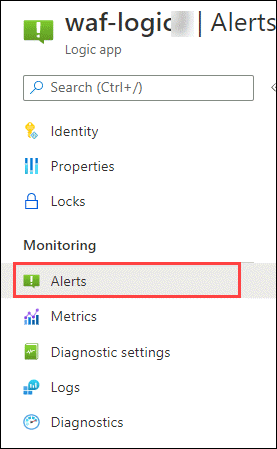
   
10. On the alerts toolbar, click on **Create (1)** and select **Alert rule (2)**.

    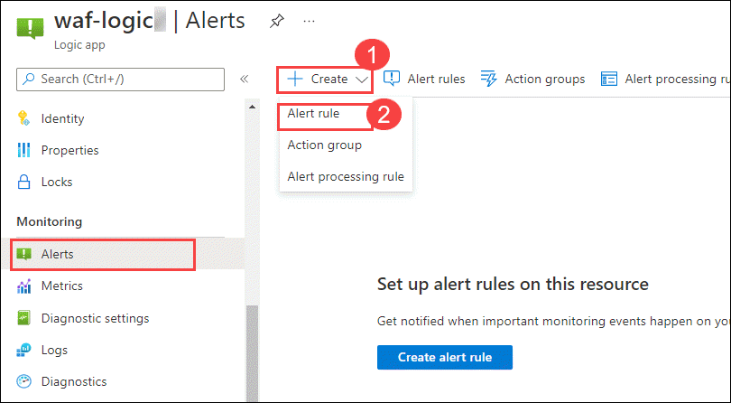
    
11. In the **Select a signal** pane, in the **Signal name** column, find and select the **Triggers Failed** signal.

    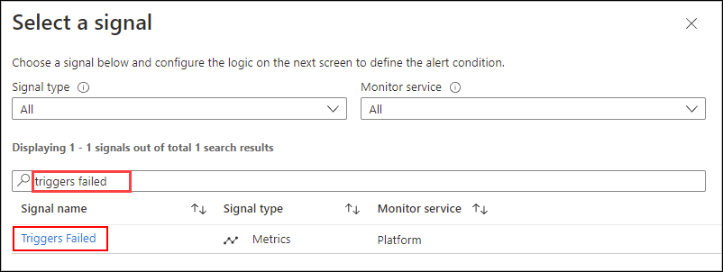
    
12. On the **Configure signal logic** pane, under **Alert logic**, set up your condition with the following details:

    * **Operator**: Greater than or equal to
    * **Aggregation type**: Count
    * **Threshold value**: 1
    * **Unit**: Count
    * **Aggregation granularity (Period)**: 1 minute
    * **Frequency of evaluation**: 1 Minute.
    
    
   
13. The **Create an alert rule (1)** page now shows the condition that you created and the cost for running that alert. Click on **Details (2)** tab.

    
    
14. On the **details** page, provide the below details:

    * **Subscription**: Select your default susbcription (1)
    * **Resource Group**: waf-prod (2)
    * **Severity**: 3 - Informational (3)
    * **Alert rule name**: waf-alert (4)
    * Click on **Review + create** (5)

     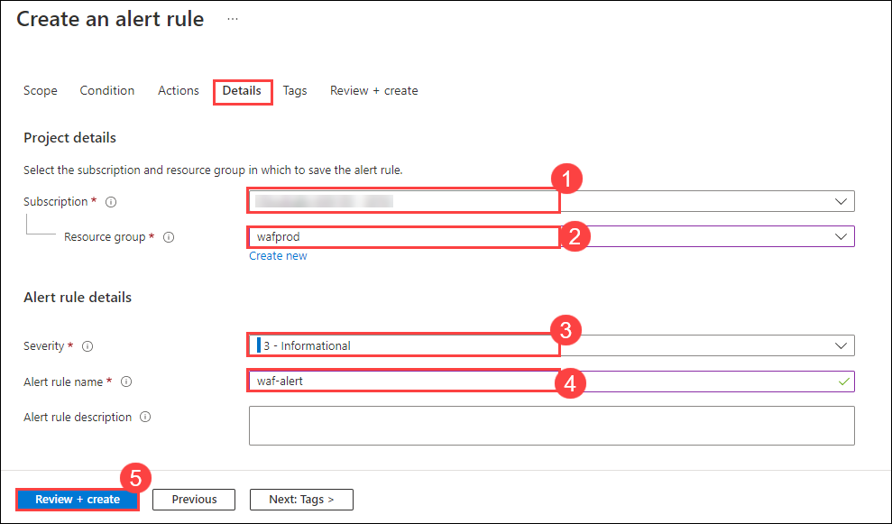
   
15. On the review page, go through all the details and click on **Create** to create the alert rule.

     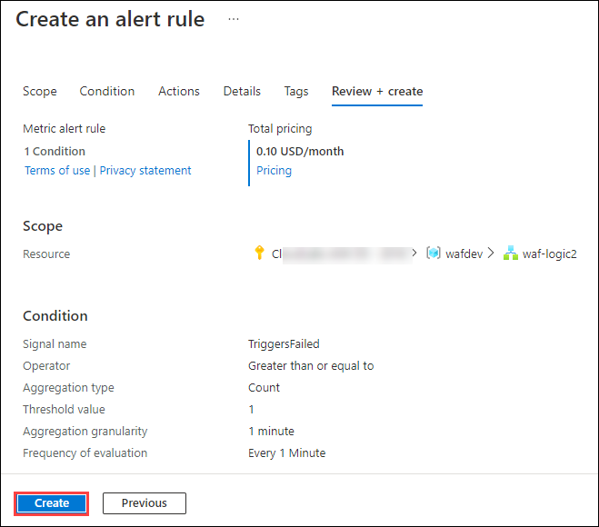
    
16. Once the alert is created, it will look similar to the image shown below. 

    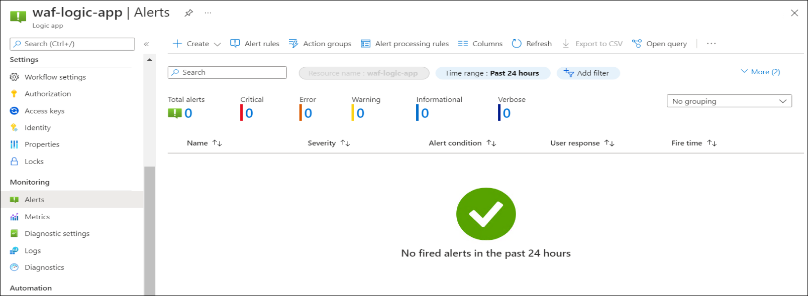

### Task 4: Configure Azure Automatic VM guest OS patching 

Enabling automatic VM guest patching for your Azure VMs helps ease update management by safely and automatically patching virtual machines to maintain security compliance.

 - Patches categorised as Critical or Security are downloaded and installed on the VM automatically.
 - Azure oversees patch orchestration, and availability-first principles are used to apply patches.
 - Patches are installed during off-peak times in the time zone of the VM.
 - Patching failures are tracked by monitoring virtual machine health, as defined by platform health signals.
 - Ideal for all VM sizes.

In this task, you will learn how to enable Azure Automatic VM guest OS patching.

1. In the Azure portal, select the Azure **Cloud Shell** icon from the top menu.

   

2. In the Cloud Shell window that opens at the bottom of your browser window, select **PowerShell**.

   

3. After a moment, a message is displayed that you have successfully requested a Cloud Shell, and you are presented with a PS Azure prompt.

   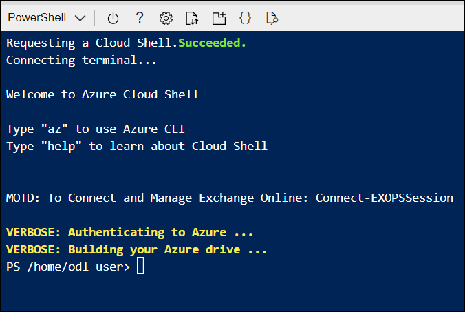

4. Copy the following command into a text editor to enable automatic VM guest patching for your Azure virtual machines. Here we will work with the **wafproxxxxdc** virtual machine from the **wafprod** resource group.

   ```
   az vm update --resource-group [resource group name] --name [virtual machine name] --set osProfile.windowsConfiguration.enableAutomaticUpdates=true osProfile.windowsConfiguration.patchSettings.patchMode=AutomaticByPlatform
   ```

5. Replace **[resource group name]** and **[virtual machine name]** with **wafprod** and **wafproxxxxdc** virtual machine name, respectively. The command will look similar to the below.

   ```
   az vm update --resource-group wafprod --name wafprok4syndc --set osProfile.windowsConfiguration.enableAutomaticUpdates=true   osProfile.windowsConfiguration.patchSettings.patchMode=AutomaticByPlatform
   ```

> **Note:** Virtual Machine name will be different for you, as the one in the above command is just for example.

6. Paste the command and hit enter. You will see the output once the command is executed successfully.

   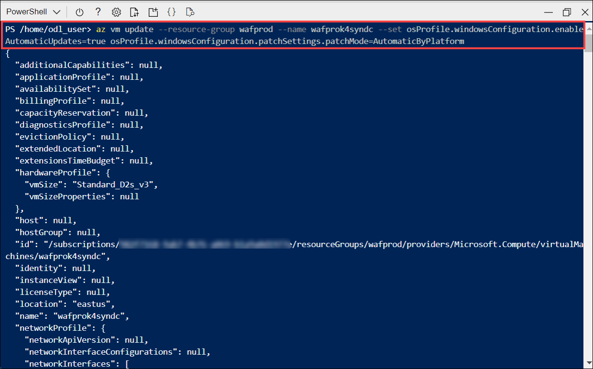

7. To verify whether automatic VM guest patching has completed and the patching extension is installed on the VM, you can review the VM’s instance view. Copy the below command in the text editor.

   ``` 
   az vm get-instance-view --resource-group [resource group name] --name [virtual machine name]
   ```

8. Replace **[virtual machine name]** with your virtual machine's name. The command will look similar to the below.

   ```
   az vm get-instance-view --resource-group wafprod --name wafprok4syndc
   ```

> **Note:** Virtual Machine name will be different for you, as the one in the above command is just for example.

9. Paste the command and hit enter. You will see the output once the command is executed succesfully.

   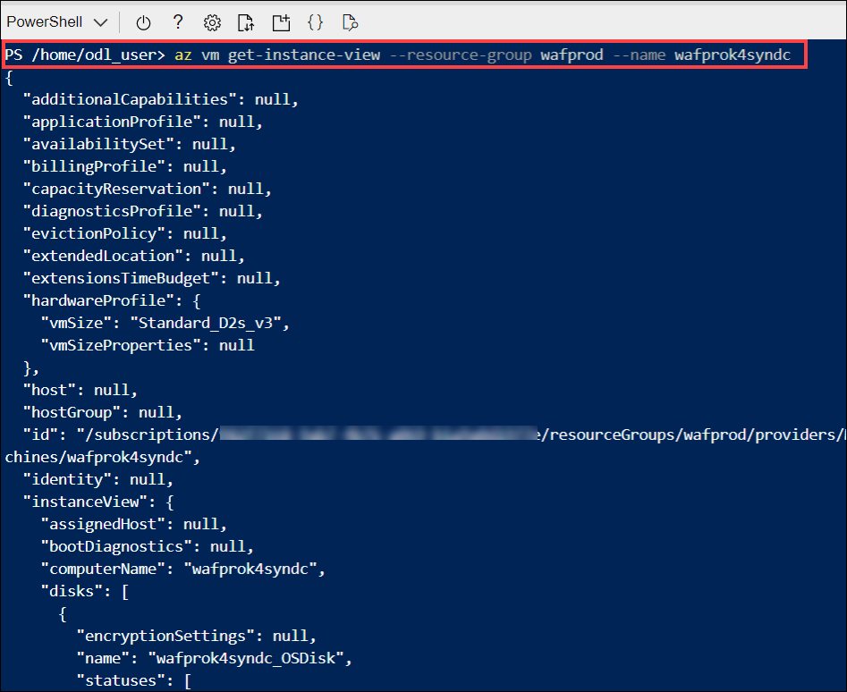

10. Scroll down to view patch settings in windows configuration. It shows that automatic updates are enabled now.

    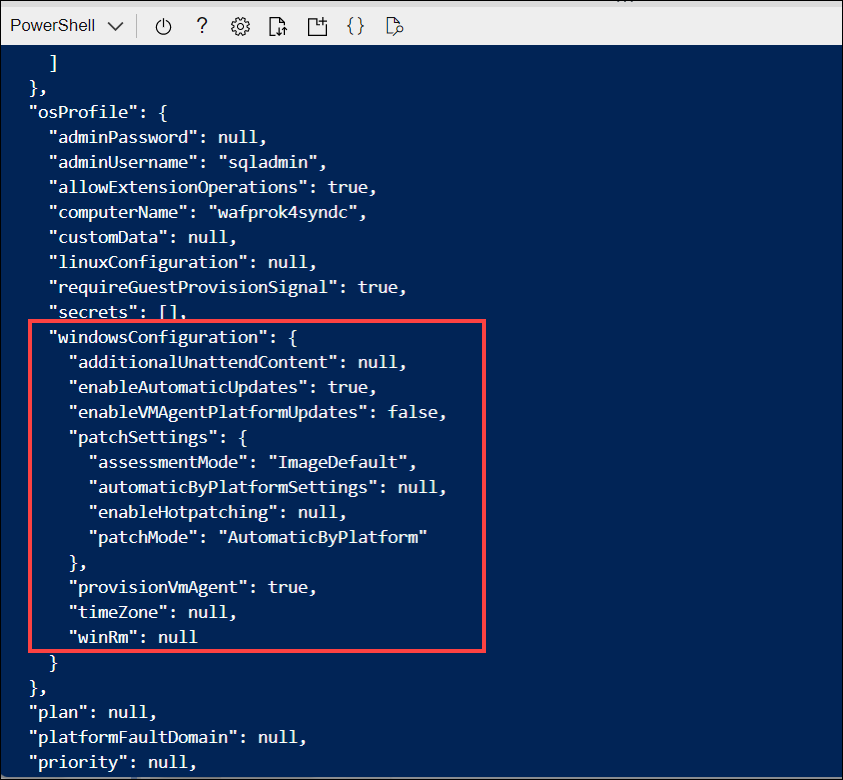

### Task 5: Processes and Cadence (Read-only task)

Anytime you create a project, you must choose a process or process template based on the process model selected for your organization or collection. The work tracking objects contained within the default processes and process templates are Basic, Agile, CMMI, and Scrum.

Basic is the most lightweight and is in a selective Preview. Scrum is the next most lightweight. Agile supports many Agile method terms, and CMMI, which stands for Capability Maturity Model Integration, provides the most support for formal processes and change management.

You can always choose the process that provides the best fit for your team.

#### Basic:

- Choose **Basic** when your team wants the simplest model that uses Issues, Tasks, and Epics to track work.

   

#### Agile:

- Choose Agile when your team uses Agile planning methods, including Scrum, and tracks development and test activities separately.

- This process works great if you want to track user stories and (optionally) bugs on the Kanban board, or track bugs and tasks on the taskboard.


   

#### Scrum:

- Choose Scrum when your team practices Scrum. This process works great if you want to track product backlog items (PBIs) and bugs on the Kanban board, or break down PBIs and bugs into tasks on the taskboard.

   


#### CMMI:

- Choose CMMI when your team follows more formal project methods that require a framework for process improvement and an auditable record of decisions. With this process, you can track requirements, change requests, risks, and reviews.

- This process supports formal change management activities. Tasks support tracking Original Estimate, Remaining Work, and Completed Work.

    


Now, click on the **Next** button from lower right corner to move to the next page.


