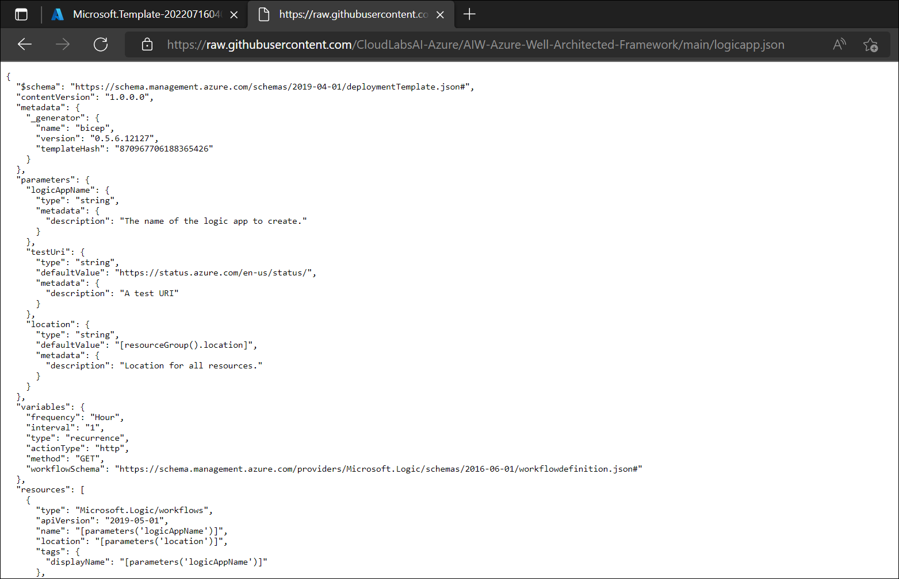
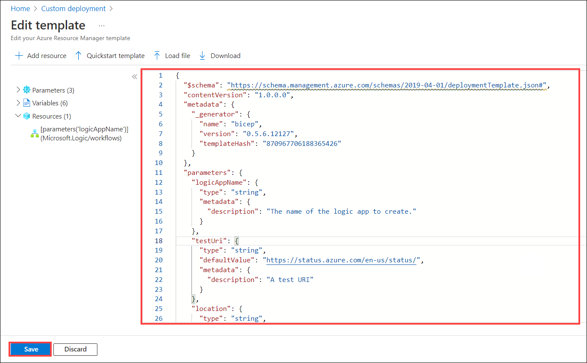
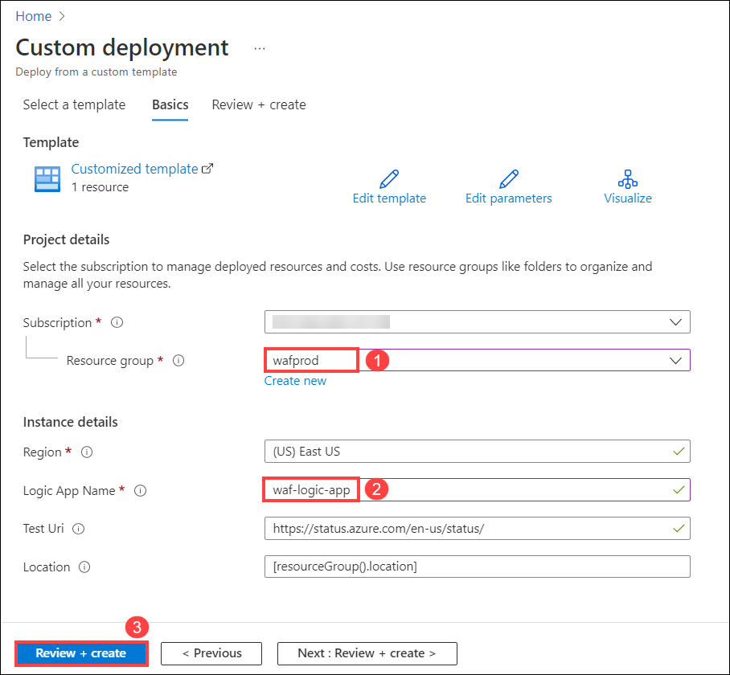
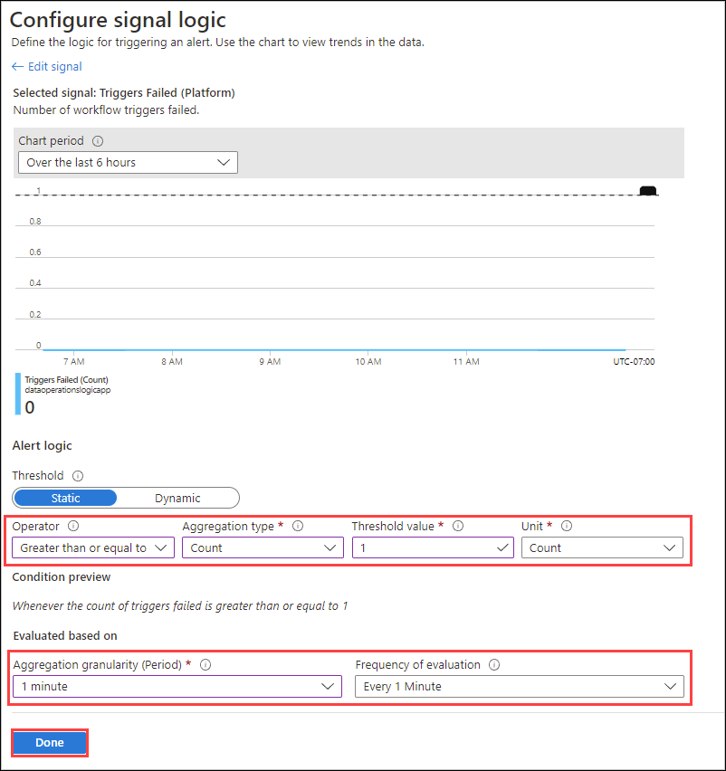
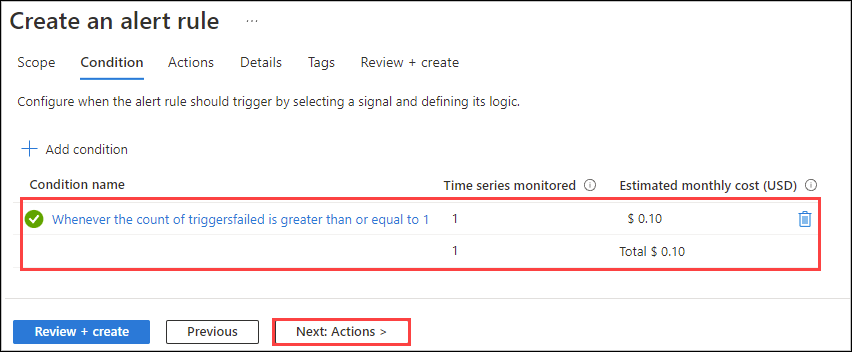

# Exercise 2: Operational-Excellence

## Overview

**Operational excellence** apply reliable, predictable, and automated operations processes to your architecture to keep an application running in production.

It covers the operations and processes that keep an application running in production. Deployments must be reliable and predictable. Automate deployments to reduce the chance of human error. Fast and routine deployment processes won't slow down the release of new features or bug fixes.


### Task 1: DevOps

To activate resources on demand, deploy solutions rapidly, minimize human error, and produce consistent and repeatable results, we should automate deployments and updates.Complex issue may not always be able to be identified in a timely manner. However, with good automation, detection of these issues should occur quickly.
 
Once a process is automated, training and maintenance can be greatly reduced or eliminated. This frees engineers to spend less time on manual processes and more time on automating business solutions.

Thre different types of automation includes:

#### 1. Infrastructure deployment:

As businesses move to the cloud, they need to repeatedly deploy their solutions and know that their infrastructure is in a reliable state. To meet these challenges, you can automate deployments using a practice referred to as infrastructure as code. In code, you define the infrastructure that needs to be deployed.

-There are many deployment technologies you can use with Azure. Here are three examples that uses declarative approach:

 * Azure Resource Manager (ARM) templates
 * Azure Bicep
 * Terraform

-You can automate ARM Template deployment from Azure DevOps. Without going deeper, let's see what is the basic workflow.


#### 2. Infrastructure configuration

If you don't manage configuration carefully, your business could encounter disruptions such as systems outages and security issues. Optimal configuration can enable you to quickly detect and correct configurations that could interrupt or slow performance.

- When creating new resources on Azure, you may take advantage of configuration as code to bootstrap the deployment.

- Configuration tools can also be used to configure and manage the ongoing state of deployed resources.

#### 3. Operational tasks

As the demand for speed in performing operational tasks increases over time, you are expected to deliver things faster and faster. Manually performing operational tasks will fail to scale as demand increases. This is where automation can help. 

To meet on-demand delivery using an automation platform, you need to develop automation components (such as runbooks and configurations), create integrations to systems that are already in place efficiently, and operate and troubleshoot.

Advantages of automating operational tasks include:

 * Optimize and extend existing processes.
 * Deliver flexible and reliable services.
 * Lower costs.
 * Improve predictability.


### Task 2: Deployment

In this task, you will be creating an automated workflow that integrates two services, an RSS feed for a website and an email account using logic app. The RSS connector has a trigger that checks an RSS feed, based on a schedule. The Office 365 Outlook connector has an action that sends an email for each new item.

1. In the Azure search box, enter **Deploy a custom template** and select it.

   
   
2. On the Custom deployment page, click on **Build your own template in the editor**.

   
   
3. In a new tab, browse to the below given URL. This template creates a Consumption logic app workflow that uses the built-in Recurrence trigger, which is set to run every hour, and a built-in HTTP action, which calls a URL that returns the status for Azure. Built-in operations run natively on Azure Logic Apps platform.

```https://raw.githubusercontent.com/CloudLabsAI-Azure/AIW-Azure-Well-Architected-Framework/main/logicapp.json```

   

4. Copy the whole ARM Template and paste in the Edit template console, and click on **Save**.

   


5. On the **Custom deployment** page, on the Basics tab, provide the following details for your logic app:

   * **Subscription**: Subscription will be selected by default.
   * **Resource Group**: Select **waf-prod (1)** from the drop down
   * **Logic App name**: Enter **waf-logic-app (2)**. You can give a name of your choice too.
   * Leave all the other values as default and click on **Review + Create (3)**.
    
   
   
6. At last, click on **Create**.

   

7. After Azure successfully deploys your app, select **Go to resource**.

   
   
8. Select Logic App Designer from the left pane and click on **Templates**. 

   
 
  > **Note:** Click on **OK** when asked for **Discard changes**.
  
9. Scroll down to Templates section and select **Blank Logic App**.

   

10. In the designer search box, select **All** and enter **rss**. From the Triggers list, select the RSS trigger, **When a feed item is published**.
 
   
   
11. Provide the following information in the trigger details page:

    * **The RSS feed URL**: `https://feeds.a.dj.com/rss/RSSMarketsMain.xml` (1)
    * **Chosen property will be used to determine**: PublishDate (2)
    * **Interval**: 1 (3)
    * **Frequency**: Minute (4)
    * click on **New step (5)**

   
   
12. Enter `Send an email (V2)` in the filter box, then select the **Send an email (V2)** action for Office 365 Outlook.

   
   
13. Select **Sign in** and sign in to your Office 365 Outlook account.

   
   
14. In the Send an email form, provide the following values:

    * Enter your email address in the **To** box.
    * **Subject**: Enter **New RSS item:** and from the Add dynamic content list, under When a feed item is published, select **Feed title**.
    * **Body**: Enter **Date published:** and from the Add dynamic content list, under When a feed item is published, select **Feed published on**.

    

15. On the designer toolbar, select **Save** to save your logic app. .

    
    
16. Select **Run Trigger** to execute the Logic App. If the RSS feed has new items, your workflow sends an email for each new item. Otherwise, your workflow waits until the next interval to check the RSS feed again.

     
   
17. The following screenshot shows a sample email that's sent by the workflow.

    


### Task 3: Monitor 

After you create and run a Consumption logic app workflow, you can check that workflow's run status, trigger history, runs history, and performance. To get notifications about failures or other possible problems, set up alerts. In this task we will perform all the operations such as creating alerts, checking on the run status and trigger history.


1. In the Azure search box, enter **logic apps (1)**, and select **Logic apps (2)**.

   
   
2. Select your logic app with the name **waf-logic-app**. 

   
   
3. On your logic app's menu, select **Overview** and select **Trigger history**. Under **Trigger history**, all trigger attempts appear. Each time the trigger successfully fires, Azure Logic Apps creates an individual workflow instance and runs that instance.

   
   
4. To view information about a specific trigger attempt, select that trigger event.
  
5. You can now review information about the selected trigger event.

   
   
6. Go back to the logic app **Overview** pane and select **Runs history**. Under **Runs history**, you can see all the past, current, and any waiting runs appear.

   
   
7. To view information about a specific run, select that run. The **Logic app run** pane shows each step in the selected run, each step's run status, and the time taken for each step to run,

     
     
8. Click on **Run Details** and you will be able to view the run information in list form.

   
   
   
   
9. Go back to your logic app menu, under **Monitoring**, select **Alerts**.

   
   
10. On the alerts toolbar, click on **Create (1)** and select **Alert rule (2)**.

    
    
11. On the **Select a signal** pane, in the **Signal name** column, find and select the **Triggers Failed** signal.

    
    
12. On the **Configure signal logic** pane, under **Alert logic**, set up your condition with the following details:

    * **Operator**: Greater than or equal to
    * **Aggregation type**: Count
    * **Threshold value**: 1
    * **Unit**: Count
    * **Aggregation granularity (Period)**: 1 minute
    * **Frequency of evaluation**: Every 1 Minute
    * Click on **done**.

    
   
13. The **Create an alert rule** page now shows the condition that you created and the cost for running that alert. Click on **Next**.

    
    
14. On the **details** page, provide the below details:

    * **Subscription**: Select your default susbcription (1)
    * **Resource Group**: waf-prod (2)
    * **Severity**: 3 - Informal (3)
    * **Alert rule name**: waf-alert (4)
    * Click on **Review + create** (5)

   
     
   
15. On the review page, go through all the details and click on **Create** to create the alert rule.

     
    

### Task 4: Processes and cadence 

Anytime you create a project, you must choose a process or process template based on the process model selected for your organization or collection. The work tracking objects contained within the default processes and process templates are Basic, Agile, CMMI, and Scrum.

Basic is the most lightweight and is in a selective Preview. Scrum is the next most lightweight. Agile supports many Agile method terms, and CMMI, which stands for Capability Maturity Model Integration, provides the most support for formal processes and change management.

You can always choose the process that provides the best fit for your team.

#### Basic:

- Choose **Basic** when your team wants the simplest model that uses Issues, Tasks, and Epics to track work.

  

#### Agile:

- Choose Agile when your team uses Agile planning methods, including Scrum, and tracks development and test activities separately.

- This process works great if you want to track user stories and (optionally) bugs on the Kanban board, or track bugs and tasks on the taskboard.


   

#### Scrum:

- Choose Scrum when your team practices Scrum. This process works great if you want to track product backlog items (PBIs) and bugs on the Kanban board, or break down PBIs and bugs into tasks on the taskboard.

   


#### CMMI:

- Choose CMMI when your team follows more formal project methods that require a framework for process improvement and an auditable record of decisions. With this process, you can track requirements, change requests, risks, and reviews.

- This process supports formal change management activities. Tasks support tracking Original Estimate, Remaining Work, and Completed Work.

    


