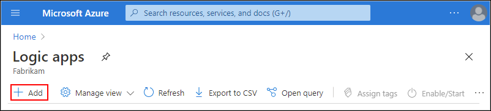
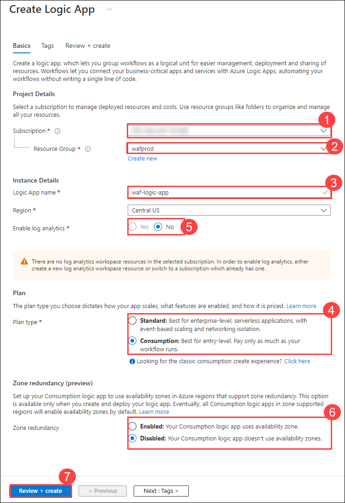
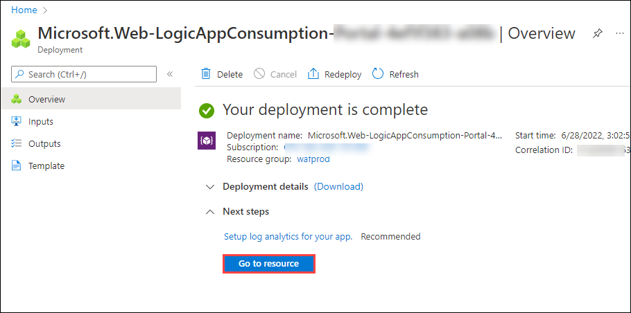
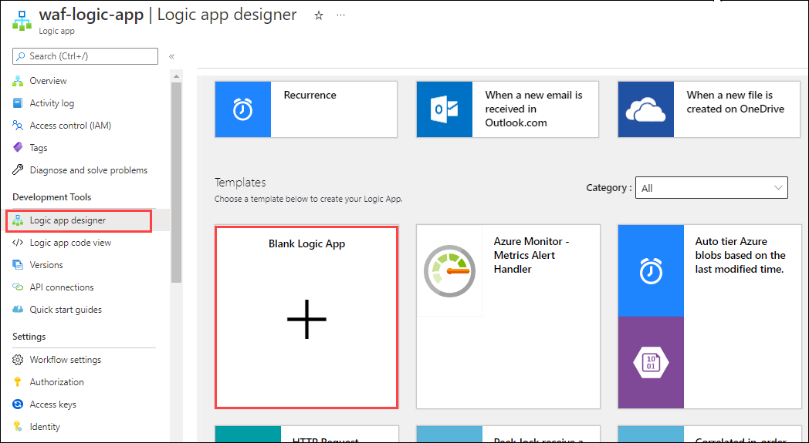
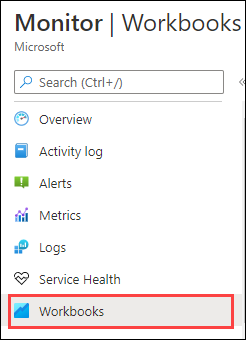
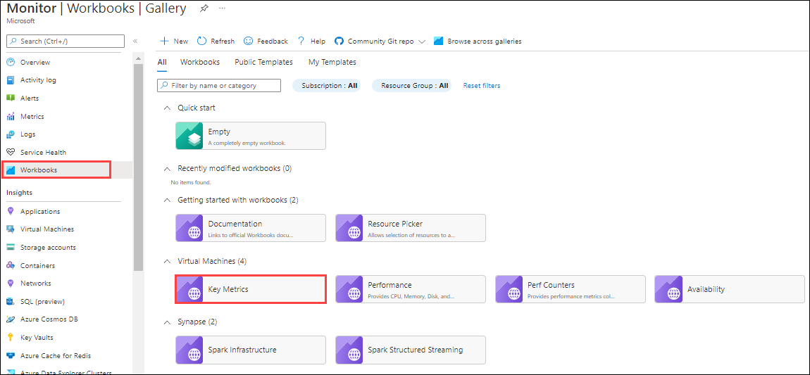
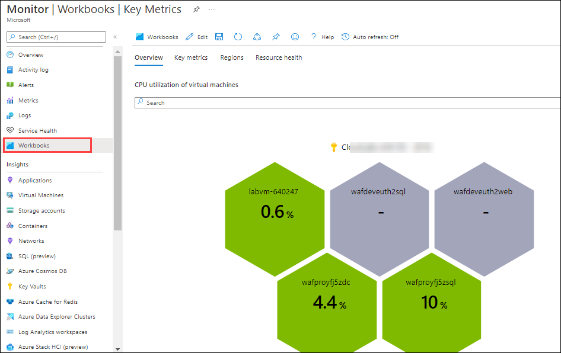
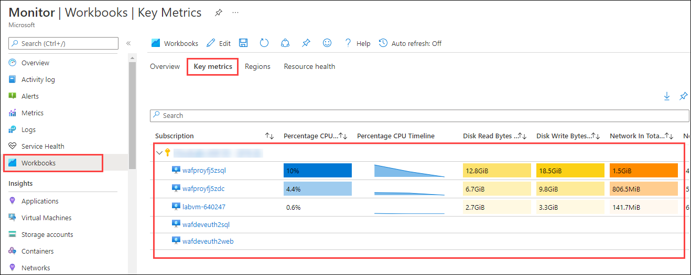

# Exercise 2: Operational-Excellence

## Overview

**Operational excellence** apply reliable, predictable, and automated operations processes to your architecture to keep an application running in production.

It covers the operations and processes that keep an application running in production. Deployments must be reliable and predictable. Automate deployments to reduce the chance of human error. Fast and routine deployment processes won't slow down the release of new features or bug fixes.

In this exercise, we will go through the given architecutre and know more about:

  * How would you optimize App time to market?
  * What would you automate? Does PaaS improve the operations?
  * Would you change anything in the current monitoring set up? Why?
  * What changes would you introduce in the deployment?.
  * Is the architecture prepared for the unexpected and to catch mistakes?

### Task 1: DevOps

 To activate resources on demand, deploy solutions rapidly, minimize human error, and produce consistent and repeatable results, we should automate deployments and updates.Complex issue may not always be able to be identified in a timely manner. However, with good automation, detection of these issues should occur quickly.

 Automation leads to more innovative solutions, and in general provides more value to the business. This in turn raises morale and job satisfaction.

 Once a process is automated, training and maintenance can be greatly reduced or eliminated. This frees engineers to spend less time on manual processes and more time on automating business solutions.

Thre differenet types of automation includes:

#### 1. Infrastructure deployment:

As businesses move to the cloud, they need to repeatedly deploy their solutions and know that their infrastructure is in a reliable state. To meet these challenges, you can automate deployments using a practice referred to as infrastructure as code. In code, you define the infrastructure that needs to be deployed.

-There are many deployment technologies you can use with Azure. Here are three examples that uses declarative approach:

 * Azure Resource Manager (ARM) templates
 * Azure Bicep
 * Terraform

#### 2. Infrastructure configuration

If you don't manage configuration carefully, your business could encounter disruptions such as systems outages and security issues. Optimal configuration can enable you to quickly detect and correct configurations that could interrupt or slow performance.

- When creating new resources on Azure, you may take advantage of configuration as code to bootstrap the deployment.

- Configuration tools can also be used to configure and manage the ongoing state of deployed resources.

#### 3. Operational tasks

As the demand for speed in performing operational tasks increases over time, you are expected to deliver things faster and faster. Manually performing operational tasks will fail to scale as demand increases. This is where automation can help. 

To meet on-demand delivery using an automation platform, you need to develop automation components (such as runbooks and configurations), create integrations to systems that are already in place efficiently, and operate and troubleshoot.

Advantages of automating operational tasks include:

 * Optimize and extend existing processes.
 * Deliver flexible and reliable services.
 * Lower costs.
 * Improve predictability.

### Task 2: Deployment

In this task you will be creating an automated workflow that integrates two services, an RSS feed for a website and an email account using logic app.

The RSS connector has a trigger that checks an RSS feed, based on a schedule. The Office 365 Outlook connector has an action that sends an email for each new item.

1. In the Azure search box, enter **logic apps**, and select **Logic apps**.

   
   
2. On the **Logic apps** page, select **Add**.

   
   
3. On the **Create Logic App** pane, on the Basics tab, provide the following basic information about your logic app:

   * **Subscription**: Select your default susbcription
   * **Resource Group**: waf-prod
   * **Logic App name**: waf-logic-app
   * **Plan type**: Consumption
   * **Enable log analytics**: No
   * **Zone redundancy**: disbaled
   * Leave all the other values as default and click on **Review + Create** followed by **Create**.
    
   
   
4. After Azure successfully deploys your app, select **Go to resource**.

   
   
5. In the Logic App Designer, scroll through the page until you locate the **templates** section. Click on **Blank Logic App**.

   
   
6. In the designer search box, select **All** and enter **rss**. From the Triggers list, select the RSS trigger, **When a feed item is published**.
 
   
   
7. Provide the following information in the trigger details page and click on **New step**,

    * **The RSS feed URL**: https://feeds.a.dj.com/rss/RSSMarketsMain.xml
    * **Chosen property will be used to determine**: PublishDate
    * **Interval**: 1
    * **Frequency**: Minute

   
   
8. Enter `Send an email (V2)` in the filter box, then select the **Send an email (V2)** action for Office 365 Outlook.

   
   
9. Select **Sign in** and sign in to your Office 365 Outlook account.

   
   
10. In the Send an email form, provide the following values:

    * Enter your email address in the **To** box.
    * **Subject**: Enter **New RSS item:** and from the Add dynamic content list, under When a feed item is published, select **Feed title**.
    * **Body**: Enter **Date published:** and from the Add dynamic content list, under When a feed item is published, select **Feed published on**.

    

11. On the designer toolbar, select **Save** to save your logic app. .

    
    
12. Select **Run Trigger** to execute the Logic App. If the RSS feed has new items, your workflow sends an email for each new item. Otherwise, your workflow waits until the next interval to check the RSS feed again.

   
   
13. The following screenshot shows a sample email that's sent by the workflow.

    

### Task 3: Monitor 

**Azure Monitor** helps you maximize the availability and performance of your applications and services. It delivers a comprehensive solution for collecting, analyzing, and acting on telemetry from your cloud and on-premises environments. This information helps you understand how your applications are performing and proactively identify issues affecting them and the resources they depend on. 

1. Type **Monitor** in the search box located on the top of the Azure Portal page and click on it.
   
   
   
2. Click on **Metrics** in the left-hand menu.

   
   
3. You will be prompted with **Select a scope** page, select **wafprod** and 2 virtual machines with the name **wafprodxxxx** under scope. Click on **apply**.

   
   
4. Once the scope is applied, slect the following in the **Metrics** page.

   - **Metric**: Max Data Disk Read Operations/Sec
   - **Aggregation**: Max
   
    
    
5. Click on **Workbooks** in the left-hand menu.

    
    
6. On the workbooks page, click on **Key Metrics** under Virtual Machines which lists all the saved workbooks and templates for your workspace.

   
   
7. On the overview page of the workbook, you will be able to see the CPU utilization of virtual machines across subscription. Each cell represents a virtual machine and the color/label represents its average CPU utilization. 
     
    
    
8. Click on **Key metrics** and observe the CPU utilization in the Grid view.

    
   

### Task 4: Processes and cadence 
