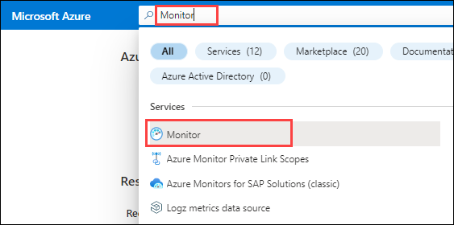
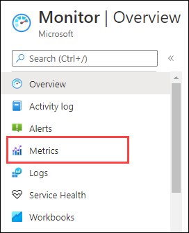
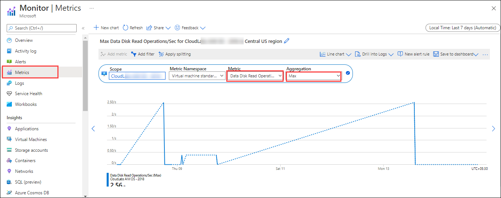

# Exercise 2: Operational-Excellence

## Overview

**Operational excellence** apply reliable, predictable, and automated operations processes to your architecture to keep an application running in production.

It covers the operations and processes that keep an application running in production. Deployments must be reliable and predictable. Automate deployments to reduce the chance of human error. Fast and routine deployment processes won't slow down the release of new features or bug fixes.

In this exercise, we will go through the given architecutre and know more about:

 * How would you optimize App time to market?
 * What would you automate? Does PaaS improve the operations?
 * Would you change anything in the current monitoring set up? Why?
 * What changes would you introduce in the deployment?.
 * Is the architecture prepared for the unexpected and to catch mistakes?

### Task 1: DevOps

### Task 2: Deployment

### Task 3: Monitor 

**Azure Monitor** helps you maximize the availability and performance of your applications and services. It delivers a comprehensive solution for collecting, analyzing, and acting on telemetry from your cloud and on-premises environments. This information helps you understand how your applications are performing and proactively identify issues affecting them and the resources they depend on. 

1. Type **Monitor** in the search box located on the top of the Azure Portal page and click on it.
   
   
   
2. Click on **Metrics** in the left-hand menu.

   
   
3. You will be prompted with **Select a scope** page, select **wafprod** and 2 virtual machines with the name **wafprodxxxx** under scope. Click on **apply**.

   
   
4. Once the scope is applied, slect the following in the **Metrics** page.

   - **Metric**: Max Data Disk Read Operations/Sec
   - **Aggregation**: Max
   
    

### Task 4: Processes and cadence 
