# Exercise 4: Reliability

## Overview

The term "reliable workload" refers to a task that is both resilient and available. The ability of a system to recover from failures and continue to function is known as resiliency. After a failure, the goal of resiliency is to restore the application to its original condition. The availability of your workload refers to whether or not your users can access it when they need it.

Building for reliability includes:
* Ensuring a highly available architecture
* Recovering from failures such as data loss, major downtime, or ransomware incidents

Azure has many resiliency features already built into the platform, such as:

* Azure Storage, SQL Database, and Cosmos DB all provide built-in data replication across availability zones and regions.
* Azure managed disks are automatically placed in different storage scale units to limit the effects of hardware failures.
* Virtual machines (VMs) in an availability set are spread across several fault domains. This limits the impact of physical hardware failures, network outages, or power interruptions.
* Availability Zones are physically separate locations within each Azure region. Each zone is composed of one or more datacenters equipped with independent power, cooling, and networking infrastructure. With availability zones, you can design and operate applications, and databases that automatically transition between zones without interruption, which ensures resiliency if one zone is affected.

### **Task 1: Define requirements** 

Gathering requirements is the first step in incorporating resiliency (recovering from failures) and availability (operating in a healthy condition without significant downtime) into your applications. 

For example, how much downtime is acceptable? What is the cost of potential downtime to your company? What are the requirements for your customer's availability? How much money do you put into making your app widely available? What is the expense versus the risk?

The following are some of the considerations you should make in Azure to improve reliability and satisfy business goals.

 #### 1. Availability targets
 
  - A **Service Level Agreement (SLA)**, is an availability target that represents a commitment around performance and availability of the application.
  
  - Understanding the SLA of individual components within the system is essential in order to define reliability targets. Knowing the SLA of dependencies will also provide a justification for additional spend when making the dependencies highly available and with proper support contracts.
  
  - Monitoring and measuring application availability is vital to qualifying overall application health and progress towards defined targets.
 
 #### 2. Recovery targets
 
 - **Recovery targets** identify how long the workload can be unavailable and how much data is acceptable to lose during a disaster. 
 
 - Recovery targets are nonfunctional requirements of a system and should be dictated by business requirements. They should be defined in accordance to the required Recovery Time Objective (RTO) and Recovery Point Objective (RPO) targets for the workloads.

 - **Recovery Time Objective (RTO)** is the maximum acceptable time an application is unavailable after a disaster, and **Recovery Point Objective (RPO)** is the maximum duration of data loss that is acceptable during a disaster.

 #### 3. Meet application platform requirements
 
  - Azure application platform services offer resiliency features to support application reliability, they will only be applicable at a certain SKU and configuration/deployment.

   * **Multiple and paired regions**: The ability to respond to disaster scenarios for overall compute platform availability and application resiliency depends on the use of multiple regions or other deployment locations.
   
   * **Availability Zones and sets**: An Availability Set (AS) is a logical construct to inform Azure that it should distribute contained virtual machine instances across multiple fault and update domains within an Azure region. Availability Zones (AZ) elevate the fault level for virtual machines to a physical datacenter by allowing replica instances to be deployed across multiple datacenters within an Azure region. 
   
 #### 4. Meet data platform requirements
 
  - Data and storage services should be running in a highly available configuration/SKU. Azure data platform services offer resiliency features to support application reliability.
 
   
#### 5. Replication and Redundancy
   
   - To maintain data availability and durability, Azure Storage creates and stores copies of data across multiple locations. This process is called storage replication. The goal is to provide redundancy to protect data against hardware failures, power or network outages.

   - Replicating data across zones or paired regions supports application availability objectives to limit the impact of failure scenarios. 

   - The ability to restore data from a backup is essential when recovering from data corruption situations as well as failure scenarios. To ensure sufficient redundancy and availability for zonal and regional failure scenarios, backups should be stored across zones and/or regions.

### **Task 2: Test with simulations and forced failovers** 

In this task, you will learn how to enable replication for virtual machines, run a test failover to validate your replication and disaster recovery strategy, without any data loss or downtime.

### **a. Replicate a Virtual machine**

1. In the Azure portal, click on **Show portal menu (1)** and select **Resource groups(2)**.

   

2. Open **wafprod** resource group and select a virtual machine.

   

3. From the left pane, select **Disaster recovery (1)** present under _Operations_. Then select a **Target region (2)** from the drop down and click on **Review + Start Replication (3)**.

   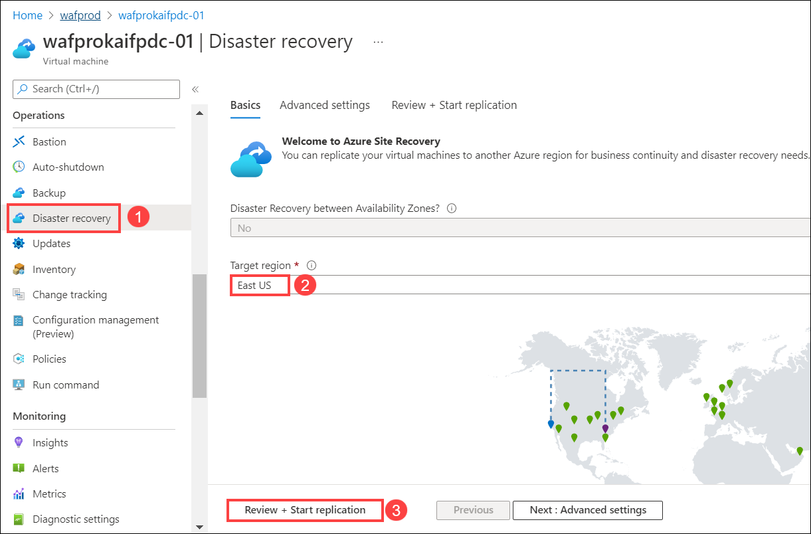

4. Review the details and click on **Start replication**.

   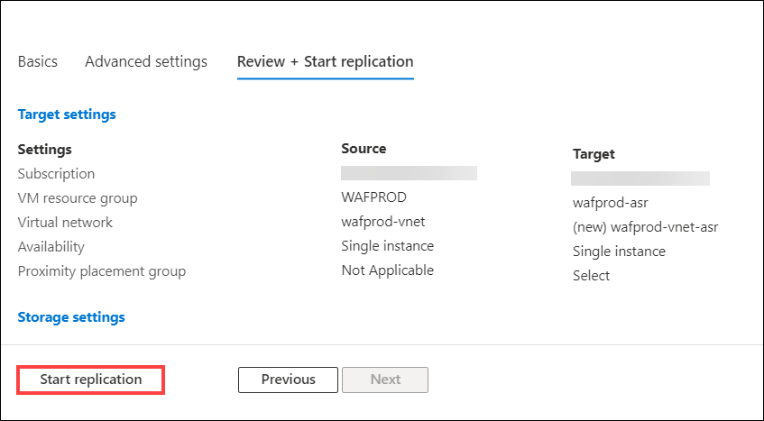

5. Once the deployment starts, a new resource group will get created in which a recovery service vault will get deployed.

6. In the search bar, search for Recovery service vaults and select **Recovery services vaults** from the suggestions.

   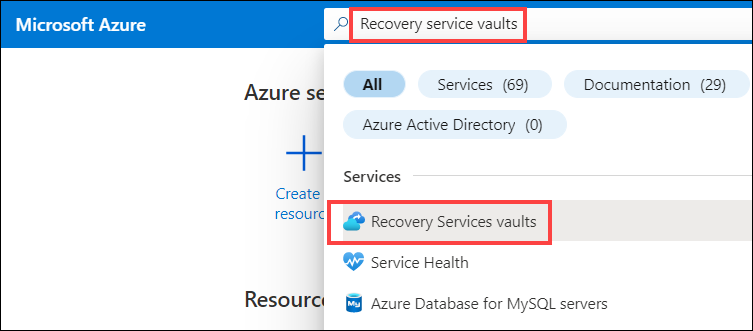

7. Observe the vaults here, select the **Site-recovery-vault-eastus** vault, that falls under **site-recovery-vault-rg** resource group.

   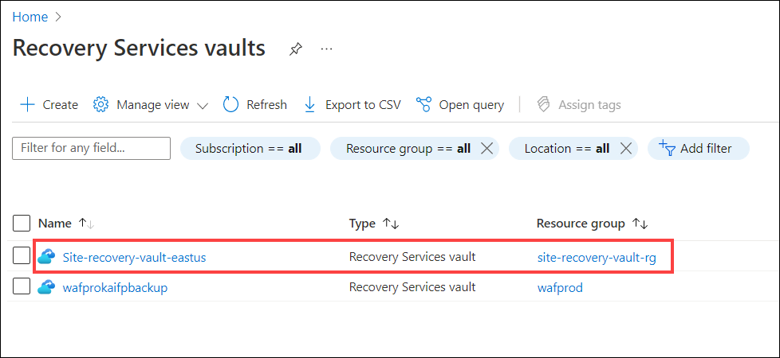   

8. From the left pane, select **Site Recovery jobs** present under _Monitoring_. You will see all the jobs here with there status.

   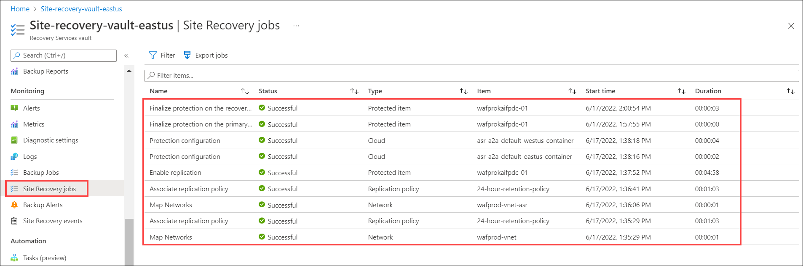

9. Now from the left pane, select **Replicated items** present under _Protected items_. You will have the the VM here that you just replicated, select that virtual machine **wafproxxxxxx**.

   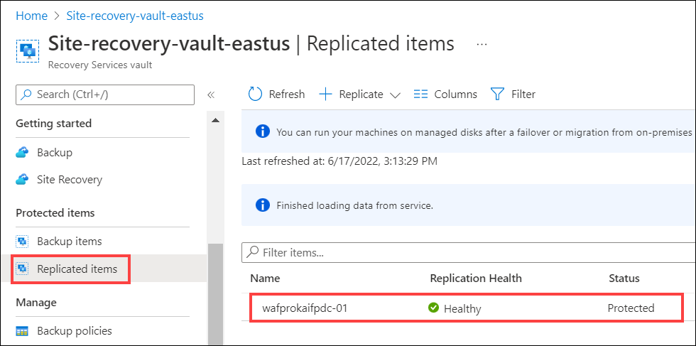

10. On the Overview page of the replicated virtual machine, you will have details such as _Health and status, Failover readiness, Errors_ and so on.

   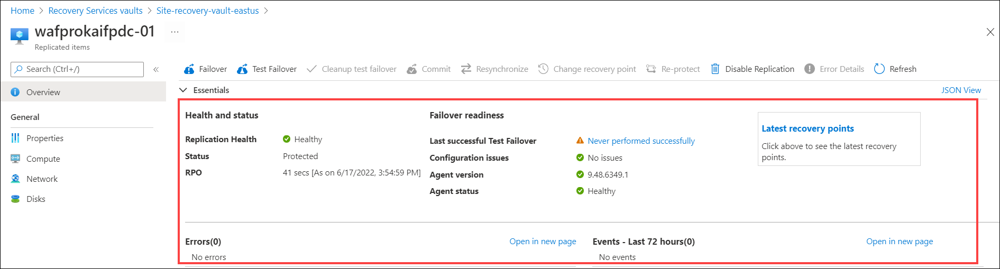

### **b. Create a Recovery plan**

1. In the Recovery Services vault, select **Recovery Plans (Site Recovery)** present under _Manage_ and click on **+ Recovery plan**.

   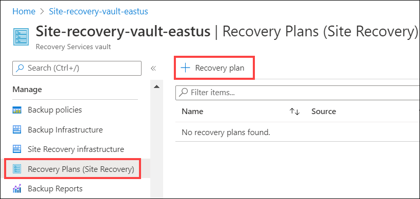

2. Provide following details for the recovery plan:

* **Name:** Specify a name for the plan **(1)**.
* **Source:** Choose a source location from the drop down. The source location must have machines that are enabled for failover and recovery. Here we are using **WestUS (2)** as it's the same location where we have our virtual machine.
* **Target:** Choose a target location from the drop down **(3)**.
* **Allow items with deployment model:** Select **Resource Manager (4)** from the drop down.
* Click on **Select items (5)**.

   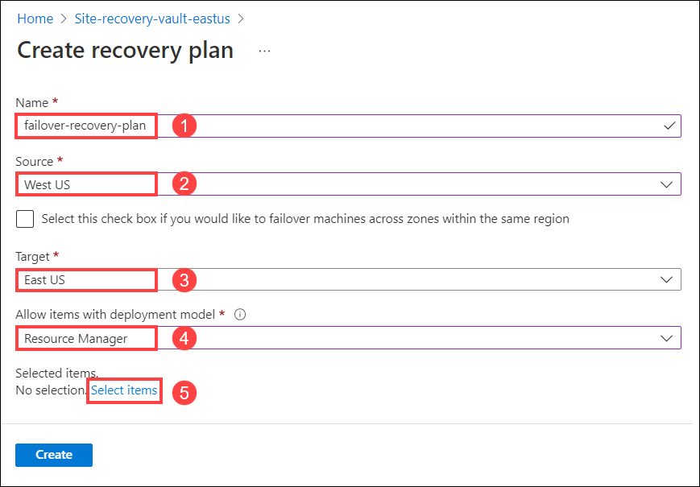

3. In Select items, select the machine that you want to add to the plan and then click on **OK**.

   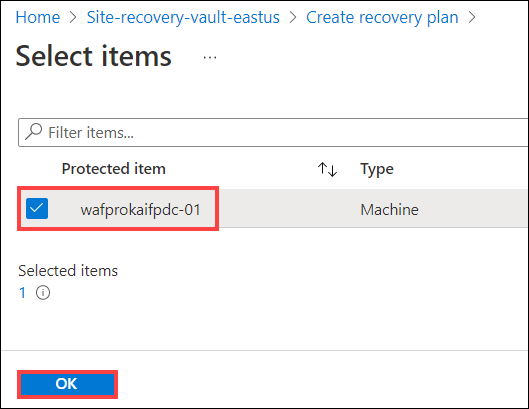

   > **Note:** You can only select machines are in the source and target locations that you specified.
   
4. At last, click on **Create**. Once the plan is created successfully, move to the next task.

   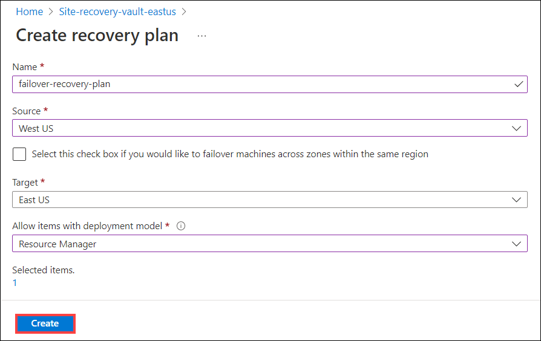

### **c. Run a test failover to Azure**

1. In the recovery services vault, select **Recovery Plans (Site Recovery)** and click on **failover-recovery-plan**. This is the Recovery plan that you just created.

   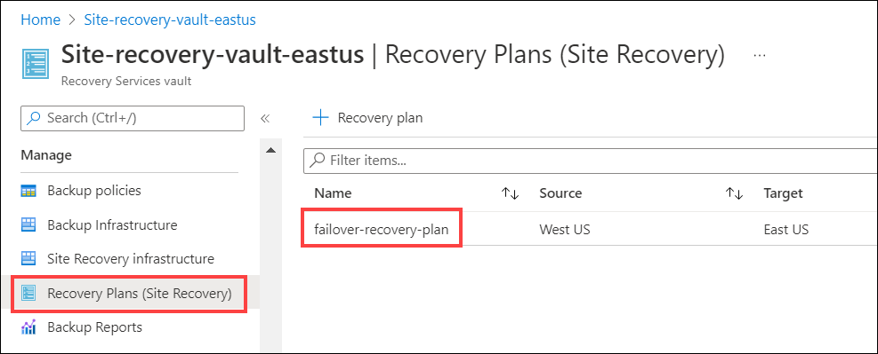

2. Now select **Test Failover**.

   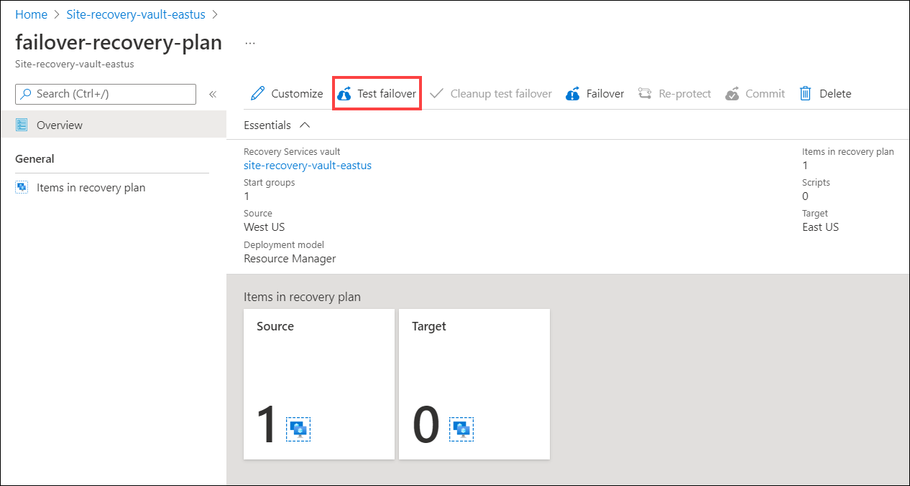

3. Provide following details for the failover:

* **Choose a Recovery Point:** Select **Latest processed (low RTO) (1)** from the drop down. This option fails over all VMs in the plan to the latest recovery point processed by Site Recovery. This option provides a low RTO (Recovery Time Objective), because no time is spent processing unprocessed data.
* **Azure virtual network:** Select an Azure virtual network **(2)** from the drop down, in which test virtual machine will be created.
* Click on **OK (3)**.

   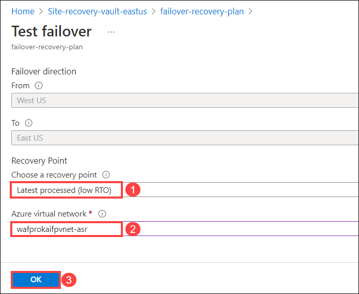

4. Go to **Site Recovery Jobs** present under _Monitoring_. Here you can track the failover progress. Click on the failover to view the process.

   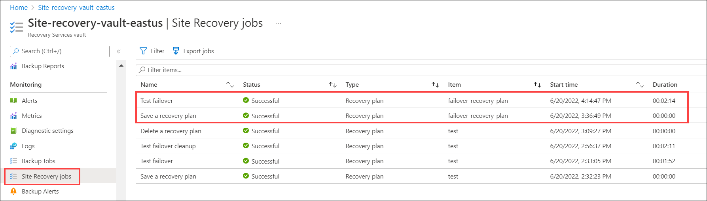

5. When a test failover is triggered, the following occurs:

* **Prerequisites:** A prerequisites check runs to make sure that all conditions required for failover are met.
* **Failover:** The failover processes and prepared the data, so that an Azure VM can be created from it.
* **Latest:** If you have chosen the latest recovery point, a recovery point is created from the data that's been sent to the service.
* **Start:** This step creates an Azure virtual machine using the data processed in the previous step.

   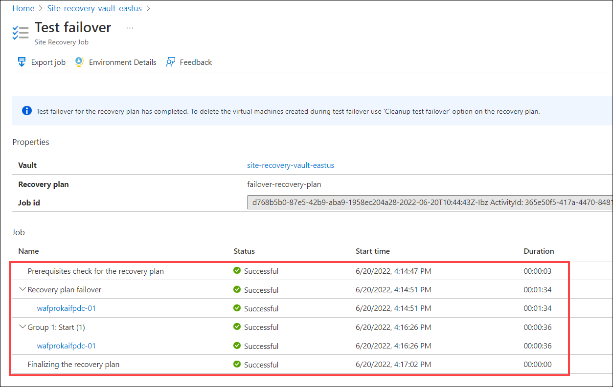

6. When everything is working as expected, click Cleanup test failover. This deletes the VMs that were created during test failover.

7. Return to the Recovery plan you created and click on **Cleanup test failover**.

   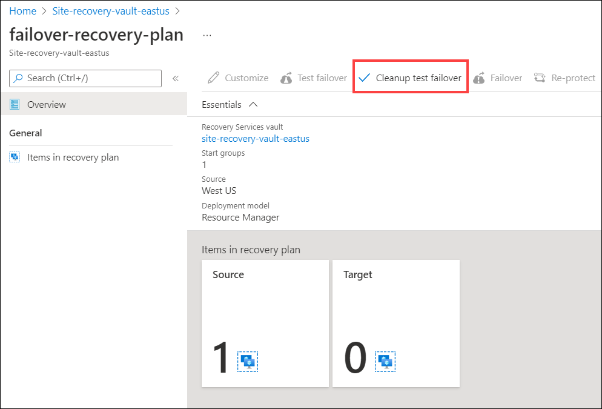

8. Add a note for cleanup and check the _'Testing is complete. Delete test failover virtual machine(s)'_ checkbox and click on **OK**.

   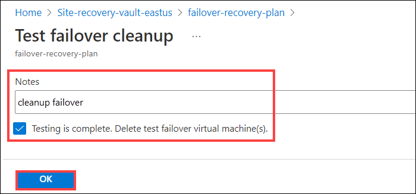

9. You can track the cleanup progress in **Site Recovery Jobs** present under _Monitoring_.

   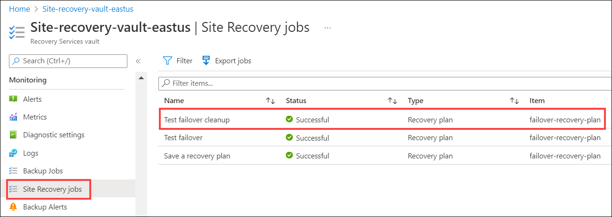
   

### **Task 3: Deploy consistently** 

### **Task 4: Monitor health** 

**Service Health** provides a personalized view of the health of the Azure services and regions you're using. This is the best place to look for service impacting communications about outages, planned maintenance activities, and other health advisories because the authenticated Service Health experience knows which services and resources you currently use. 

Service Health tracks four types of health events that may impact your resources:

 - **Service issues** - Problems in the Azure services that affect you right now.
 
 - **Planned maintenance** - Upcoming maintenance that can affect the availability of your services in the future.
 
 - **Health advisories** - Changes in Azure services that require your attention. Examples include deprecation of Azure features or upgrade requirements (e.g upgrade to a supported PHP framework).
 
 - **Security advisories** - Security related notifications or violations that may affect the availability of your Azure services.
 
 - **Health history** - Service Health provides you with a customizable dashboard which tracks the health of your Azure services in the regions where you use them. In this dashboard, you can track active events like ongoing service issues, upcoming planned maintenance, or relevant health advisories. When events become inactive, they get placed in your health history for up to 90 days.

In this task you will set up **Service Health alerts** to notify you via your preferred communication channels when service issues, planned maintenance, or other changes may affect the Azure services and regions you use.

1. Type **service** in the search box located on the top of the Azure Portal page and click on **Service Health** to open it.

   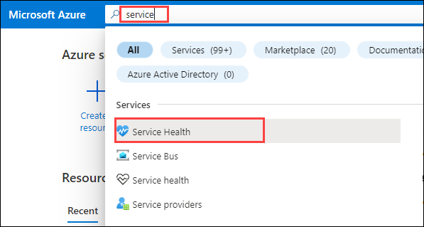
   
2. From the left navigation pane, click on **Service issues**. You will be prompted with the active issues if there are any.

   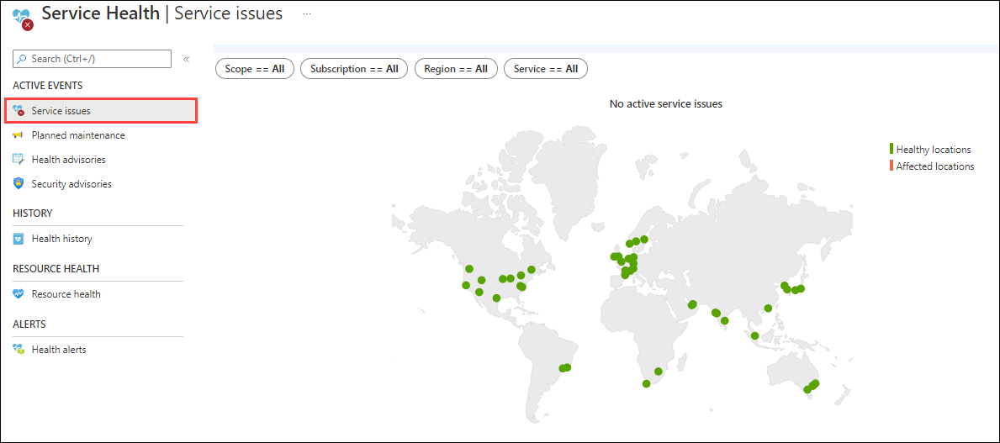

3. Click on **health history** from left navigation pane and select the time range as **Last 3 months**. you will be able to see the inactive events such as service issues, upcoming planned maintenance and health advisories.

   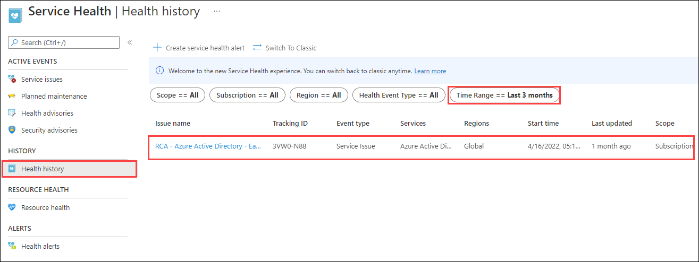
   
   > **Note:** Feel free to click on the events and check on the details.
   
4. Click on **Health alerts** from the left natigation pane under **Alerts**.

   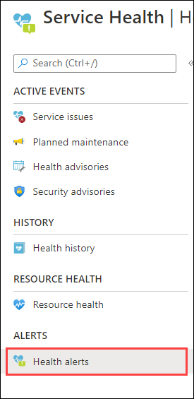
   
5. On the **Health alerts** page, click on **Add service health alert**.

   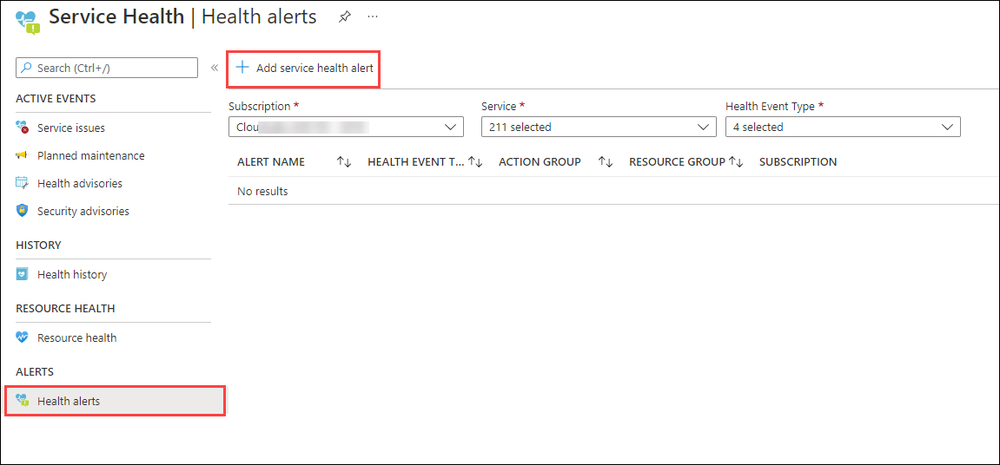
   
6. On the create an alert rule page, go to **Actions** and click on **select action group**.

   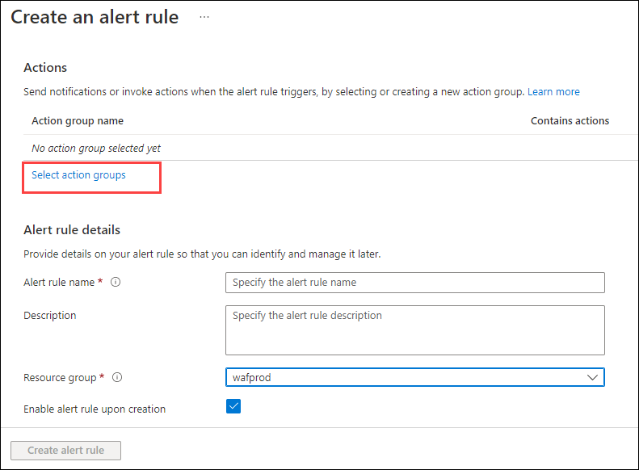
   
7. You will be prompted to **select action group** page, in this page make sure your subscription is selected and select the action group with the name **waf-actiongroup** which you created in exercise 1, task 4. Click on **Select**.

   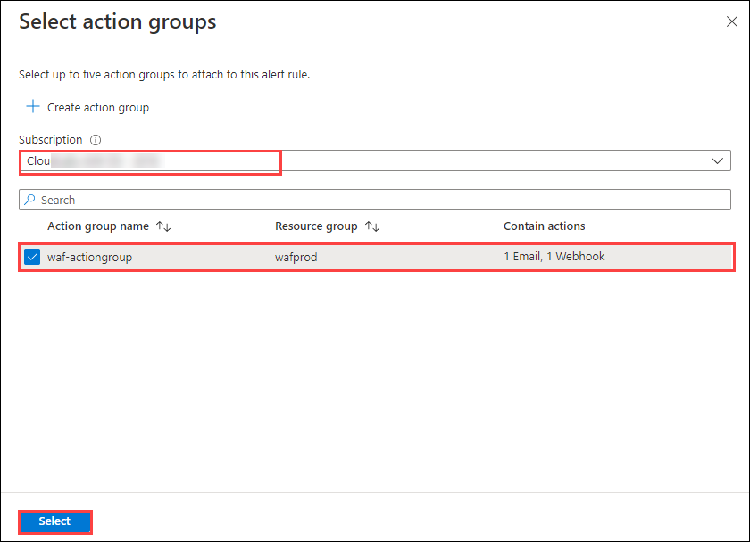

8. Under **Alert rule details**, Provide the following details:

   * **Alert rule name**: waf-alert
   * **Resource Group**: waf-prod
   * Check **Enable alert rule upon creation**

   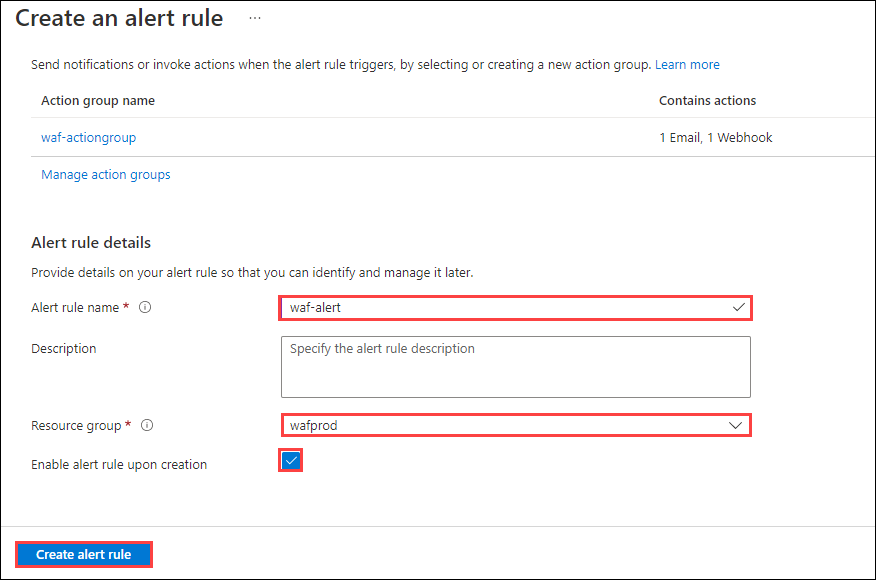
   
9. Once the alert rule is created, go to **Health alerts** page and observe all the details of the alert.

   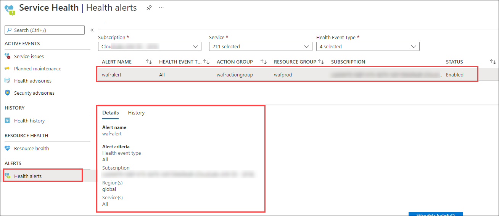

### **Task 5: Respond to failure and disaster** 

Azure services are always available, thanks to Microsoft's efforts. Unexpected service disruptions, on the other hand, are possible. If you need resiliency for your application, Microsoft advises employing geo-redundant storage, which replicates your data to a second location. Customers should also have a plan in place for dealing with a regional outage. An important part of a disaster recovery plan is preparing to fail over to the secondary endpoint in the event that the primary endpoint becomes unavailable.

In this task, you will learn how to initiate an account failover for your storage account.

1. In Azure portal, search for storage accounts and select **Storage accounts** from the suggestions.

   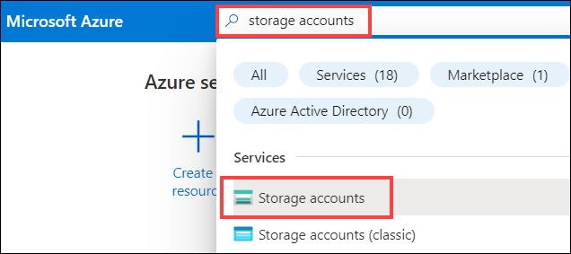

2. Select the storage account **wafdevxxxxx**.

   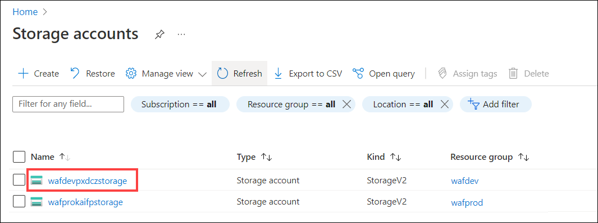

   > **Note:** The storage account should be configured for geo-replication. Geo-replication is available for Geo-redundant (GRS) and Read access geo-redundant (RA-GRS) storage accounts. The storage account present in wafdevxxxx resource group is already configured with GRS so we are using it here.
   > 
   > You can also update the replication type of a storage account under Configuration to use this setting. **We will not perform this as on updating the configuration, failover will not be available. Initial data synchronization from the primary to secondary region will be in progress and can take up to an hour. Failover will be available when synchronization is complete.**
   > 
   > 

3. Now select **Geo-replication** present under _Data management_ and click on **Prepare for failover**.

   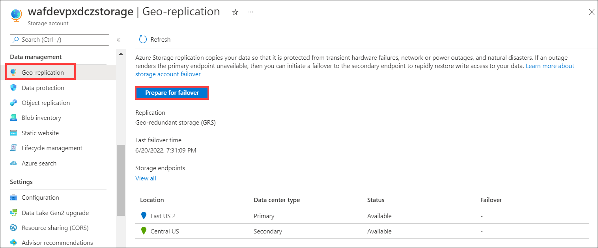
   
4. Enter **YES** for _'Confirm Failover'_ and click on **Failover**. The Last Sync Time property here, indicates how far the secondary is behind from the primary. Last Sync Time provides an estimate of the extent of data loss that you will experience after the failover is completed.

   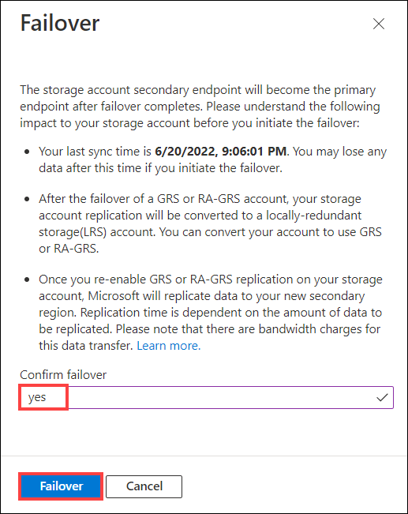

5. Once the failover begins, you will see a notification saying _Failover in progress_. This will take up to an hour to succeed.

   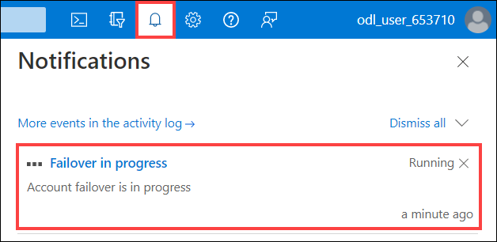

6. After the failover is performed, go to **Geo-replication** present under _Data management_. You will see that Central US is updated as primary endpoint.

   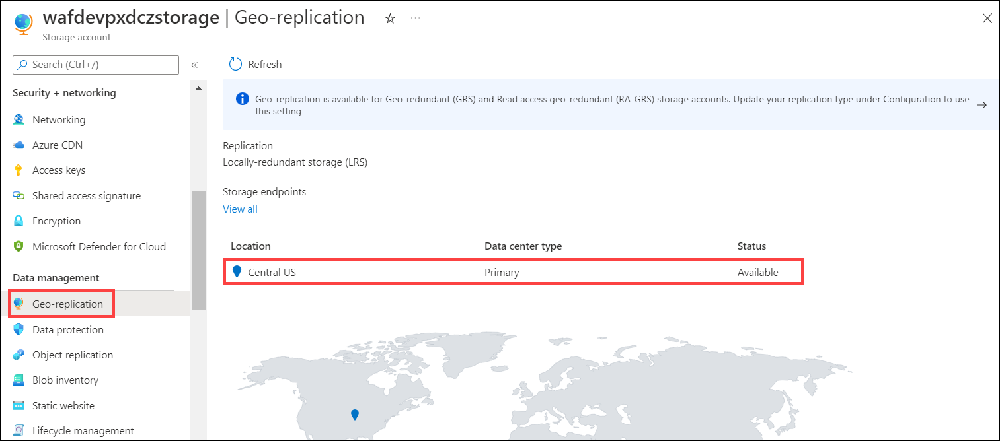

7. Once the failover is complete, clients can begin writing to the new primary endpoint.

8. After the failover, your storage account type is automatically converted to locally redundant storage (LRS) in the new primary region. 

