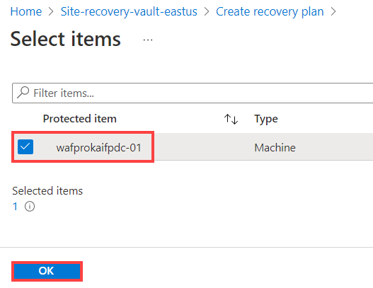
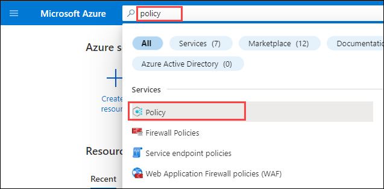
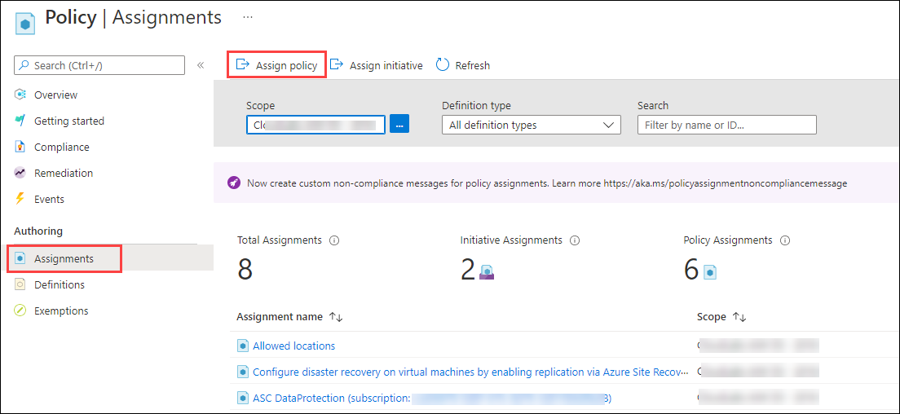
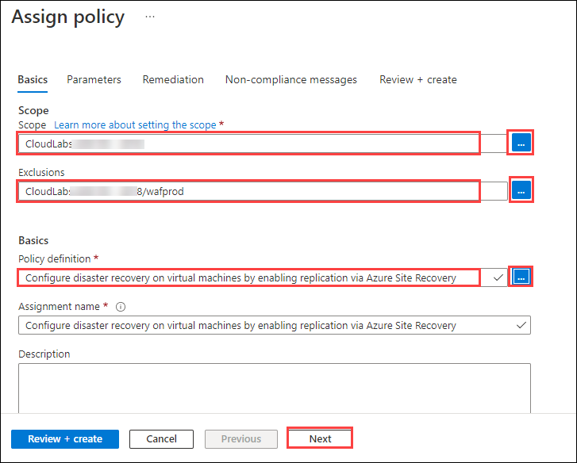
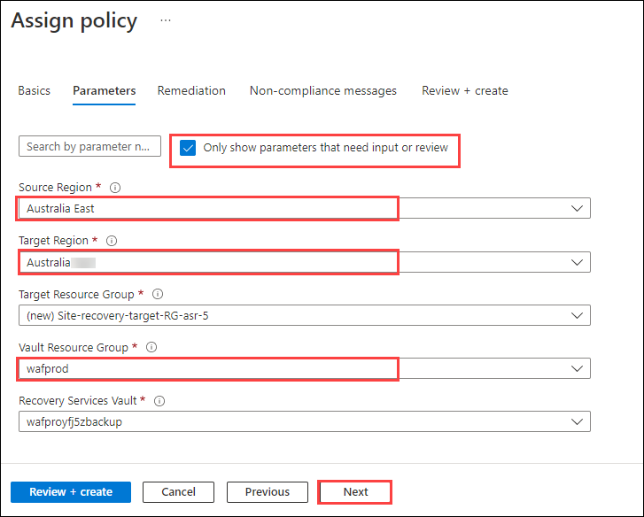
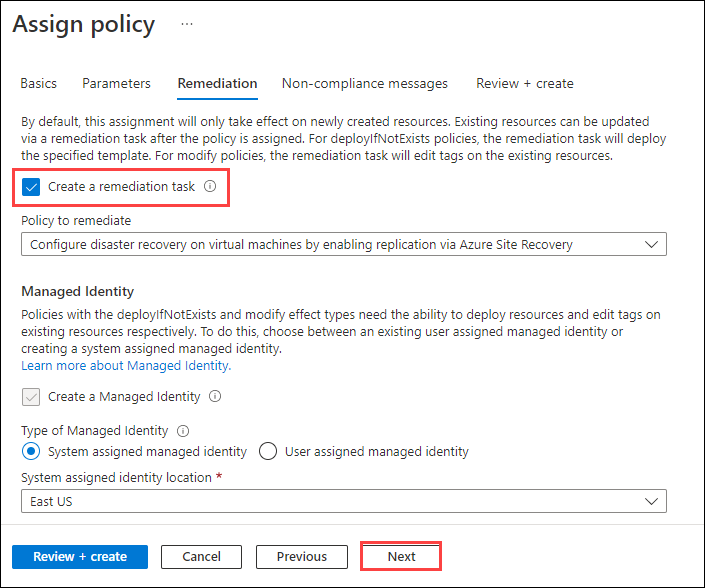
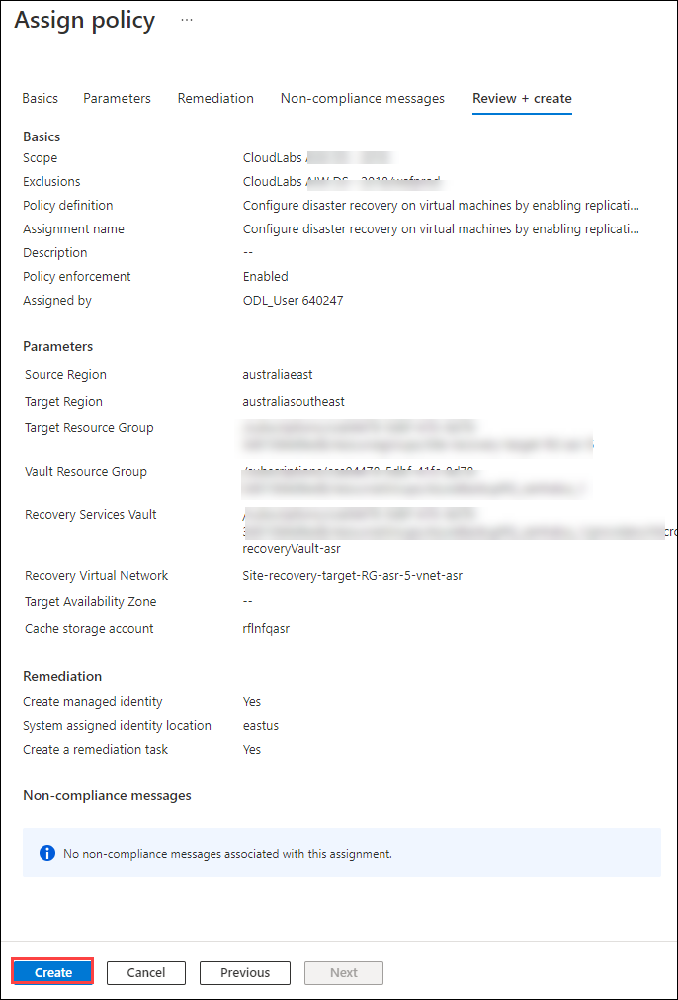
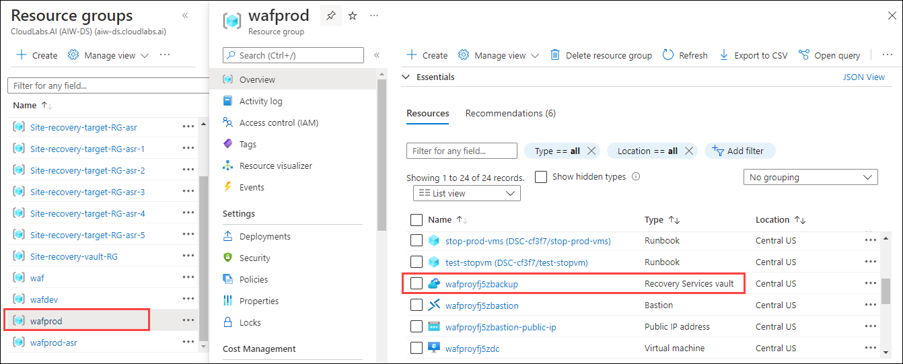

# Exercise 4: Reliability

## Overview

The term "reliable workload" refers to a task that is both resilient and available. The ability of a system to recover from failures and continue to function is known as resiliency. After a failure, the goal of resiliency is to restore the application to its original condition. The availability of your workload refers to whether or not your users can access it when they need it.

Building for reliability includes:
* Ensuring a highly available architecture
* Recovering from failures such as data loss, major downtime, or ransomware incidents

Azure has many resiliency features already built into the platform, such as:

* Azure Storage, SQL Database, and Cosmos DB all provide built-in data replication across availability zones and regions.
* Azure managed disks are automatically placed in different storage scale units to limit the effects of hardware failures.
* Virtual machines (VMs) in an availability set are spread across several fault domains. This limits the impact of physical hardware failures, network outages, or power interruptions.
* Availability Zones are physically separate locations within each Azure region. Each zone is composed of one or more datacenters equipped with independent power, cooling, and networking infrastructure. With availability zones, you can design and operate applications, and databases that automatically transition between zones without interruption, which ensures resiliency if one zone is affected.

### **Task 1: Define requirements** 

### **Task 2: Test with simulations and forced failovers** 

In this task, you will learn how to enable replication for virtual machines, run a test failover to validate your replication and disaster recovery strategy, without any data loss or downtime.

### **a. Replicate a Virtual machine**

1. In the Azure portal, click on **Show portal menu (1)** and select **Resource groups(2)**.

   

2. Open **wafprod** resource group and select a virtual machine.

   

3. From the left pane, select **Disaster recovery (1)** present under _Operations_. Then select a **Target region (2)** from the drop down and click on **Review + Start Replication (3)**.

   

4. Review the details and click on **Start replication**.

   

5. Once the deployment starts, a new resource group will get created in which a recovery service vault will get deployed.

6. In the search bar, search for Recovery service vaults and select **Recovery services vaults** from the suggestions.

   

7. Observe the vaults here, select the **Site-recovery-vault-eastus** vault, that falls under **site-recovery-vault-rg** resource group.

      

8. From the left pane, select **Site Recovery jobs** present under _Monitoring_. You will see all the jobs here with there status.

   

9. Now from the left pane, select **Replicated items** present under _Protected items_. You will have the the VM here that you just replicated, select that virtual machine **wafproxxxxxx**.

   

10. On the Overview page of the replicated virtual machine, you will have details such as _Health and status, Failover readiness, Errors_ and so on.

   

### **b. Create a Recovery plan**

1. In the Recovery Services vault, select **Recovery Plans (Site Recovery)** present under _Manage_ and click on **+ Recovery plan**.

   

2. Provide following details for the recovery plan:

* Name: Specify a name for the plan **(1)**.
* Source: Choose a source location from the drop down. The source location must have machines that are enabled for failover and recovery. Here we are using **WestUS (2)** as it's the same location where we have our virtual machine.
* Target: Choose a target location from the drop down **(3)**.
* Allow items with deployment model: Select **Resource Manager (4)** from the drop down.
* Click on **Select items**.

   

3. In Select items, select the machine that you want to add to the plan and then click on **OK**.

   

   > **Note:** You can only select machines are in the source and target locations that you specified.
   
4. At last, click on **Create**. Once the plan is created successfully, move to next task.

   

### **c. Run a test failover to Azure**

1. In the recovery services vault, select **Recovery Plans (Site Recovery)** and click on **failover-recovery-plan**. This is the Recovery plan that you just created.

   

2. Now select **Test Failover**.

   

3. Provide following details for the failover:

* Choose a Recovery Point: Select **Latest processed (low RTO) (1)** from the drop down. This option fails over all VMs in the plan to the latest recovery point processed by Site Recovery. This option provides a low RTO (Recovery Time Objective), because no time is spent processing unprocessed data.
* Azure virtual network: Select an Azure virtual network **(2)** from the drop down, in which test virtual machine will be created.
* Click on **OK (3)**.

   

4. Go to **Site Recovery Jobs** present under _Monitoring_. Here you can track the failover progress. Click on the failover to view the process.

   

5. When a test failover is triggered, the following occurs:

* Prerequisites: A prerequisites check runs to make sure that all conditions required for failover are met.
* Failover: The failover processes and prepared the data, so that an Azure VM can be created from it.
* Latest: If you have chosen the latest recovery point, a recovery point is created from the data that's been sent to the service.
* Start: This step creates an Azure virtual machine using the data processed in the previous step.

   

6. When everything is working as expected, click Cleanup test failover. This deletes the VMs that were created during test failover.

7. Return to the Recovery plan you created and click on **Cleanup test failover**.

   

8. Add a note for cleanup and check the _'Testing is complete. Delete test failover virtual machine(s)'_ checkbox and click on **OK**.

   

9. You can track the cleanup progress in **Site Recovery Jobs** present under _Monitoring_.

   
   

### **Task 3: Deploy consistently** 

### **Task 4: Monitor health** 

### **Task 5: Respond to failure and disaster** 

**Site Recovery** helps you keep your applications up and running in the event of planned or unplanned zonal/regional outages. Enabling Site Recovery on your machines at scale through the Azure portal can be challenging. **Azure Policy** can help you enable replication at scale without resorting to any scripting.

In this task, we are going to create a policy assignment for the built-in Azure Site Recovery policy that enables replication for all the VMs in a subscription or resource group.

1. Type **Policy** in the search box located on the top of the Azure Portal page and click on **Policy** to open it.

   
   
2. Click on **Assignments** from the left natigation pane under **Authoring**.

   
   
3. Select **Assign policy** from the top of the **Policy - Assignments** page.

    
    
4. On the **Assign policy**, provide the following details on the **Basic** tab:

   * **Scope**: Select your default subscription.
   * **Exclusions**: Click on ellipses and select **wafprod** resource group. 
   * **Policy definition**: Click on ellipses and search for **Configure disaster recovery on virtual machines by enabling replication via Azure Site Recovery**. Select it.
   * Leave all the other values to default and click **Next**.

    

5. On the **parameters** tab of **Assign policy** page, provide the following details:

   * Check only show parameters that need input or review
   * **Source Region**: Central US
   * **Target Region**: East US
   * **Vault Resource Group**: wafprod
   * Leave all the other values to default and select **Next**.

   
   
6. On the **Remediation** tab in the **Assign policy** workflow, select the **Create a Remediation Task** checkbox and click on **Next**.

   
   
7. Click on **Review and create** to review the selected options, and then select **Create** at the bottom of the page.

   
   
   > **Note:** After you assign the policy, wait for up to 1 hour for replication to be enabled.

8. In the Azure portal, click on **Show portal menu (1)** and select **Resource groups(2)**.

   
   
9. Open **wafprod** resource group and select the Recovery services vault with the name **wafprodxxxxbackup**.

    

