# Exercise 5: Security

## Overview

**Security** is one of the most important aspects of any architecture. It provides the **Confidentiality**, **Integrity**, **Availability** assurances against deliberate attacks and abuse of your valuable data and systems.

Losing these assurances can negatively affect your business operations and revenue, and your organization's reputation. Cloud architectures can help simplify the complex task of securing an enterprise estate through **specialization** and **shared responsibilities**:

 * **Specialization**: Specialist teams at cloud providers can develop advanced capabilities to operate and secure systems on behalf of organizations. This approach is preferable to numerous organizations individually developing deep expertise on managing and securing common elements.
 
 * **Shared Responsibility Model**: Organizations can reduce focus on activities that aren't core business competencies by shifting these responsibilities to a cloud service. Depending on the specific technology choices, some security protections will be built into the particular service, while addressing others will remain the customer's responsibility. To ensure that proper security controls are provided, organizations must carefully evaluate the services and technology choices.

In this exercise, we will apply security principles to your architecture to protect against attacks on the data and systems.

**Task 1: Identity and access management**

**Task 2: Infra protection**

In this task you will learn how to control access to the Azure resources that you deploy. you will also create a diagnostic setting to send the Activity log to Azure **Storage account** for cheaper, long-term archiving to get an insight into subscription-level events.

**Role Assignment to Resources**

1. In the Azure Portal, navigate to the **Resource Group** named **wafdev**.

   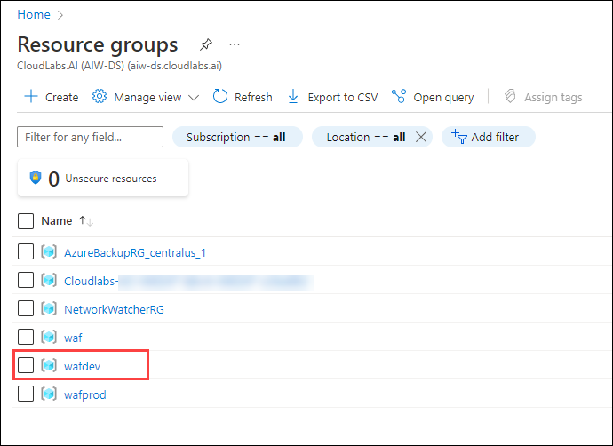
   
2. Select **Access Control (IAM)** in the left-hand menu, select **+ Add** above `Role assignments` and select **Add role assignment**.
   
   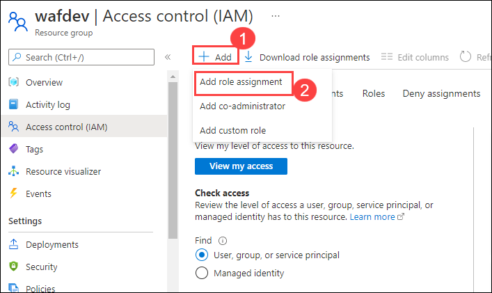
   
3. In the add role assignment form, search for **Reader** in Role and select it, Click on Next.

   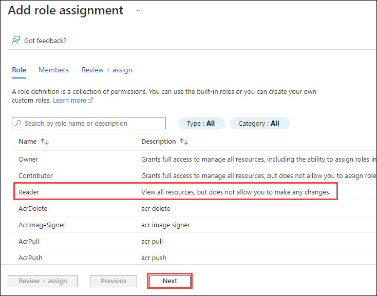
   
4. In Members pane, for **Assign access to** select **User, group, or service principle** and for **Members** click on **+Select Members**.
   
   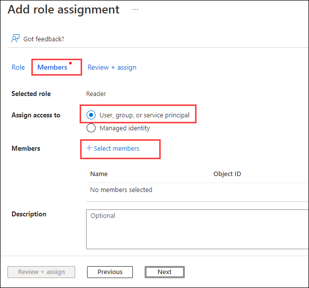
   
5. A Select members pane appears, search and add the member and **select**.
  
   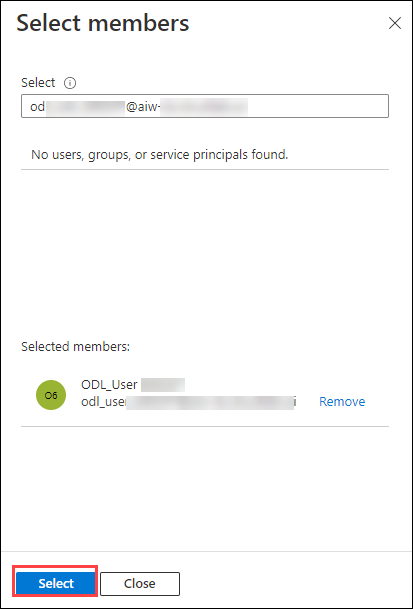
   
6. After adding the Member, then select **Review + Assign**.

   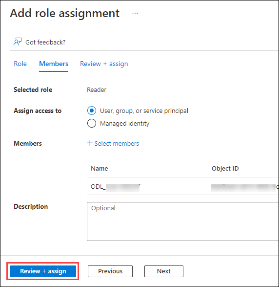
 
**Creating a Diagnostic Setting**
 
7. Navigate to the **wafdev** resource group pane and click on **Activity log**. 

   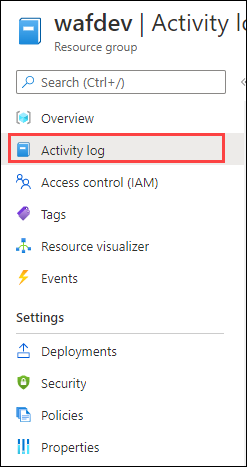
   
8. Then from the filter menu, click on **Timespan** filter and then select **last month**. Click on **apply** to apply the filter.
   
   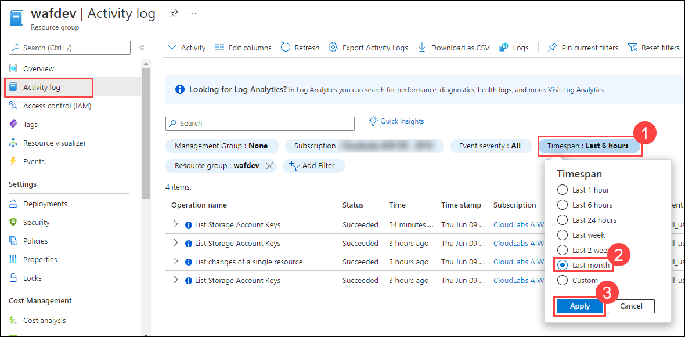
   
9. Once the filter is applied and you are able to see all the operations from last month. Select **Export Activity Logs**.

   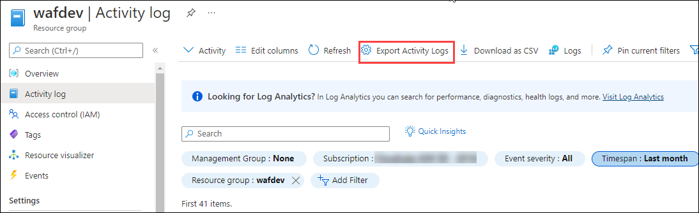
   
10. On the **Diagnostic Settings** page, make your subscription is selected and then click on **+ Add diagnostic setting**.

    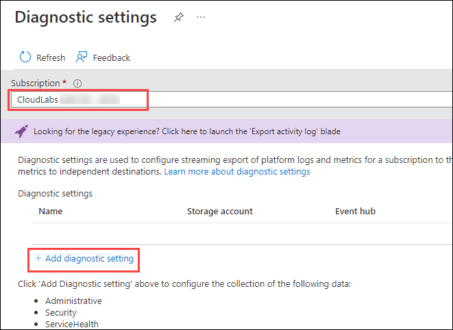
    
11. Make sure you fill the **Diagnostic Settings** page with the following details and click on **Save**.

    * **Diagnostic setting name**: `dev-log`
    *  **Logs**: Make sure you have selected all the categories
    *  **Destination details**: Check **Archive to a storage account** and leave all the other values to default

   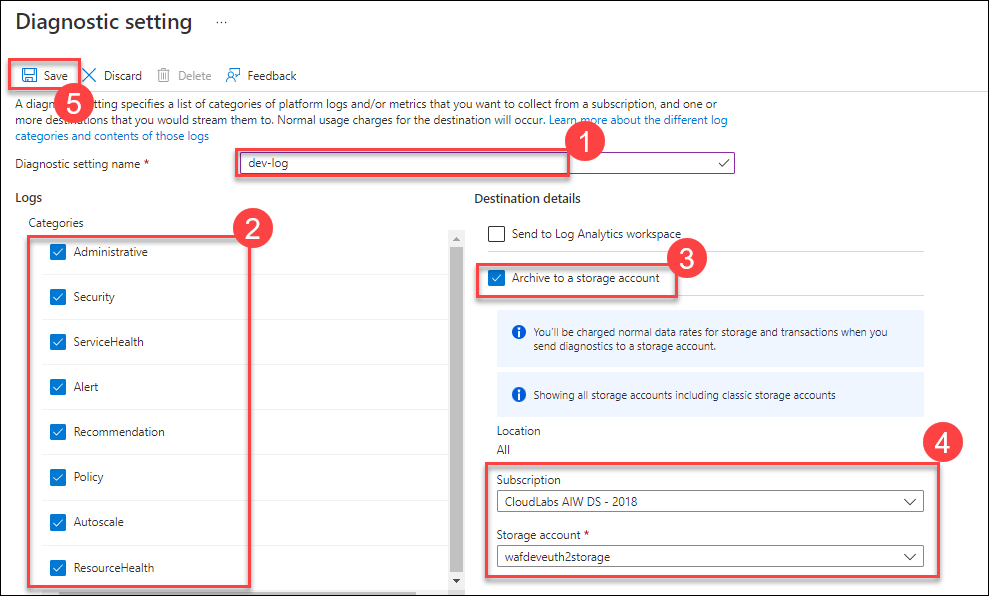
   
12. Navigate back to the **wafdev** resource group and select the storage account **wafdevxxxx**.

    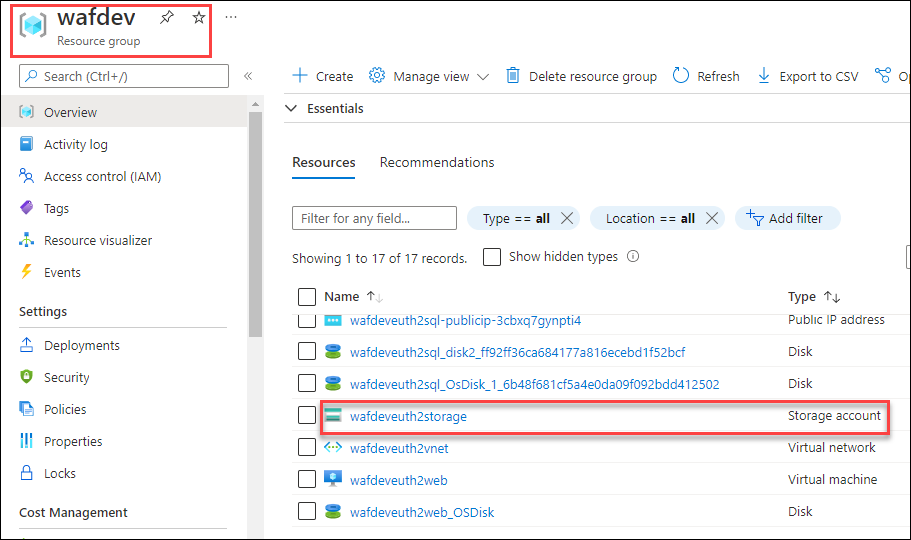
    
13. From the left navigation pane, under the **Data storage** section, Select **Containers**.

    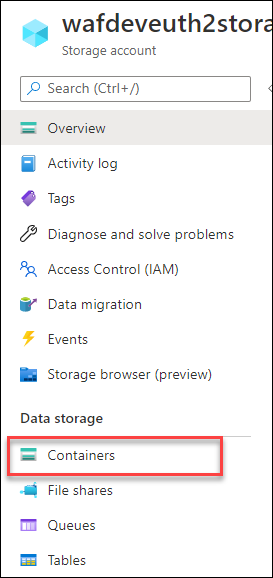
    
14. You will be able to see a container with the name **insights-activity-logs**. Click on it.

    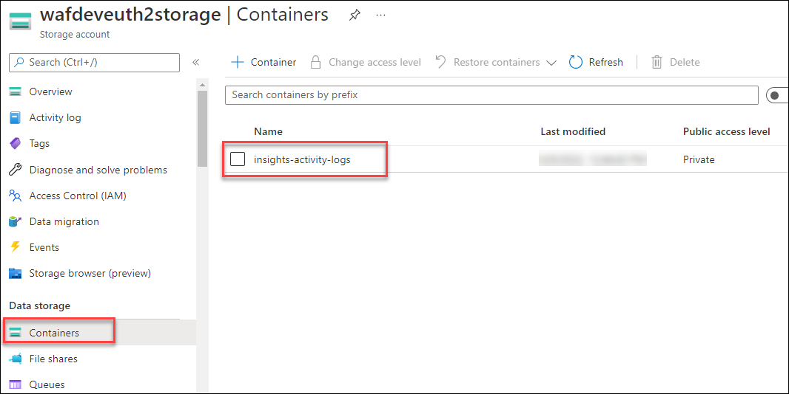
    
    
     > **Note:** The container might take upto 2 minutes for getting created. Click on **Refresh** button once in few seconds until you are able to see the container.
    
15. Go through the folder names **resourceid=** and observe that each event is stored in the PT1H.json file with the following format that uses a common top-level schema.

   `{ "time": "2020-06-12T13:07:46.766Z", "resourceId": "/SUBSCRIPTIONS/00000000-0000-0000-0000-000000000000/RESOURCEGROUPS/MY-RESOURCE-GROUP/PROVIDERS/MICROSOFT.COMPUTE/VIRTUALMACHINES/MV-VM-01", "correlationId": "0f0cb6b4-804b-4129-b893-70aeeb63997e", "operationName": "Microsoft.Resourcehealth/healthevent/Updated/action", "level": "Information", "resultType": "Updated", "category": "ResourceHealth", "properties": {"eventCategory":"ResourceHealth","eventProperties":{"title":"This virtual machine is starting as requested by an authorized user or process. It will be online shortly.","details":"VirtualMachineStartInitiatedByControlPlane","currentHealthStatus":"Unknown","previousHealthStatus":"Unknown","type":"Downtime","cause":"UserInitiated"}}}`
   
   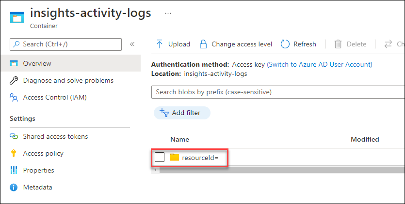

**Task 3: App Security**

**Task 4: Data encryption and sovereignty**

**Task 5: Security operations**
