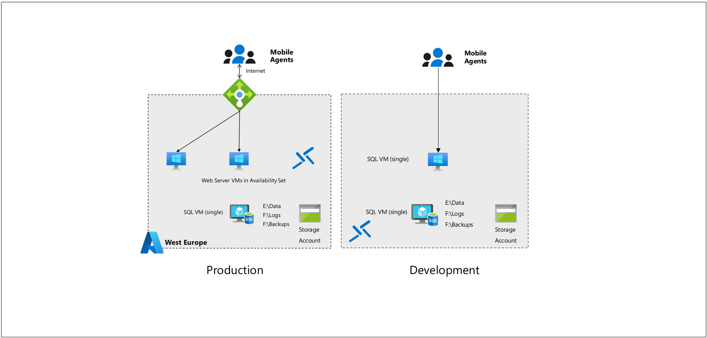

# Overview

Contoso Inc., is an Insurance Company headquartered in Madrid, provides insurance solutions across Europe. Mobile agents located across the continent visit claimants to verify their claims and upload information using the Claims Application. Headquarters is in Madrid, Spain with various branch locations. Contoso IT group is a classic shop, mainly focused on infrastructure, little automation in operations. They use legacy tools for monitoring, governance, security and deployments.

The AppDev department’s skill set is dated, predominantly focused on client/server development. The organization has an Internet-based claims application they recently deployed into Azure. The current design relies on a single SQL Server VM and a single AD VM. Web servers use a load-balancer with TCP probe. Branch offices are connected to Azure using Site-to-Site VPNs with on-site RRAS server. 

Customers have reported reliability issues with the claims application. Failures were correlated to service health issues with the SQL VM. Network connectivity issues between the branch offices and the corporate office have occurred intermittently. Every time there is a failure in connectivity, IT team needs to travel to the branch office to troubleshoot on site. Disk storage has a heightened level of attention due to a critical server running out of disk space, highlighting gaps in proactive monitoring. Recent stability issues with the claims application prompted Contoso to perform a business impact analysis of the application. The result is an executive mandate to achieve an SLA of at least 99.95% for the claims application, with RTO of 4 hours and RPO of 6 hours, plus backup of all critical VMs and data.

Security is a big concern as their deployment is internet facing and distributed. They need to design their system securely both in the cloud and branch offices. The insurance industry is subject to regulatory standards that they need to align to and provide the mechanisms to enforce compliance guidelines as well as provide auditing information when requested. Cost is a concern; they need to optimize their current spending with the IaaS design.

## **Solution Architecture**

From the architectural standpoint, the deployment will consist of the following components:

 * Web servers deployed into an availability set
 * SQL Server backend (single VM)
 * GRS Storage account for object storage
 * Azure Bastion is deployed to manage the VM access.
 * West Europe

   

