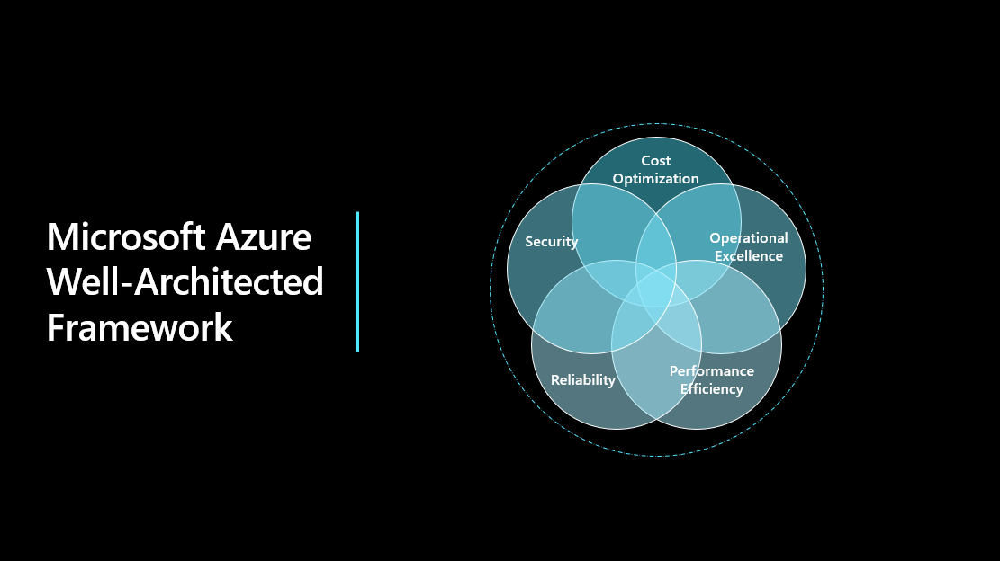

# **Overview**

The Microsoft Azure Well-Architected Framework (WAF) assessment is desgined to provide clients with high-level guidance and best practices to help you maintain and improve secure, reliable, perfomant, cost optimised and operationally excellent applications in the Azure Cloud.

The framework consists of five pillars of architectural excellence:

1. Reliability
2. Security
3. Cost Optimization
4. Operational Excellence
5. Performance Efficiency

   

Incorporating these pillars helps produce a high quality, stable, and efficient cloud architecture:

  * **Reliability:**	The ability of a system to recover from failures and continue to function.
  * **Security:**	Protecting applications and data from threats.
  * **Cost Optimization:**	Managing costs to maximize the value delivered.
  * **Operational Excellence:**	Operations processes that keep a system running in production.
  * **Performance Efficiency:**	The ability of a system to adapt to changes in load.

## **Solution Architecture**

From the architectural standpoint, the deployment will consist of the following components:

 * Web servers deployed into an availability set
 * SQL Server backend(single VM)
 * GRS Storage account for object storage
 * Azure Bastion is deployed to manage the VM access.
 * West Europe

   

